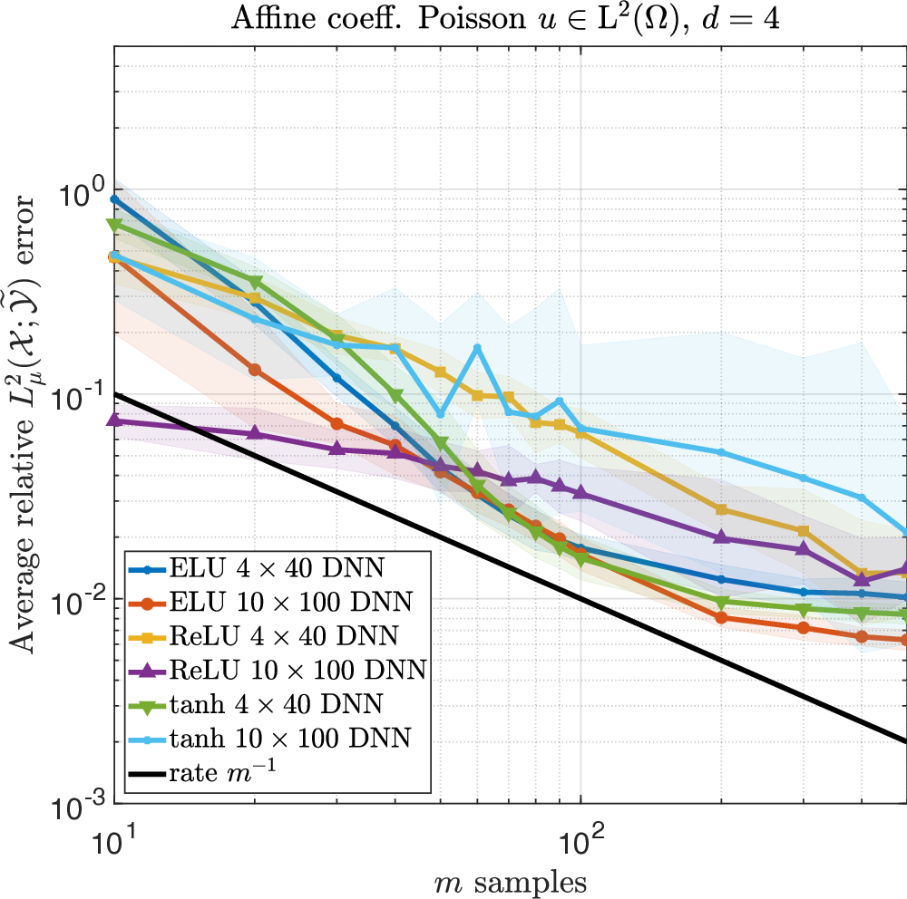
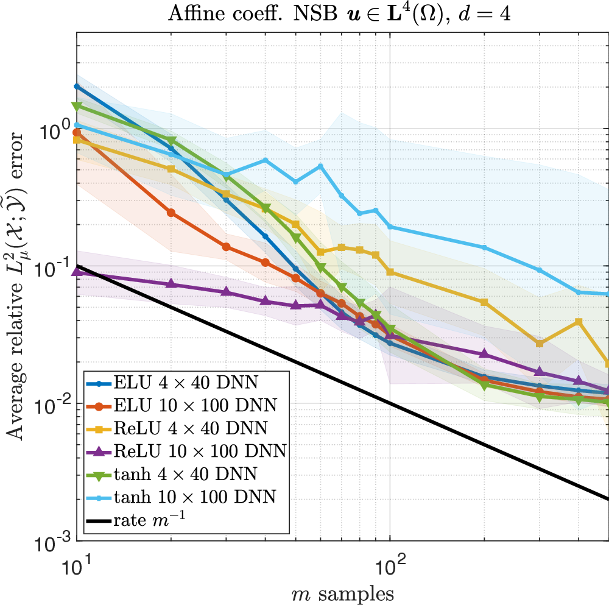
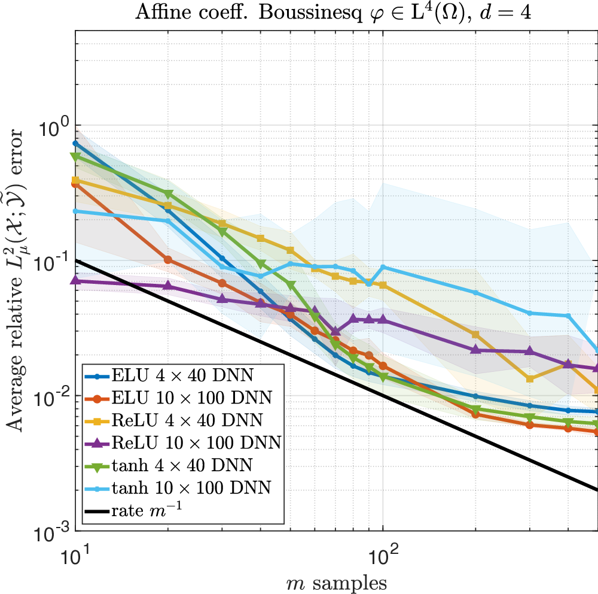

# Optimal Deep Learning of Holomorphic Operators between Banach Spaces

## TLDR

This paper presents a comprehensive theoretical framework for learning holomorphic operators between Banach spaces using deep neural networks (DNNs). Key contributions include:

- Optimal generalization bounds for learning holomorphic operators using standard DNN architectures and training procedures
- Problem-agnostic DNN architectures that depend only on the amount of training data
- Proof that deep learning achieves optimal rates for this problem, up to log factors
- Extension to operators between general Banach spaces, not just Hilbert spaces
- Numerical experiments demonstrating effectiveness on challenging PDE problems

## Introduction

Operator learning has emerged as a crucial area in scientific computing and engineering, particularly for problems involving partial differential equations (PDEs). These operators map between function spaces, often Banach or Hilbert spaces, and capture complex dynamics in physical systems. The goal of operator learning is to efficiently approximate these mappings using surrogate models, typically based on deep neural networks (DNNs).

In this blog post, we'll dive into a recent paper by Ben Adcock, Nick Dexter, and Sebastian Moraga titled "Optimal deep learning of holomorphic operators between Banach spaces". This work makes significant strides in the theoretical understanding of deep learning for operator approximation, focusing on the important class of holomorphic operators.

## Problem Formulation

Let's start by formalizing the operator learning problem. We want to learn an operator:

$$
F: \mathcal{X} \to \mathcal{Y}, \quad X \in \mathcal{X} \mapsto F(X) \in \mathcal{Y}
$$

Here, $\mathcal{Y}$ is the PDE solution space, and $X$ represents the data supplied to the PDE (e.g., initial conditions, boundary conditions, or forcing terms).

Given noisy training data:

$$
\left \{ (X_i,F(X_i) + E_i) \right \}^{m}_{i=1}
$$

where $X_1,\ldots,X_m \sim_{\mathrm{i.i.d.}} \mu$ (with $\mu$ being a probability measure on $\mathcal{X}$) and $E_i$ is noise, the goal is to approximate $F$ as:

$$
F \approx \widehat{F} := \mathcal{D}_{\mathcal{Y}} \circ \widehat{N} \circ \mathcal{E}_{\mathcal{X}}
$$

Here, $\mathcal{E}_{\mathcal{X}}$ is an approximate encoder, $\mathcal{D}_{\mathcal{Y}}$ is an approximate decoder, and $\widehat{N}$ is a DNN.

## Key Contributions

### 1. Generalization Bounds for Holomorphic Operators

The paper focuses on learning classes of holomorphic operators, which are relevant in many applications, especially those involving parametric PDEs. The authors identify a family of DNNs that achieve optimal generalization bounds for such operators.

For standard fully-connected architectures, they show that there are uncountably many minimizers of the training problem that yield equivalent optimal performance. The DNN architectures considered are 'problem agnostic', with width and depth only depending on the amount of training data $m$ and not on regularity assumptions of the target operator.

### 2. Extension to Banach Spaces

Unlike most existing work that considers only Hilbert spaces, this paper extends the theory to operators taking values in general Banach spaces. This broadens the applicability of the results to a wider range of PDEs and physical systems.

### 3. Optimal Rates

The authors prove that deep learning achieves optimal rates for this problem, up to log factors. Specifically, they show that no recovery procedure can surpass these generalization bounds.

### 4. Practical Performance

The paper includes numerical results demonstrating the practical performance on challenging problems, including the parametric diffusion, Navier-Stokes-Brinkman, and Boussinesq PDEs.

## Theoretical Framework

### Assumptions

The paper makes several key assumptions:

1. There exists a measurable mapping $\iota: \mathcal{X} \to \mathbb{R}^{\mathbb{N}}$ such that the pushforward measure $\varsigma := \iota \sharp \mu$ is quasi-uniform on $D = [-1,1]^{\mathbb{N}}$.

2. The operator $F$ has the form $F = f \circ \iota$, where $f \in \mathcal{H}(\mathbf{b})$ for some $\mathbf{b} \in \ell^p_{\mathsf{M}}(\mathbb{N})$ and $0 < p < 1$.

3. The encoder $\mathcal{E}_{\mathcal{X}}$ and decoder $\mathcal{D}_{\mathcal{Y}}$ satisfy certain properties.

### Main Results

The paper presents two main theorems:

**Theorem 1 (Existence of good DNN architectures):**
There exists a class $\mathcal{N}$ of hyperbolic tangent (tanh) DNNs with width and depth bounds:

$$
\mathrm{width}(\mathcal{N}) \lesssim (m/L)^{1+\delta}, \quad \mathrm{depth}(\mathcal{N}) \lesssim \log(m/L)
$$

such that any approximate minimizer $\widehat{N}$ of the training problem yields an approximation $\widehat{F}$ satisfying error bounds in both $L^2_{\mu}$ and $L^{\infty}_{\mu}$ norms.

**Theorem 2 (Fully-connected DNN architectures are good):**
For fully-connected architectures satisfying certain conditions, there are uncountably many minimizers of the training problem that yield equivalent optimal performance. These minimizers are stable and can be far apart in parameter space.

### Lower Bounds

The paper also provides lower bounds showing that the generalization bounds are optimal with respect to $m$, up to log factors:

**Theorem 3 (Optimal $L^2$ error rates):**
For any $0 < p < 1$, there exists a sequence $\mathbf{b}$ such that the optimal error rate in the $L^2_{\mu}$ norm is lower bounded by $m^{1/2-1/p}$.

**Theorem 4 (Optimal $L^{\infty}$ error rates):**
For any $0 < p < 1$, there exists a sequence $\mathbf{b}$ such that the optimal error rate in the $L^{\infty}_{\mu}$ norm is lower bounded by $m^{1-1/p}/\log(m)$.

## Numerical Experiments

The paper includes extensive numerical experiments to validate the theoretical results and demonstrate the practical performance of the proposed approach. Let's look at some of the key findings:

### Parametric Elliptic Diffusion Equation

*Figure 1: Average relative $L^2_{\mu}(\mathcal{X}; \widetilde{\mathcal{Y}})$-norm error versus $m$ for different DNNs approximating the solution operator for the elliptic diffusion equation.*

The authors consider the parametric elliptic diffusion equation, which arises in applications such as groundwater flow modeling. They use a mixed variational formulation and compare different DNN architectures.

Key observations:
- ELU and tanh activations generally outperform ReLU
- The best-performing DNNs achieve an error decay rate close to $m^{-1}$
- Performance is consistent when doubling the parametric dimension from 4 to 8

### Navier-Stokes-Brinkman Equations

*Figure 2: Average relative $L^2_{\mu}(\mathcal{X}; \widetilde{\mathcal{Y}})$-norm error versus $m$ for different DNNs approximating the velocity field of the NSB problem.*

The Navier-Stokes-Brinkman equations describe the dynamics of a viscous fluid through porous media with random viscosity. The authors use a sophisticated mixed variational formulation.

Key observations:
- ELU and tanh architectures again outperform ReLU
- Error decay rate is close to $m^{-1}$
- No significant performance degradation when increasing parametric dimension

### Boussinesq Equation

*Figure 3: Average relative $L^2_{\mu}(\mathcal{X}; \widetilde{\mathcal{Y}})$-norm error versus $m$ for different DNNs approximating the temperature of the Boussinesq problem.*

The Boussinesq model arises in fluid dynamics and natural convection problems where temperature changes affect fluid velocity. The authors use a fully mixed variational formulation.

Key observations:
- ELU and smaller tanh networks perform best
- Error decay rate is again close to $m^{-1}$
- Consistent performance across different parametric dimensions

## Discussion and Implications

The results presented in this paper have several important implications for the field of operator learning:

1. **Theoretical Foundation**: The paper provides a rigorous theoretical foundation for using deep learning to approximate holomorphic operators between Banach spaces. This extends previous work that focused primarily on Hilbert spaces.

2. **Optimal Performance**: The authors show that deep learning achieves optimal rates for this problem, up to log factors. This is a significant result, as it demonstrates that DNNs are theoretically capable of achieving the best possible performance for these types of problems.

3. **Problem-Agnostic Architectures**: The DNN architectures proposed in the paper are 'problem agnostic', meaning their width and depth depend only on the amount of training data and not on the regularity of the target operator. This suggests that these architectures could be broadly applicable across different types of PDEs and physical systems.

4. **Practical Guidance**: The numerical experiments provide valuable insights for practitioners. For example, the consistent outperformance of ELU and tanh activations over ReLU suggests that these might be better choices for operator learning tasks.

5. **Scalability**: The experiments show that performance doesn't significantly degrade when increasing the parametric dimension. This is encouraging for applications involving high-dimensional parameter spaces.

## Open Questions and Future Directions

While this paper makes significant advances, there are still several open questions and potential areas for future research:

1. **Gaussian Measures**: The current results assume a quasi-uniform measure on the parameter space. Extending these results to Gaussian measures would be valuable for many applications.

2. **Encoder-Decoder Assumptions**: The paper makes certain technical assumptions about the encoder and decoder. Relaxing these assumptions could broaden the applicability of the results.

3. **All Minimizers**: The current results show that some minimizers of the training problem are 'good', but not necessarily all of them. Extending the results to all minimizers, or showing that standard training procedures reliably find 'good' minimizers, would be an important next step.

4. **Banach vs. Hilbert Space Gap**: The paper shows slightly worse bounds for Banach spaces compared to Hilbert spaces. Determining whether this gap can be closed is an interesting open problem.

5. **Other PDEs**: While the paper considers several important PDEs, extending the results to an even broader class of equations would be valuable.

## Conclusion

This paper represents a significant advance in our theoretical understanding of deep learning for operator approximation. By providing optimal generalization bounds for holomorphic operators between Banach spaces, it lays a solid foundation for future work in this area.

The combination of strong theoretical results and practical numerical experiments makes this paper particularly valuable. It not only advances our mathematical understanding but also provides guidance for practitioners working on real-world PDE problems.

As we continue to push the boundaries of scientific computing and AI, work like this will be crucial in bridging the gap between theory and practice, ultimately leading to more powerful and reliable computational tools for tackling complex physical systems.

## References

1. B. Adcock, N. Dexter, and S. Moraga. "Optimal deep learning of holomorphic operators between Banach spaces." (2024)

2. N. Kovachki, S. Lanthaler, and S. Mishra. "On universal approximation and error bounds for Fourier neural operators." J. Mach. Learn. Res., 22(1):13237–13312, 2021.

3. S. Lanthaler, S. Mishra, and G. E. Karniadakis. "Error estimates for DeepONets: A deep learning framework in infinite dimensions." Trans. Math. Appl., 6(1):tnac001, 2022.

4. Z. Li, N. Kovachki, K. Azizzadenesheli, B. Liu, K. Bhattacharya, A. Stuart, and A. Anandkumar. "Fourier neural operator for parametric partial differential equations." In ICLR, 2021.

5. L. Lu, P. Jin, G. Pang, Z. Zhang, and G. E. Karniadakis. "Learning nonlinear operators via DeepONet based on the universal approximation theorem of operators." Nat. Mach. Intell., 3(3):218–229, 2021.

