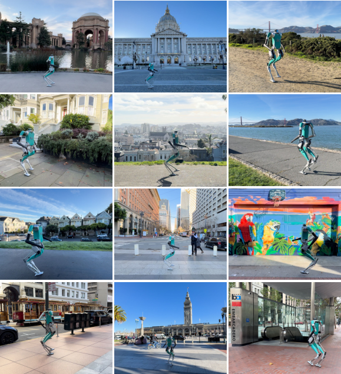
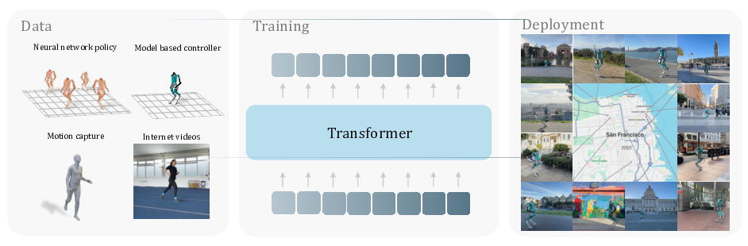

# Humanoid Locomotion as Next Token Prediction

*A humanoid robot walking in various locations around San Francisco*

## TL;DR

This paper presents a novel approach to humanoid locomotion by framing it as a next token prediction problem, similar to language modeling. The authors train a causal transformer model on diverse sensorimotor trajectories, including data from neural network policies, model-based controllers, human motion capture, and YouTube videos. Their method enables zero-shot transfer to real-world walking for a full-sized humanoid robot, demonstrating robust performance across various terrains in San Francisco.

## Introduction

The field of artificial intelligence has seen remarkable progress in recent years, largely driven by large neural networks trained on massive datasets from the internet. This approach has been particularly successful in natural language processing, where models like GPT-3 have demonstrated impressive capabilities in few-shot learning and multi-task performance. But can we apply similar techniques to learn powerful models of sensory and motor representations?

In this blog post, we'll dive into a fascinating paper that explores this question in the context of humanoid locomotion. The authors, Ilija Radosavovic and colleagues from UC Berkeley, propose a method that casts humanoid control as data modeling of large collections of sensorimotor trajectories. Their approach draws inspiration from language modeling techniques but adapts them to the unique challenges of robotics data.

## The Core Idea: Sensorimotor Trajectories as Sentences

The key insight of this paper is to view sensorimotor trajectories as the "sentences" of the physical world. Just as language models predict the next word in a sequence, the authors train a transformer model to predict the next token in a sensorimotor trajectory.

However, robotics data presents some unique challenges compared to language:

1. It's high-dimensional
2. It contains multiple input modalities (sensors, motor commands)
3. Some trajectories may have missing information (e.g., human videos without action data)

To address these challenges, the authors propose a flexible framework that can handle both complete and incomplete trajectories.

## Method Overview

*Overview of the proposed approach for humanoid locomotion as next token prediction*

The method consists of the following key steps:

1. **Data Collection**: Gather a diverse dataset of sensorimotor trajectories from various sources.
2. **Tokenization**: Convert the continuous trajectory data into discrete tokens.
3. **Transformer Training**: Train a causal transformer model to predict the next token in the sequence.
4. **Deployment**: Use the trained model for zero-shot transfer to real-world locomotion.

Let's dive deeper into each of these components.

### Data Collection

The authors collect trajectories from four main sources:

1. **Neural Network Policies**: Complete trajectories (observations + actions) from a policy trained with reinforcement learning.
2. **Model-based Controllers**: Trajectories without actions from Agility Robotics' controller.
3. **Human Motion Capture**: Trajectories of human movement, retargeted to the robot via inverse kinematics.
4. **YouTube Videos**: Human movements extracted from internet videos, reconstructed in 3D and retargeted to the robot.

This diverse dataset allows the model to learn from both optimal and suboptimal trajectories, as well as from data with missing modalities.

### Tokenization and Model Architecture

The sensorimotor trajectories are tokenized and fed into a causal transformer model. The model architecture is similar to those used in language modeling, with some adaptations for the robotics domain.

The input to the model at each time step $t$ is:

$$t_i = \text{concat}(o_i, a_i)$$

where $o_i \in \mathbb{R}^m$ represents the observation and $a_i \in \mathbb{R}^n$ represents the action. These are projected into a $d$-dimensional embedding space:

$$h^0_i = W t_i$$

where $W \in \mathbb{R}^{d \times (m + n)}$ is a learned projection matrix.

For trajectories with missing actions (e.g., from human videos), a learned mask token $\texttt{[M]} \in \mathbb{R}^n$ is used in place of $a_i$.

The transformer processes these embeddings through $L$ layers of self-attention and feedforward networks:

$$
\begin{align}
\tilde{H_l} &= \text{LayerNorm}(H_l) \\
\tilde{H_l} &= \tilde{H_l} + \text{MHSA}(\tilde{H_l}) \\
H_{l+1} &= \tilde{H_l} + \text{MLP}(\tilde{H_l})
\end{align}
$$

where MHSA stands for Multi-Head Self-Attention.

### Training Objective

The model is trained to predict the next token in the sequence, minimizing the mean squared error between predicted and ground truth tokens:

$$L = \frac{1}{K} \sum_{k=1}^K (\hat{t}_k - t_k)^2$$

Importantly, the model predicts both observations and actions, allowing it to learn a richer representation of the world dynamics.

### Handling Missing Modalities

One of the key innovations in this paper is the ability to learn from trajectories with missing information. For example, when processing human videos, we have observations but no corresponding actions.

The authors handle this by inserting mask tokens $\texttt{[M]}$ in place of missing actions:

$$\mathcal{T} = (o_1, \texttt{[M]}, o_2, \texttt{[M]}, ..., o_T, \texttt{[M]})$$

During training, the loss is only computed for the non-masked tokens. This allows the model to learn from diverse data sources while maintaining a unified training framework.

### Modality-Aligned Prediction

Rather than predicting the next token in a modality-agnostic way, the authors propose a modality-aligned prediction scheme. For each input token, the model predicts the next token from the same modality. This approach helps maintain the structure of the sensorimotor data and improves performance.

## Experimental Results

The authors evaluate their approach on the Digit humanoid robot, a full-sized platform developed by Agility Robotics. They conduct both real-world experiments and extensive simulations to validate their method.

### Real-World Deployment

*The humanoid robot walking on various terrains in San Francisco*

One of the most impressive results is the zero-shot transfer to real-world locomotion. The authors deploy their trained policy on the Digit robot in various locations around San Francisco over the course of a week. The robot successfully navigates different surfaces, including:

- Walkways
- Concrete
- Asphalt
- Tiled plazas
- Sanded roads

This demonstrates the robustness and generalization capabilities of the learned policy.

### Simulation Studies

To quantitatively evaluate their approach, the authors conduct extensive simulation experiments. They compare their method to state-of-the-art reinforcement learning approaches and analyze various aspects of their model:

1. **Trajectory Adherence**: The model shows superior tracking of desired trajectories compared to RL baselines, especially for turning motions.

2. **Gait Quality**: Phase portraits of joint angles reveal smoother, more cyclic gaits compared to RL policies.

3. **Generalization**: The model demonstrates the ability to follow backward walking commands, despite not being explicitly trained on this task.

4. **Scaling Properties**: Performance improves with increased data, longer context lengths, and larger model sizes.

### Ablation Studies

The authors conduct several ablation studies to understand the impact of different design choices:

1. **Concatenated vs. Separate Tokens**: Both approaches perform comparably, with concatenation offering computational efficiency.

2. **Modality-Aligned vs. Non-Aligned Prediction**: Aligned prediction outperforms non-aligned approaches.

3. **Joint vs. Staged Training**: Both methods work well for combining complete and incomplete trajectory data.

4. **State-Action vs. Action-Only Prediction**: Predicting both states and actions leads to better performance than action-only prediction.

## Discussion and Future Directions

This paper presents a promising new direction for learning complex robotic control tasks through generative modeling of sensorimotor trajectories. Some key takeaways and potential areas for future work include:

1. **Scalability**: The approach shows favorable scaling properties with data size and model complexity, suggesting potential for further improvements with larger datasets and models.

2. **Multi-Modal Learning**: The ability to learn from diverse data sources, including those with missing modalities, opens up exciting possibilities for leveraging large-scale, unstructured data for robotics.

3. **Zero-Shot Transfer**: The successful zero-shot transfer to real-world locomotion is particularly impressive and warrants further investigation in other robotic domains.

4. **Interpretability**: While the model demonstrates strong performance, understanding what it learns and how it generalizes remains an open question.

5. **Task Generalization**: Exploring how this approach can be extended to more complex manipulation tasks or multi-task learning scenarios could be an interesting direction for future research.

## Conclusion

The paper "Humanoid Locomotion as Next Token Prediction" presents an innovative approach to learning robust humanoid control policies. By framing the problem as generative modeling of sensorimotor trajectories, the authors demonstrate that techniques inspired by language modeling can be effectively applied to challenging robotics tasks.

The success of this method in enabling zero-shot transfer to real-world humanoid locomotion is particularly exciting. It suggests a promising path forward for learning complex robotic behaviors from diverse, large-scale datasets – potentially bridging the gap between the data-driven successes we've seen in areas like computer vision and natural language processing, and the challenges of physical robot control.

As we continue to explore the intersections of machine learning, robotics, and control theory, approaches like this that can leverage diverse data sources and scale effectively are likely to play an increasingly important role in advancing the field of robotics.

## References

[1] Radosavovic, I., Zhang, B., Shi, B., Rajasegaran, J., Kamat, S., Darrell, T., Sreenath, K., & Malik, J. (2024). Humanoid Locomotion as Next Token Prediction. In *International Conference on Machine Learning (ICML)*.

[2] Vaswani, A., Shazeer, N., Parmar, N., Uszkoreit, J., Jones, L., Gomez, A. N., Kaiser, Ł., & Polosukhin, I. (2017). Attention is all you need. In *Advances in Neural Information Processing Systems*.

[3] Radford, A., Narasimhan, K., Salimans, T., & Sutskever, I. (2018). Improving language understanding by generative pre-training.

[4] Brown, T. B., Mann, B., Ryder, N., Subbiah, M., Kaplan, J., Dhariwal, P., Neelakantan, A., Shyam, P., Sastry, G., Askell, A., et al. (2020). Language models are few-shot learners. In *Advances in Neural Information Processing Systems*.

[5] Radosavovic, I., Xiao, T., Zhang, B., Darrell, T., Malik, J., & Sreenath, K. (2023). Real-world humanoid locomotion with reinforcement learning. *arXiv:2303.03381*.

[6] Mahmood, N., Ghorbani, N., Troje, N. F., Pons-Moll, G., & Black, M. J. (2019). AMASS: Archive of motion capture as surface shapes. In *International Conference on Computer Vision (ICCV)*.

[7] Rajasegaran, J., Pavlakos, G., Kanazawa, A., & Malik, J. (2022). Tracking people by predicting 3D appearance, location and pose. In *Proceedings of the IEEE/CVF Conference on Computer Vision and Pattern Recognition*.

