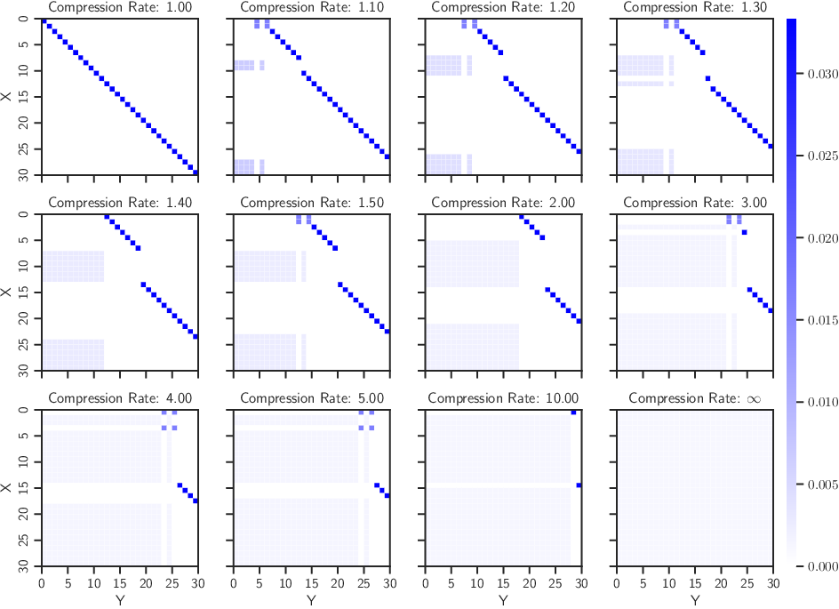
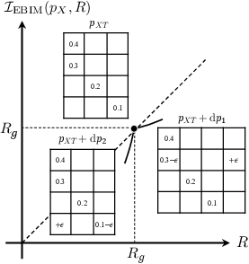
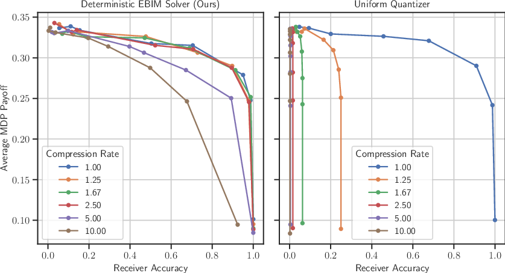

# Minimum Entropy Coupling with Bottleneck: A Novel Framework for Lossy Compression

## TLDR

This paper introduces a new lossy compression framework called Minimum Entropy Coupling with Bottleneck (MEC-B) that extends classical minimum entropy coupling by incorporating a rate-limiting bottleneck. The framework is particularly useful for joint compression and retrieval tasks or scenarios involving distributional shifts. Key contributions include:

- Formulation of the MEC-B problem and its decomposition into encoder and decoder optimization subproblems
- Theoretical analysis of the Entropy-Bounded Information Maximization (EBIM) problem for encoder design
- A greedy algorithm for finding near-optimal deterministic mappings for EBIM
- Characterization of optimal solutions in neighborhoods of deterministic mappings
- Application to Markov Coding Games to demonstrate practical utility

## Introduction

Lossy compression is a fundamental problem in information theory with wide-ranging applications. While traditional approaches often assume the reconstruction distribution matches the source distribution, many real-world scenarios involve distributional shifts or joint compression and retrieval tasks where this assumption does not hold. 

In this paper, the authors introduce a novel framework called Minimum Entropy Coupling with Bottleneck (MEC-B) to address these challenges. MEC-B extends the classical minimum entropy coupling problem by incorporating a rate-limiting bottleneck, allowing for controlled stochasticity in the coupling between input and output distributions.

Let's dive into the details of this framework and explore its theoretical foundations and practical applications.

## Problem Formulation

The authors start by formulating the MEC-B problem as follows:

$$
\begin{aligned}
    \mathcal{I}_\text{MEC-B}(p_X, p_Y, R) = &\max_{\enc_{T|X},\; \dec_{Y|T}} &&I(X;Y) \\
    &\hspace{2em} \textrm{s.t.} &&X \leftrightarrow T \leftrightarrow Y, \\
    & &&H(T) \leq R, \\
    & &&P(Y) = p_Y, \\
    & &&P(X) = p_X
\end{aligned}
$$

Here, $X$ is the input variable with distribution $p_X$, $Y$ is the output variable with distribution $p_Y$, and $T$ is an intermediate code. The encoder $\enc_{T|X}$ maps $X$ to $T$, while the decoder $\dec_{Y|T}$ maps $T$ to $Y$. The objective is to maximize the mutual information $I(X;Y)$ subject to the rate constraint $H(T) \leq R$ and the marginal distribution constraints.

This formulation extends the classical minimum entropy coupling problem by introducing the bottleneck variable $T$, allowing for a controlled degree of stochasticity in the coupling between $X$ and $Y$.

## Decomposition into Subproblems

A key insight in the paper is the decomposition of the MEC-B problem into two separate optimization problems for the encoder and decoder. This decomposition is based on the following lemma:

**Lemma 1:** Given a Markov chain $X \leftrightarrow T \leftrightarrow Y$:

$$
I(X;Y) = I(X;T) + I(Y;T) - I(T; X,Y)
$$

Using this decomposition, the authors derive a lower bound on the MEC-B objective:

$$
I(X;Y) \geq I(X;T) + I(Y;T) - R
$$

This leads to the following two subproblems:

1. **Encoder Optimization (EBIM):**

$$
\begin{aligned}
    \mathcal{I}_\text{EBIM}(p_X, R) = &\max_{\enc_{T|X}} &&I(X;T) \\
    & \ \textrm{s.t.} &&H(T) \leq R, \\
    & &&P(X) = p_X
\end{aligned}
$$

2. **Decoder Optimization (MEC):**

$$
\begin{aligned}
    \mathcal{I}_\text{MEC}(p_T, p_Y) = \max_{\enc_{Y|T}} \ &I(T;Y) \\
    \textrm{s.t.} \ \ &P(Y) = p_Y, \\
    &P(T) = p_T
\end{aligned}
$$

This decomposition allows for separate optimization of the encoder and decoder, simplifying the overall problem.

## Theoretical Analysis of EBIM

The paper provides an in-depth theoretical analysis of the Entropy-Bounded Information Maximization (EBIM) problem, which is crucial for designing the encoder. Here are some key results:

### Upper Bound and Deterministic Mappings

**Theorem 1:** $\mathcal{I}_\text{EBIM}(p_X, R) = R$ if and only if there exists a function $g: \mathcal{X} \to \mathcal{T}$ such that $H(g(X))=R$.

This theorem establishes that the upper bound on the EBIM objective is achievable only through deterministic mappings.

### Greedy Algorithm for Deterministic Mappings

The authors propose a greedy algorithm (Algorithm 1 in the paper) to find deterministic mappings with a guaranteed performance gap from the optimal solution. The algorithm iteratively merges elements of the input distribution to create a sequence of deterministic mappings.

**Theorem 2:** If the output of Algorithm 1 yields mutual information $\widehat{I}$, then:

$$
\mathcal{I}_\text{EBIM}(p_X, R) - \widehat{I} \leq h(p_2)
$$

where $h(\cdot)$ is the binary entropy function, and $p_2$ denotes the second largest element of $p_X$.

This theorem provides a tight bound on the optimality gap of the greedy algorithm, which is at most 1 bit and often much smaller in practice.

### Optimal Solutions in Neighborhoods of Deterministic Mappings

To bridge the gap between discrete deterministic mappings, the authors characterize optimal solutions in the neighborhoods of deterministic mappings:

**Theorem 3:** Let $p_{XT}$ define a deterministic mapping $T = g(X)$, with $I(X;T)=H(T)=R_g$. Then:

1. For $R_g + \epsilon$: Normalize columns, select the cell with the smallest normalized value, and move an infinitesimal probability mass to a new column in the same row.

2. For $R_g - \epsilon$: Identify columns with smallest and largest sums, select the cell with the smallest value in the column with the lowest sum, and transfer an infinitesimal probability mass to the column with the highest sum in the same row.

This characterization provides insights into the structure of optimal solutions and allows for fine-tuning of deterministic mappings.

## Application to Markov Coding Games

To demonstrate the practical utility of the MEC-B framework, the authors apply it to Markov Coding Games (MCGs) with rate limits. MCGs are a type of multi-player decentralized Markov Decision Process involving a source, an agent (sender), a Markov decision process, and a receiver.

The authors extend the original MCG formulation by introducing a rate limit between the source and the agent. The MEC-B framework is used to compress the message from the source to the agent, adhering to the rate constraint.

### Method Description

The method involves the following key components:

1. **Marginal Policy:** A maximum entropy reinforcement learning objective is used to derive a marginal policy for the MDP.

2. **Source: Message Compression:** The source compresses the message using the EBIM algorithm to generate the signal $T$.

3. **Agent: Minimum Entropy Coupling:** The agent constructs a conditional policy by performing minimum entropy coupling between the marginal policy and the signal distribution.

4. **Receiver: Decoding the Message:** The receiver mirrors the actions of the source and agent to update the message belief at each step.

### Experimental Results

The authors present experimental results using a noisy Grid World environment. They compare their proposed compression method (Algorithm 1) with a baseline uniform quantization approach.

The results demonstrate the trade-off between the average MDP reward and the receiver's decoding accuracy, navigated by varying the temperature parameter $\beta$ in the maximum entropy RL objective. The proposed method consistently outperforms the uniform quantization baseline, especially in low-rate regimes.

## Conclusion and Future Directions

The Minimum Entropy Coupling with Bottleneck framework introduced in this paper provides a novel approach to lossy compression that can handle scenarios involving distributional shifts or joint compression and retrieval tasks. The theoretical analysis of the EBIM problem and the practical application to Markov Coding Games demonstrate the potential of this framework.

Future research directions suggested by the authors include:

1. Quantifying the gap between separate optimization of encoder and decoder and the optimal joint setting
2. Enabling fine-grained control over the entropy spread in the coupling
3. Extending the framework to continuous cases
4. Applying the framework to other domains such as watermarking language models, unpaired sample-to-sample translation, and joint compression and upscaling

The MEC-B framework opens up exciting possibilities for designing more flexible and powerful compression schemes that can adapt to complex real-world scenarios.

## References

1. Courtade, T. A., & Wesel, R. D. (2011). Multiterminal source coding with an entropy-based distortion measure. In *2011 IEEE International Symposium on Information Theory Proceedings* (pp. 2040-2044). IEEE.

2. Courtade, T. A., & Weissman, T. (2013). Multiterminal source coding under logarithmic loss. *IEEE Transactions on Information Theory*, 60(1), 740-761.

3. Shkel, Y. Y., & Verdú, S. (2017). A single-shot approach to lossy source coding under logarithmic loss. *IEEE Transactions on Information Theory*, 64(1), 129-147.

4. Vidyasagar, M. (2012). A metric between probability distributions on finite sets of different cardinalities and applications to order reduction. *IEEE Transactions on Automatic Control*, 57(10), 2464-2477.

5. Kocaoglu, M., Dimakis, A., Vishwanath, S., & Hassibi, B. (2017). Entropic causal inference. In *Proceedings of the AAAI Conference on Artificial Intelligence* (Vol. 31).

6. Sokota, S., De Witt, C. A. S., Igl, M., Zintgraf, L. M., Torr, P., Strohmeier, M., ... & Foerster, J. (2022). Communicating via markov decision processes. In *International Conference on Machine Learning* (pp. 20314-20328). PMLR.

7. Ziebart, B. D., Maas, A. L., Bagnell, J. A., & Dey, A. K. (2008). Maximum entropy inverse reinforcement learning. In *AAAI* (Vol. 8, pp. 1433-1438). Chicago, IL, USA.

8. Sutton, R. S., & Barto, A. G. (2018). *Reinforcement learning: An introduction*. MIT press.

