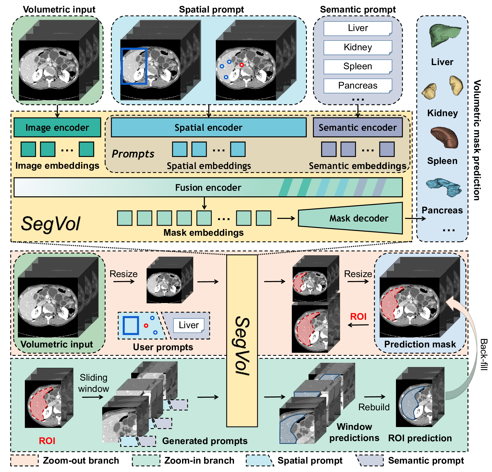
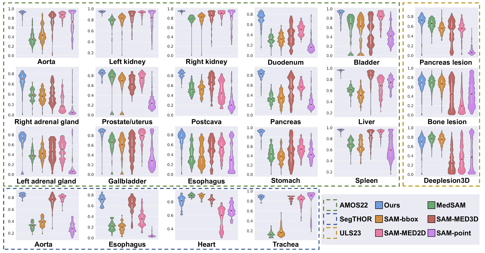

# SegVol: Universal and Interactive Volumetric Medical Image Segmentation

*Figure 1: Overview of SegVol model architecture. SegVol produces precise segmentation of 3D anatomical structures from volumetric inputs with easy user interactions, including point, bounding box, and text prompts. The zoom-out-zoom-in mechanism enables SegVol to initially produce a rough prediction mask with zoom-out inference, then refine it with zoom-in inference on the identified ROI.*

## TL;DR

- SegVol is a foundation model for universal and interactive 3D medical image segmentation
- Supports semantic and spatial prompts for over 200 anatomical categories
- Trained on 90K unlabeled CT volumes and 6K labeled CT volumes 
- Introduces zoom-out-zoom-in mechanism for efficient and precise inference
- Outperforms competitors in 19 out of 22 anatomical segmentation tasks

## Introduction

Medical image segmentation plays a crucial role in various clinical applications, from tumor monitoring to surgical planning. However, existing volumetric medical segmentation methods face several challenges, including limited generalization across datasets, poor performance on complex structures, and computational inefficiency. In this blog post, we'll dive deep into SegVol, a novel foundation model for volumetric medical image segmentation that addresses these challenges.

## The Challenges of Volumetric Medical Image Segmentation

Before we explore SegVol, let's understand the key limitations of existing methods:

1. **Dataset-specific models**: Most publicly available volumetric medical image datasets contain a small number of mask annotations from a few categories. Models trained on one dataset often struggle to generalize to others due to different label spaces.

2. **Poor performance on complex structures**: Traditional segmentation models often perform poorly when segmenting complex structures like tumors and cysts, mainly due to insufficient training data and inability to leverage spatial information through user interaction.

3. **Computational inefficiency**: Previous solutions typically employ a sliding window approach for inference, which is time-consuming and lacks global context.

While some recent works have introduced spatial prompts into medical image segmentation, most lack the ability to process 3D input directly and naturally, and none can understand the semantics of anatomical categories.

## Introducing SegVol: A Foundation Model for Volumetric Medical Image Segmentation

SegVol is designed to address these challenges by enabling universal and interactive 3D segmentation of more than 200 anatomical categories. Let's break down the key components and innovations of SegVol.

### Dataset Construction

One of the main challenges in training a universal volumetric medical segmentation model is the lack of large-scale publicly available data. The authors collected and processed 25 public volumetric medical segmentation datasets, encompassing over 200 anatomical categories. To address the issue of partial labels and spurious correlations, they introduced pseudo labels using the Felzenswalb-Huttenlocher (FH) algorithm.

The pseudo label generation process involves:

1. Applying the FH algorithm to generate pseudo masks for each CT scan
2. Replacing pseudo masks with ground truth masks when available
3. Filtering out tiny structures smaller than 1‰ of the whole volume size
4. Refining each mask through dilation and erosion operations

### Model Architecture

SegVol's architecture consists of four main components:

1. **Image Encoder**: A 3D Vision Transformer (ViT) pre-trained using the SimMIM algorithm on 96K CTs and fine-tuned on 6K labeled CTs.

2. **Text Encoder**: Leverages the CLIP model to encode text prompts, enabling universal segmentation across datasets.

3. **Prompt Encoder**: Processes spatial prompts (point and bounding box) using positional encoding.

4. **Mask Decoder**: Fuses image and prompt embeddings using self-attention and cross-attention, then generates masks using transposed convolutions and interpolation operations.

The model supports three types of prompts:

- Bounding box prompt: Coordinates of two diagonal vertices
- Point prompt: Set of positive and negative points
- Text prompt: Semantic description (e.g., "liver" or "cervical spine C2")

### Zoom-out-zoom-in Mechanism

To provide users with an easy SAM-like interface while maintaining efficiency and precision, SegVol introduces a zoom-out-zoom-in mechanism:

1. **Zoom-out**: Resize the volumetric image and generate a coarse segmentation mask.
2. **Zoom-in**: Crop the Region of Interest (ROI) from the original image and perform precise inference using a sliding window.
3. **Back-filling**: Fill the ROI prediction mask back into the coarse segmentation mask.

This mechanism significantly reduces computational cost while preserving precise segmentation of the ROI.

### Loss Function

SegVol's training process involves two stages: pre-training and supervised fine-tuning. The loss functions for each stage are as follows:

1. **Pre-training Loss**:

$$\mathcal{L}_{\text{pre-training}}(\bm{\theta}_{\text{IE}}; \mathcal{D}_{1}) = 
\frac{1}{\Omega(\bm{a}_{\text{M}})} || \bm{b}_{\text{M}} - \bm{a}_{\text{M}}||_1$$

Where $\bm{\theta}_{\text{IE}}$ is the parameter set of SegVol's image encoder, $\bm{a}$ and $\bm{b}$ are the input and predicted voxel values, M denotes the set of masked voxels, and $\Omega(\cdot)$ is the number of elements.

2. **Fine-tuning Loss**:

The fine-tuning loss combines Binary Cross-Entropy (BCE) and Dice loss:

$$\mathcal{L}_{\text{BCE}}(\bm{\theta}; \mathcal{D}_{2}) =
-\mathbb{E}_{(\bm{x}, \bm{y}) \sim \mathcal{D}_{2}} 
[\langle \bm{y}, \log (\mathcal{F}(\bm{x}, \bm{\theta}))     \rangle + 
\langle 1-\bm{y}, \log (1-\mathcal{F}(\bm{x}, \bm{\theta})) \rangle]$$

$$\mathcal{L}_{\text{Dice}}(\bm{\theta}; \mathcal{D}_{2}) = 
1-\mathbb{E}_{(\bm{x}, \bm{y}) \sim \mathcal{D}_{2}} 
[\frac{
    2 \cdot  \langle \bm{y}, \mathcal{F}(\bm{x}, \bm{\theta}) \rangle
}{
    \| \bm{y} \|_1 + \| \mathcal{F}(\bm{x}, \bm{\theta}) \|_1
}]$$

$$\mathcal{L}_{\text{fine-tuning}}(\bm{\theta}; \mathcal{D}_{2}) = 
\mathcal{L}_{\text{BCE}}(\bm{\theta}; \mathcal{D}_{2}) + 
\mathcal{L}_{\text{Dice}}(\bm{\theta}; \mathcal{D}_{2})$$

Where $\bm{\theta}$ represents the trainable parameters, $\mathcal{D}_{2}$ is the supervised fine-tuning dataset, and $\mathcal{F}(\cdot, \bm{\theta})$ is the forward function of SegVol.

## Experimental Results

The authors conducted extensive experiments to evaluate SegVol's performance and compare it with other state-of-the-art methods. Let's look at some of the key findings:

### Comparison with SAM-like Interactive Methods

SegVol was compared with five SAM-like interactive segmentation methods: SAM(Point), SAM(Bbox), SAM-MED2D, SAM-MED3D, and MedSAM. The evaluation was performed on 22 volumetric medical image segmentation tasks from three datasets: AMOS22, ULS23, and SegTHOR.

*Figure 2: Violin plots for quantitative comparison experiment results of SegVol and SAM-like interactive methods. The vertical axis represents the Dice score.*

Key findings:

- SegVol outperformed other methods in 19 out of 22 tasks
- On the AMOS22 dataset, SegVol showed a significant improvement of 19.25% (average Dice score) compared to the second-ranked SAM-MED2D
- For the SegTHOR dataset, SegVol surpassed the runner-up (SAM-MED3D) by an average Dice score improvement of 4.28%
- On the challenging ULS23 dataset, which features small patch-like masks, SegVol performed comparably to MedSAM, which excels in using bounding box prompts for segmenting small objects

### Ablation Studies

The authors conducted several ablation studies to validate the effectiveness of SegVol's key components:

1. **Zoom-out-zoom-in mechanism**: Compared to simple resize and sliding window strategies, the zoom-out-zoom-in mechanism achieved the best average Dice score while maintaining competitive inference speed.

2. **Scaling up training data**: The performance of SegVol improved significantly as the number of training datasets increased, especially for text prompt-based segmentation.

3. **Multi-prompt combination**: The combination of spatial and semantic prompts led to better performance compared to using either prompt type alone. For example, the average Dice score of 'bbox+text' prompt was 5.85% higher than using 'text' prompt alone.

### Case Studies

The authors presented two interesting case studies to demonstrate SegVol's capabilities:

1. **Disambiguation via semantic-prompt**: SegVol can effectively disambiguate between multiple plausible segmentation targets (e.g., kidney tumor, left kidney, or whole kidneys) using semantic prompts.

2. **Identifying spatial-prompt segmentation**: SegVol can accurately identify the semantic category of spatial-prompt results, providing valuable information about the segmented structures.

## Discussion and Future Directions

While SegVol shows remarkable performance and versatility, there are still areas for improvement and future research:

1. **Scalability**: The authors believe that SegVol's performance can be further improved with more data and computational resources.

2. **Generalizability to unseen modalities**: Although trained primarily on CT data, SegVol shows promising results when applied to MRI data. Future work could explore joint training on multi-modality data.

3. **Referring expression segmentation**: While SegVol can understand semantic prompts composed of sentences, there's still a gap between it and referring expression segmentation involving complex semantic information and logical relationships.

## Conclusion

SegVol represents a significant advancement in volumetric medical image segmentation, offering a universal and interactive foundation model capable of segmenting over 200 anatomical categories. By addressing key challenges such as dataset-specific models, poor performance on complex structures, and computational inefficiency, SegVol paves the way for more accurate and efficient medical image analysis.

The combination of massive pre-training, multi-prompt support, and the innovative zoom-out-zoom-in mechanism makes SegVol a powerful tool for various clinical applications. As research in this field continues to evolve, we can expect further improvements in the accuracy, efficiency, and versatility of volumetric medical image segmentation models.

## References

1. Kirillov, A., et al. (2023). Segment anything. arXiv preprint arXiv:2304.02643.
2. Ma, J., et al. (2023). Segment anything in medical images.
3. Cheng, J., et al. (2023). Sam-med2d. arXiv preprint arXiv:2308.16184.
4. Wang, H., et al. (2023). Sam-med3d.
5. Felzenszwalb, P. F., & Huttenlocher, D. P. (2004). Efficient graph-based image segmentation. International journal of computer vision, 59, 167-181.
6. Xie, Z., et al. (2022). Simmim: A simple framework for masked image modeling.
7. Radford, A., et al. (2021). Learning transferable visual models from natural language supervision. In International conference on machine learning (pp. 8748-8763). PMLR.

For the full list of references and to explore the SegVol project further, visit the [GitHub repository](https://github.com/BAAI-DCAI/SegVol).

