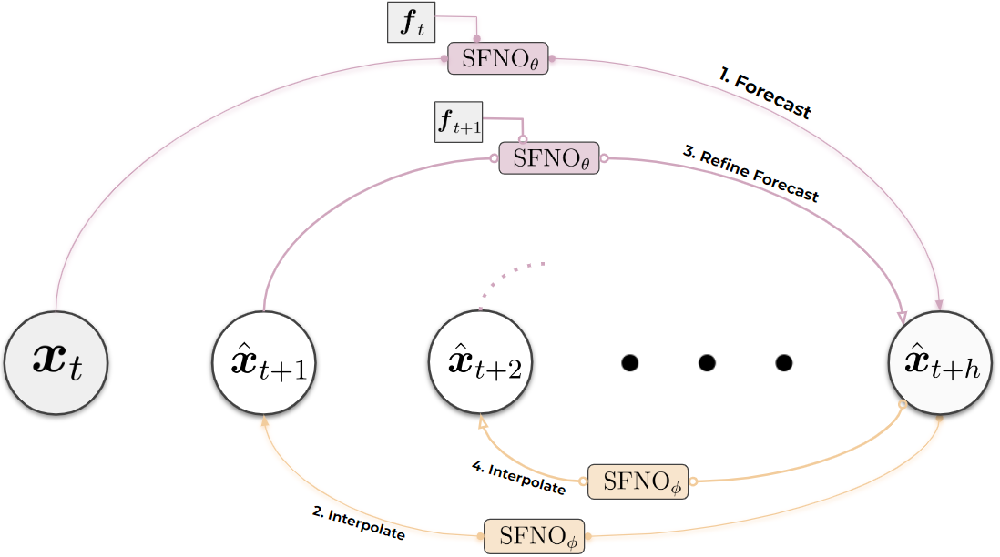
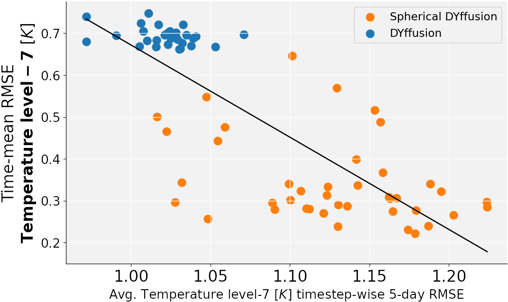
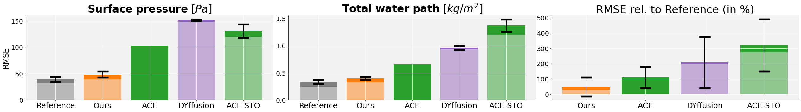
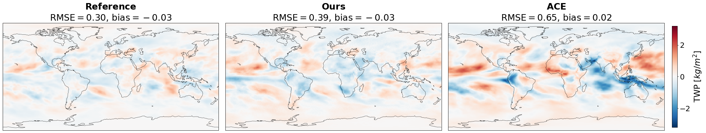
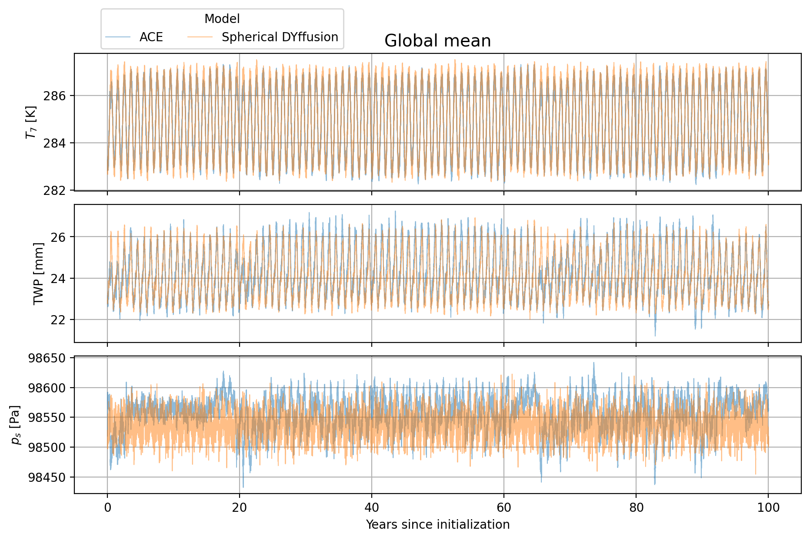

# Probabilistic Emulation of a Global Climate Model with Spherical DYffusion

*Figure 1: Overview of the Spherical DYffusion approach for climate model emulation*

## TLDR

- First conditional generative model for accurate and physically consistent global climate ensemble simulations
- Integrates dynamics-informed diffusion (DYffusion) with Spherical Fourier Neural Operator (SFNO) architecture 
- Achieves stable 100-year simulations at 6-hourly timesteps with low computational overhead
- Outperforms existing approaches in climate model emulation, reducing climate biases by over 50% compared to baselines
- Demonstrates promising ensemble skill and consistent climate variability

## Introduction

Climate models are essential tools for understanding long-term changes in the Earth system and evaluating potential mitigation and adaptation strategies. However, running these complex physics-based models is computationally expensive, limiting the exploration of different scenarios. Recent advances in deep learning have shown promise in weather forecasting, but extending these successes to climate modeling poses significant challenges due to the complexity of the data and the need for long, stable simulations.

In this blog post, we'll dive into a groundbreaking paper titled "Probabilistic Emulation of a Global Climate Model with Spherical DYffusion" by Salva Rühling Cachay et al. This work presents the first conditional generative model capable of producing accurate and physically consistent global climate ensemble simulations by emulating a coarse version of the United States' primary operational global forecast model, FV3GFS.

## The Challenge of Climate Model Emulation

Before we delve into the details of the proposed method, it's important to understand why climate model emulation is such a challenging task. Unlike weather forecasting, which focuses on short-term predictions (typically up to two weeks), climate modeling requires simulating the Earth system over decades or even centuries. This introduces several key challenges:

1. Long-term stability: The model must remain stable and physically consistent over extremely long simulation periods.
2. Computational efficiency: Running physics-based climate models is computationally expensive, so emulators need to be significantly faster.
3. Ensemble generation: Climate models often rely on ensemble simulations to capture uncertainty and variability, requiring efficient methods for generating multiple plausible scenarios.
4. Accurate reproduction of climate statistics: The emulator must accurately reproduce long-term climate statistics, not just short-term weather patterns.

## The Disconnect Between Weather and Climate Performance

One of the key insights from this paper is that performance on short-term weather forecasting tasks does not necessarily translate to accurate long-term climate simulations. The authors demonstrate this disconnect in Figure 2:

*Figure 2: Weather performance (x-axis) is not a strong indicator of climate performance (y-axis). Each dot corresponds to a distinct sample or checkpoint epoch.*

This figure shows that models with similar weather forecasting skill (measured by 5-day forecast RMSE) can have vastly different performance in reproducing long-term climate statistics (measured by 10-year time-mean RMSE). This observation has important implications for the development of ML-based climate models, suggesting that optimizing solely for short-term forecasting skill may not be sufficient for accurate climate simulations.

## Spherical DYffusion: A Novel Approach

The authors propose a new method called Spherical DYffusion, which combines two key components:

1. The dynamics-informed diffusion framework (DYffusion)
2. The Spherical Fourier Neural Operator (SFNO) architecture

Let's break down each of these components and see how they work together to create a powerful climate model emulator.

### Dynamics-Informed Diffusion (DYffusion)

DYffusion is a framework introduced by Cachay et al. in a previous paper that adapts diffusion models for forecasting problems. The key idea is to make the forward and reverse processes of the diffusion model dynamics-informed by coupling them directly to the physical time steps of the data.

In standard diffusion models, the forward process gradually adds noise to the data, while the reverse process learns to denoise the data. In DYffusion, these processes are instead tied to the temporal evolution of the system being modeled.

The forward process in DYffusion is represented by a stochastic interpolator network, while the reverse process is a multi-step forecasting network. This approach allows for efficient sampling at inference time, with computational overhead capped at less than 3x that of a deterministic next-step forecasting model.

### Spherical Fourier Neural Operator (SFNO)

The SFNO architecture, introduced by Bonev et al., extends the Fourier Neural Operator framework to spherical data and symmetries, making it well-suited for global climate modeling. SFNO uses the spherical harmonic transform (SHT) instead of the standard Fast Fourier Transform, allowing it to better handle the spherical geometry of Earth data.

## Integrating DYffusion and SFNO

The authors carefully integrate the DYffusion framework with the SFNO architecture to create Spherical DYffusion. This integration involves several key modifications:

1. Time-conditioning modules: The SFNO architecture is extended with time-conditioning modules to allow the interpolator and forecaster networks to be conditioned on specific time steps.

2. Inference stochasticity: The authors introduce stochasticity to the SFNO model through Monte Carlo dropout and stochastic depth, enabling the generation of ensemble predictions.

3. Training procedure: The model is trained in two stages, first optimizing the interpolator network and then the forecaster network, following the DYffusion framework.

The resulting model can be described by the following equations:

For the interpolator network:

$$\interpolator\brackets{\xt[t], \xt[t+h], \ft[t], i\;\vert\xi} \approx \xt[t+i]$$

For the forecaster network:

$$\forecaster(\interpolator\brackets{\xt[t], \xt[t+h], \ft[t], j \;\vert\xi}, \ft[t+j], j)\approx \xt[t+h]$$

Where:
- $\xt[t]$ represents the state of the atmosphere at time $t$
- $\ft[t]$ represents the forcing variables (e.g., sea surface temperatures)
- $h$ is the training horizon
- $i \in \{1, \dots, h-1\}$ and $j \in \{0, 1, \dots, h-1\}$
- $\xi$ represents the random variable for the interpolator network's inference stochasticity

## Model Architecture and Training

The Spherical DYffusion model uses a modified version of the SFNO architecture for both the interpolator and forecaster networks. The key modifications include:

1. Time-conditioning modules: These transform the time condition into a vector of sine/cosine Fourier features, which are then passed through a 2-layer MLP to obtain 128-dimensional time encodings.

2. Inference stochasticity: Monte Carlo dropout is applied inside the MLP of each SFNO block, and stochastic depth is used to randomly skip entire SFNO blocks during inference.

The model is trained in two stages:

1. Train the interpolator network to accurately predict intermediate states between two given time steps.
2. Train the forecaster network to predict future states given an interpolated state from the first stage.

The training process uses a combination of L1 and L2 losses, with early stopping based on the Continuous Ranked Probability Score (CRPS) averaged over a 500-step rollout.

## Experimental Results

The authors evaluate their model on a dataset consisting of 11 distinct 10-year-long simulations from the FV3GFS global atmospheric model. They compare Spherical DYffusion against several baselines, including the deterministic ACE model and a standard DYffusion implementation.

### Climate Biases

One of the most impressive results is the reduction in climate biases achieved by Spherical DYffusion. Figure 3 shows the RMSE of 10-year time-means for various important climate variables:

*Figure 3: RMSE of 10-year time-means for a subset of important fields. The leftmost bar shows the reference noise floor, while subsequent bars show scores for different models.*

Key observations:

1. Spherical DYffusion consistently outperforms baseline methods across most fields.
2. The errors of Spherical DYffusion are often closer to the noise floor of the reference simulation than to the next best baseline.
3. Ensemble averaging further improves the performance of Spherical DYffusion, reducing climate biases by 29.28% on average across all variables.

### Global Time-Mean Biases

The authors also analyze global maps of time-mean biases for key variables like total water path (TWP). Figure 4 shows these bias maps:

*Figure 4: Global maps of the 10-year time-mean biases for the total water path field.*

Spherical DYffusion reproduces small biases of similar location and magnitude to the reference simulation, suggesting that these biases are mainly due to internal climate variability rather than model bias. In contrast, the baseline ACE model exhibits larger climate biases.

### Climate Variability

An important aspect of climate modeling is accurately reproducing the natural variability of the climate system. The authors demonstrate that Spherical DYffusion generates ensemble climate simulations with decadal variability consistent with the underlying climate model. Table 1 shows the global area-weighted mean of the spread of an ensemble of 10-year time-means for key variables:

| Model | $p_s$ | $\mathrm{TWP}$ | $T_7$ | $u_7$ | $v_7$ |
|-------|-------|----------------|-------|-------|-------|
| Reference | 19.96 | 0.199 | 0.090 | 0.142 | 0.110 |
| Ours | 23.52 | 0.214 | 0.094 | 0.167 | 0.121 |
| DYffusion | 24.75 | 0.223 | 0.082 | 0.169 | 0.127 |
| ACE-STO | 30.32 | 0.256 | 0.135 | 0.192 | 0.131 |

*Table 1: Global area-weighted mean of the spread of an ensemble of 10-yr time-mean's for surface pressure, total water path, air temperature, zonal wind, and meridional wind (the last three at the near-surface level).*

### Long-Term Stability

To evaluate the long-term stability of Spherical DYffusion, the authors perform a 100-year simulation. Figure 5 shows time series of key global mean variables from this simulation:

*Figure 5: Comparison of 100-year global mean simulations between Spherical DYffusion and ACE.*

Spherical DYffusion demonstrates more stable trajectories, particularly evident in the surface pressure predictions, while maintaining physically realistic variability patterns. This consistent behavior across all variables indicates the model's robustness for long-term climate simulations.

## Computational Efficiency

One of the key advantages of Spherical DYffusion is its computational efficiency compared to physics-based climate models. The authors report that their method provides significant 25× speed-ups and associated energy savings over using the emulated physics-based model, FV3GFS.

The computational complexity of Spherical DYffusion in terms of the number of neural function evaluations (NFEs) needed to predict $h$ time steps is $3(h - 1)$, compared to $h$ for deterministic models like ACE and $Nh$ for standard diffusion models (where $N$ is typically between 20 and 1000).

## Limitations and Future Work

While Spherical DYffusion represents a significant advance in ML-based climate modeling, the authors acknowledge several limitations and areas for future work:

1. Expansion to climate change scenarios: The current dataset needs to be expanded to include time-varying climate change forcings such as greenhouse gas and aerosol concentrations.

2. Full Earth System Model emulation: The current work focuses on emulating the atmosphere, but a complete Earth System Model would need to include other components like oceans, land, and sea-ice.

3. Initial condition uncertainty: While the method characterizes model uncertainty, incorporating initial condition uncertainty could further enhance its capabilities.

4. Output-only variables: The method needs to be extended to handle output-only variables like precipitation.

## Conclusion

Spherical DYffusion represents a significant step forward in the development of ML-based climate model emulators. By combining the dynamics-informed diffusion framework with the Spherical Fourier Neural Operator architecture, the authors have created a model that can produce accurate, physically consistent, and computationally efficient global climate ensemble simulations.

The key contributions of this work include:

1. The first conditional generative model for probabilistic emulation of a realistic climate model with minimal computational overhead.
2. Careful integration of the ACE and DYffusion frameworks, including modifications to the SFNO architecture.
3. Significantly reduced climate biases compared to baseline methods, approaching the theoretical minimum imposed by internal variability.
4. Demonstration of consistent climate variability and ensemble skill.

As climate change continues to be one of the most pressing challenges facing humanity, the development of fast, accurate, and accessible climate modeling tools is crucial. Spherical DYffusion opens up new possibilities for exploring a wide range of climate scenarios and improving our understanding of the Earth system, potentially leading to better-informed adaptation and mitigation strategies.

## References

1. Zhou, L., Lin, S. J., Chen, J. H., Harris, L. M., Chen, X., & Rees, S. L. (2019). Toward convective-scale prediction within the next generation global prediction system. Bulletin of the American Meteorological Society, 100(7), 1225-1243. [Link](https://doi.org/10.1175/BAMS-D-17-0246.1)

2. Bonev, B., Kurth, T., Hundt, C., Pathak, J., Baust, M., Kashinath, K., & Anandkumar, A. (2023). Spherical fourier neural operators: Learning stable dynamics on the sphere. International Conference on Machine Learning. [Link](https://doi.org/10.48550/arxiv.2306.03838)

3. Cachay, S. R., Zhao, B., Joren, H., & Yu, R. (2023). DYffusion: A dynamics-informed diffusion model for spatiotemporal forecasting. Advances in Neural Information Processing Systems. [Link](https://doi.org/10.48550/arxiv.2306.01984)

4. Watt-Meyer, O., Dresdner, G., McGibbon, J., Clark, S. K., Duncan, J., Henn, B., ... & Bretherton, C. (2023). ACE: A fast, skillful learned global atmospheric model for climate prediction. NeurIPS 2023 Workshop on Tackling Climate Change with Machine Learning. [Link](https://doi.org/10.48550/arxiv.2310.02074)

5. Kay, J. E., Deser, C., Phillips, A., Mai, A., Hannay, C., Strand, G., ... & Vertenstein, M. (2015). The Community Earth System Model (CESM) large ensemble project: A community resource for studying climate change in the presence of internal climate variability. Bulletin of the American Meteorological Society, 96(8), 1333-1349. [Link](https://doi.org/10.1175/BAMS-D-13-00255.1)

6. Eyring, V., Collins, W. D., Gentine, P., Barnes, E. A., Barreiro, M., Beucler, T., ... & Zanna, L. (2024). Pushing the frontiers in climate modelling and analysis with machine learning. Nature Climate Change, 1-13. [Link](https://doi.org/10.1038/s41558-024-02095-y)

