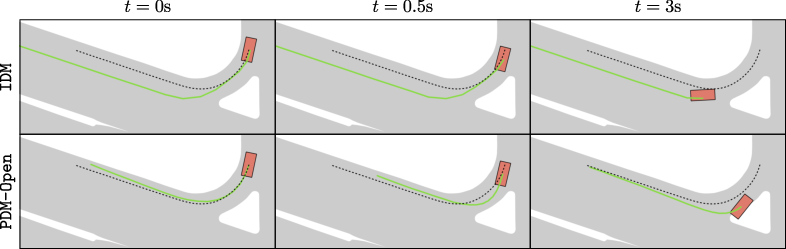

# Parting with Misconceptions about Learning-based Vehicle Motion Planning

*Figure 1: Planning vs. ego-forecasting. A nuPlan scenario showing the driveable area (grey) and original human trajectory (dashed black line). The ego agent (red) and its prediction (green) are shown at different time steps.*

## TLDR

- The paper reveals a misalignment between open-loop and closed-loop evaluation in autonomous vehicle motion planning.
- Simple rule-based planners like IDM outperform state-of-the-art learning-based methods in closed-loop performance on the nuPlan benchmark.
- For open-loop ego-forecasting, a centerline representation is sufficient to achieve strong performance, challenging the need for complex scene representations.
- The authors propose a hybrid planner (PDM-Hybrid) that combines the strengths of rule-based and learning-based approaches, winning the nuPlan planning challenge 2023.

## Introduction

As researchers in autonomous driving, we often find ourselves caught up in the excitement of developing increasingly complex learning-based motion planning systems. However, a recent paper titled "Parting with Misconceptions about Learning-based Vehicle Motion Planning" by Daniel Dauner, Marcel Hallgarten, Andreas Geiger, and Kashyap Chitta from the University of Tübingen and Robert Bosch GmbH challenges some of our long-held assumptions in this field.

In this blog post, we'll dive deep into their findings, which not only question the effectiveness of current learning-based approaches but also propose a surprisingly simple yet powerful solution. Let's explore how this work might reshape our understanding of vehicle motion planning.

## Background: The nuPlan Benchmark

Before we delve into the paper's key findings, it's crucial to understand the context of their experiments. The authors base their work on the nuPlan dataset and simulator, which represents a significant advancement in autonomous driving research.

### What is nuPlan?

nuPlan is the first large-scale, publicly available real-world planning benchmark. It consists of:

- 1,300 hours of real-world driving data
- A data-driven simulator that closely mimics real-world conditions
- Standardized evaluation metrics for both open-loop and closed-loop performance

### Evaluation Metrics

nuPlan offers three primary evaluation metrics:

1. Open-loop score (OLS): Measures ego-forecasting accuracy using distance-based metrics.
2. Closed-loop score non-reactive (CLS-NR): Assesses driving performance in simulation where other actors follow pre-recorded trajectories.
3. Closed-loop score reactive (CLS-R): Similar to CLS-NR, but other vehicles use an Intelligent Driver Model (IDM) planner.

Each score is a weighted average of sub-scores, ranging from 0 to 100, with higher scores being better.

## Key Finding 1: The Misalignment of Open-loop and Closed-loop Evaluation

One of the most surprising revelations in this paper is the discovery of a negative correlation between open-loop and closed-loop performance. This finding challenges the common assumption that improvements in ego-forecasting (open-loop) naturally lead to better real-world driving performance (closed-loop).

### The Experiment

To demonstrate this misalignment, the authors introduced two baseline models:

1. **IDM (Intelligent Driver Model)**: A simple rule-based planner that follows a leading vehicle while maintaining a safe distance.

2. **PDM-Open (Predictive Driver Model - Open)**: A straightforward multi-layer perceptron (MLP) designed to predict future waypoints based on the centerline and ego history.

The IDM model is defined by the following equation:

$$ \frac{dv}{dt} = a \left(1 - \left(\frac{v}{v_0}\right)^{\delta} - \left(\frac{s^*}{s}\right)^2 \right) $$

Where:
- $v$ is the current velocity
- $s$ is the distance to the leading vehicle
- $a$, $v_0$, $s^*$, and $\delta$ are manually selected parameters

The PDM-Open model, on the other hand, uses an MLP to predict future waypoints:

$$ \mathbf{w}_{\text{Open}} = \phi_{\text{Open}}(\mathbf{c}, \mathbf{h}) $$

Where:
- $\mathbf{c}$ is the centerline
- $\mathbf{h}$ is the ego history
- $\phi_{\text{Open}}$ is the MLP with two 512-dimensional hidden layers

### Results and Implications

The results of this experiment were striking:

| Method | CLS-R ↑ | CLS-NR ↑ | OLS ↑ |
|--------|---------|----------|-------|
| IDM    | 77      | 76       | 38    |
| PDM-Open | 54    | 50       | 86    |

These results reveal a clear trade-off between closed-loop (CLS) and open-loop (OLS) performance. The rule-based IDM planner excels in closed-loop scenarios but performs poorly in open-loop evaluation. Conversely, the learning-based PDM-Open model achieves high open-loop scores but struggles in closed-loop simulations.

This misalignment raises important questions about the relevance of current ego-forecasting techniques in real-world driving scenarios. It suggests that we may need to reconsider how we evaluate and develop motion planning systems for autonomous vehicles.

## Key Finding 2: The Surprising Effectiveness of Rule-based Planning

Another unexpected discovery in this paper is the superior performance of simple rule-based planners compared to state-of-the-art learning-based methods in closed-loop evaluations.

### Comparing Rule-based and Learning-based Approaches

The authors implemented and evaluated several state-of-the-art learning-based planners alongside their rule-based IDM planner:

1. **Urban Driver**: Encodes polygons with PointNet layers and predicts trajectories using a linear layer after a multi-head attention block.
2. **GC-PGP**: Clusters trajectory proposals based on route-constrained lane-graph traversals.
3. **PlanCNN**: Predicts waypoints using a CNN from rasterized grid features.

The results were surprising:

| Method | CLS-R ↑ | CLS-NR ↑ | OLS ↑ | Time ↓ |
|--------|---------|----------|-------|--------|
| Urban Driver | 50 | 53 | 82 | 64 |
| GC-PGP | 55 | 59 | 83 | 100 |
| PlanCNN | 72 | 73 | 64 | 43 |
| IDM | 77 | 76 | 38 | 27 |

The simple rule-based IDM planner outperformed all learning-based methods in terms of closed-loop performance (CLS-R and CLS-NR) while also being the fastest in terms of runtime.

### Implications for Autonomous Driving Research

These results challenge the prevailing notion that rule-based planning faces difficulties in generalization. They suggest that we may have been overlooking the potential of simpler, more interpretable approaches in our pursuit of increasingly complex learning-based systems.

This finding raises several important questions:

1. Have we been overcomplicating our motion planning systems?
2. Are there fundamental limitations to current learning-based approaches that we haven't fully understood?
3. How can we better leverage the strengths of both rule-based and learning-based methods?

## Key Finding 3: The Power of Simplicity in Ego-forecasting

Perhaps the most counterintuitive discovery in this paper is that a simple centerline representation is sufficient for achieving state-of-the-art performance in open-loop ego-forecasting.

### The Centerline-Only Approach

The authors implemented a naive learned planning baseline called PDM-Open, which uses only the centerline and ego history as input. Surprisingly, this simple approach outperformed more complex models that incorporate detailed scene representations such as lane graphs, vectorized maps, and rasterized maps.

The PDM-Open model architecture is remarkably simple:

1. The centerline is sampled with a resolution of 1 meter up to a length of 120 meters.
2. The ego history incorporates positions, velocities, and accelerations over the previous two seconds, sampled at 5Hz.
3. Both inputs are linearly projected to feature vectors of size 512, concatenated, and fed into an MLP with two 512-dimensional hidden layers.

### Results and Implications

The PDM-Open model achieved an impressive Open Loop Score (OLS) of 86, outperforming all other methods in the study. This result challenges the common belief that complex scene representations are necessary for accurate ego-forecasting.

These findings have several important implications:

1. We may be overengineering our input representations for ego-forecasting tasks.
2. The relationship between scene complexity and forecasting accuracy may not be as straightforward as previously thought.
3. There could be untapped potential in simpler, more efficient approaches to motion planning.

## The PDM-Hybrid: Combining the Best of Both Worlds

Building on their insights, the authors propose a hybrid approach called PDM-Hybrid, which combines the strengths of rule-based planning and learning-based ego-forecasting.

### PDM-Closed: An Enhanced Rule-based Planner

The authors first extend the IDM planner to create PDM-Closed, incorporating several concepts from model predictive control:

1. **Forecasting**: Simple constant velocity forecasting for other agents.
2. **Proposals**: Generate multiple trajectory proposals using different target speeds and lateral offsets.
3. **Simulation**: Simulate proposals using a kinematic bicycle model.
4. **Scoring**: Evaluate proposals based on traffic rule compliance, progress, and comfort.
5. **Trajectory selection**: Choose the highest-scoring proposal and extend it to the full horizon.

### PDM-Hybrid: Integrating Learning-based Corrections

To combine the precise short-term actions of PDM-Closed with the accurate long-term predictions of PDM-Open, the authors introduce PDM-Hybrid. This model uses a learned module (PDM-Offset) to predict offsets to the waypoints from PDM-Closed:

$$ \mathbf{w}_{\text{Hybrid}}^t = \mathbf{w}_{\text{Closed}}^t + \mathbb{1}_{[t > C]} \phi^t_{\text{Offset}}(\mathbf{w}_{\text{Closed}}, \mathbf{c}, \mathbf{h}) $$

Where:
- $\mathbf{w}_{\text{Closed}}^t$ are the PDM-Closed waypoints
- $C$ is the correction horizon (default 2 seconds)
- $\phi_{\text{Offset}}$ is an MLP with the same architecture as PDM-Open

### Results: A New State-of-the-Art

The PDM-Hybrid model achieved remarkable results, outperforming all other methods in both closed-loop and open-loop evaluations:

| Method | CLS-R ↑ | CLS-NR ↑ | OLS ↑ | Time ↓ |
|--------|---------|----------|-------|--------|
| PDM-Closed | 92 | 93 | 42 | 91 |
| PDM-Open | 54 | 50 | 86 | 7 |
| PDM-Hybrid | 92 | 93 | 84 | 96 |

These results demonstrate that it's possible to achieve strong performance in both closed-loop planning and open-loop ego-forecasting with a relatively simple hybrid approach.

## Winning the nuPlan Challenge 2023

The effectiveness of the PDM-Hybrid approach was further validated by its performance in the 2023 nuPlan challenge. A preliminary version of PDM-Hybrid ranked first out of 25 participating teams, achieving the highest overall score:

| Method | CLS-R ↑ | CLS-NR ↑ | OLS ↑ | Score ↑ |
|--------|---------|----------|-------|---------|
| PDM-Hybrid* | 93 | 93 | 83 | 90 |
| 2nd Place | 89 | 88 | 85 | 87 |
| 3rd Place | 82 | 85 | 88 | 85 |

This success in a competitive real-world challenge underscores the practical value of the insights and approaches presented in this paper.

## Discussion and Future Directions

The findings presented in this paper challenge several long-held assumptions in the field of autonomous vehicle motion planning. Here are some key takeaways and areas for future research:

1. **Rethinking Evaluation Metrics**: The misalignment between open-loop and closed-loop performance suggests that we need to reconsider how we evaluate motion planning systems. Future work could focus on developing more holistic evaluation frameworks that better reflect real-world driving requirements.

2. **Exploring Simple Rule-based Approaches**: The strong performance of rule-based planners like IDM indicates that there's still untapped potential in these approaches. Researchers should consider revisiting and refining rule-based methods alongside learning-based ones.

3. **Simplifying Input Representations**: The success of the centerline-only approach in ego-forecasting suggests that we may be overcomplicating our input representations. Future work could explore minimal yet effective scene representations for various driving tasks.

4. **Developing Hybrid Approaches**: The PDM-Hybrid model demonstrates the potential of combining rule-based and learning-based methods. There's likely much more to explore in this direction, potentially leading to more robust and efficient planning systems.

5. **Addressing Limitations**: While the PDM-Hybrid model shows impressive performance, it still has limitations, such as the inability to execute lane changes. Future work could focus on extending the model to handle more complex maneuvers while maintaining its simplicity and efficiency.

6. **Improving Simulation Environments**: The authors note some limitations in the nuPlan simulator, such as unrealistic behavior of background agents. Developing more refined reactive environments for testing autonomous driving systems could be a valuable area of research.

## Conclusion

This paper serves as a wake-up call for the autonomous driving research community. It challenges us to question our assumptions, reevaluate our methods, and consider the value of simplicity in our pursuit of better motion planning systems.

By demonstrating the effectiveness of rule-based planning, the power of simple representations, and the potential of hybrid approaches, the authors have opened up new avenues for research and development in autonomous driving. As we move forward, it's crucial that we keep these insights in mind and continue to critically examine our methods and assumptions.

The success of the PDM-Hybrid model in the nuPlan challenge shows that sometimes, the most effective solutions come from combining simple, well-understood techniques with carefully applied machine learning. As we continue to push the boundaries of autonomous driving technology, let's not forget the power of simplicity and the importance of challenging our preconceptions.

