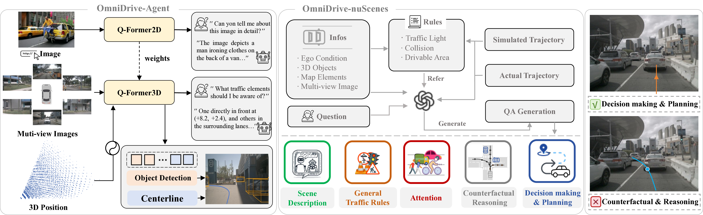
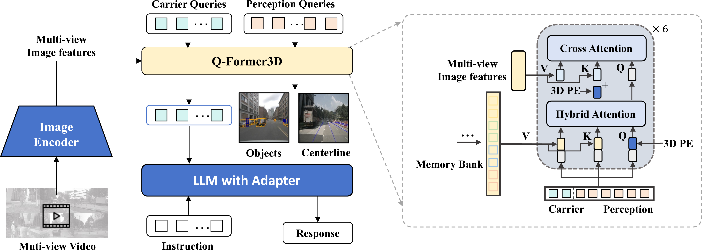

---
title: "OmniDrive: Holistic LLM-Agents for Autonomous Driving with 3D Perception, Reasoning and Planning"
date: 2020-09-15T11:30:03+00:00
# weight: 1
# aliases: ["/first"]
tags: ['autonomous driving', 'large language models', '3D perception', 'reasoning', 'planning', 'multimodal learning', 'computer vision', 'deep learning']
author: "Me"
# author: ["Me", "You"] # multiple authors
showToc: true
TocOpen: true
draft: false
hidemeta: false
comments: false
description: ""
canonicalURL: "https://canonical.url/to/page"
disableHLJS: true # to disable highlightjs
disableShare: false
disableHLJS: false
hideSummary: false
searchHidden: false
ShowReadingTime: true
ShowBreadCrumbs: true
ShowPostNavLinks: true
ShowWordCount: true
ShowRssButtonInSectionTermList: true
UseHugoToc: true
cover:
    image: "<image path/url>" # image path/url
    alt: "<alt text>" # alt text
    caption: "<text>" # display caption under cover
    relative: false # when using page bundles set this to true
    hidden: true # only hide on current single page
editPost:
    URL: "https://github.com/<path_to_repo>/content"
    Text: "Suggest Changes" # edit text
    appendFilePath: true # to append file path to Edit link
---

# OmniDrive: Holistic LLM-Agents for Autonomous Driving with 3D Perception, Reasoning and Planning

*Figure 1: Overview of OmniDrive, showing the novel OmniDrive-Agent model architecture and OmniDrive-nuScenes benchmark tasks.*

## TL;DR

- OmniDrive introduces a holistic framework for end-to-end autonomous driving using large language model (LLM) agents
- Key contributions:
  1. OmniDrive-Agent: A novel 3D vision-language model leveraging sparse queries for efficient 3D perception and reasoning
  2. OmniDrive-nuScenes: A comprehensive benchmark with visual question-answering tasks for 3D reasoning and planning
- The approach demonstrates strong 3D spatial understanding and counterfactual reasoning capabilities for complex driving scenarios

## Introduction

The rapid advancement of multimodal large language models (MLLMs) has sparked growing interest in applying LLM-based approaches to autonomous driving. These models offer powerful reasoning capabilities that could potentially enhance planning and decision-making for self-driving vehicles. However, fully leveraging MLLMs for autonomous driving poses significant challenges:

1. Extending 2D understanding to complex 3D environments
2. Handling high-resolution, multi-view video inputs efficiently
3. Aligning perception with reasoning and planning in 3D space

In this blog post, we'll dive deep into OmniDrive, a novel framework that addresses these challenges through a holistic approach to end-to-end autonomous driving with LLM agents. We'll explore the key components of OmniDrive: the OmniDrive-Agent model architecture and the OmniDrive-nuScenes benchmark. By the end, you'll have a comprehensive understanding of how this framework pushes the boundaries of LLM-based autonomous driving.

## OmniDrive-Agent: A Novel 3D MLLM Architecture

At the heart of OmniDrive is a carefully designed 3D multimodal large language model (MLLM) architecture. Let's break down the key components and innovations that make this model unique.

### Q-Former3D: Bridging 2D and 3D Understanding

The OmniDrive-Agent builds upon the Q-Former architecture introduced in BLIP-2 [1], but extends it to handle 3D spatial information. This design choice offers several advantages:

1. **Efficient handling of high-resolution inputs**: Unlike self-attention based MLLMs (e.g., LLaVA-1.5 [2]), which are limited to low-resolution inputs, the cross-attention design of Q-Former allows for processing higher resolution images by compressing visual information into sparse queries.

2. **Leveraging 2D pre-training**: The architecture allows for minimal adjustments to utilize knowledge from 2D pre-training while gaining crucial 3D spatial understanding.

3. **Alignment with 3D perception models**: The Q-Former architecture shares similarities with query-based 3D perception models like DETR3D [3], PETR [4], and StreamPETR [5]. This alignment enables the integration of 3D position encoding and supervision from 3D perception tasks.

Let's dive into the mathematical formulation of the Q-Former3D:

1. **2D Q-Former (for comparison)**:

   $$\tilde{Q}_t = f_q(Q_t, F_s)$$

   Where $Q_t$ is the initialized text embedding, $F_s$ is the single-view image features, and $\tilde{Q}_t$ is the refined text embedding.

2. **3D Q-Former**:

   $$\tilde{Q}_d = f_d(Q_d, F_m + P_m)$$

   Where $Q_d$ are the initialized detection queries, $F_m$ are multi-view image features, $P_m$ is the 3D position encoding, and $\tilde{Q}_d$ are the refined detection queries.

### OmniDrive-Agent Architecture

*Figure 2: Detailed architecture of OmniDrive-Agent, showing the Q-Former3D structure and temporal modeling.*

The OmniDrive-Agent architecture consists of the following key components:

1. **Shared Visual Encoder**: Extracts multi-view image features $F_m \in \mathbb{R}^{N \times C \times H \times W}$

2. **Q-Former3D**: Processes the extracted features with 3D position encoding $P_m$

3. **Detection and Carrier Queries**: Initialize detection queries $Q_d$ and carrier queries $Q_c$

4. **Self-Attention and Cross-Attention**: 

   Self-attention:
   
   $$(Q, K, V) = ([Q_c, Q_d], [Q_c, Q_d], [Q_c, Q_d])$$
   $$\tilde{Q} = \text{Multi-head Attention}(Q, K, V)$$

   Cross-attention:
   
   $$(Q, K, V) = ([Q_c, Q_d], P_m + F_m, F_m)$$
   $$\tilde{Q} = \text{Multi-head Attention}(Q, K, V)$$

5. **Perception Head**: Uses detection queries to predict categories and coordinates of foreground elements

6. **Language Model Integration**: Carrier queries are processed through an MLP and fed into the LLM for text generation

### Multi-task Learning and Temporal Modeling

OmniDrive-Agent incorporates two additional key features:

1. **Multi-task Learning**: Integrates task-specific Q-Former3D modules for different perception tasks (e.g., center-line construction, 3D object detection)

2. **Temporal Modeling**: Utilizes a memory bank to store and propagate top-k perception queries across frames, enabling effective processing of video inputs

### Training Strategy

The training of OmniDrive-Agent occurs in two stages:

1. **2D Pre-training**: 
   - Initializes Q-Former and carrier queries on 2D image tasks
   - Uses LLaVA v1.5 training recipe and data
   - Two-step process: image-text pair training followed by instruction tuning

2. **3D Fine-tuning**:
   - Enhances 3D localization while retaining 2D semantic understanding
   - Fine-tunes visual encoder and LLM with LoRA [6]
   - Trains Q-Former3D with a larger learning rate

## OmniDrive-nuScenes: A Comprehensive Benchmark

To evaluate the capabilities of drive LLM-agents, the authors introduce OmniDrive-nuScenes, a novel benchmark built on the nuScenes dataset [7]. This benchmark features high-quality visual question-answering (QA) pairs that cover perception, reasoning, and planning in 3D environments.

### Key Features of OmniDrive-nuScenes

1. **Automated QA Generation**: Utilizes GPT-4 for generating QA pairs, leveraging 3D perception ground truths, traffic rules, and planning simulations as context

2. **Long-horizon Questions**: Focuses on attention, counterfactual reasoning, and open-loop planning, challenging true spatial understanding and planning capabilities in 3D space

3. **Online Grounding Questions**: Provides a pipeline for generating various types of grounding questions on-the-fly, enhancing 3D spatial understanding and reasoning capabilities

### Offline Question-Answering

The offline QA generation pipeline uses several types of prompts to generate diverse and challenging questions:

1. **Caption**: Scene description based on multi-view images
2. **Lane-object Association**: Representation of relationships between objects and lane lines
3. **Simulated Trajectories**: Generated for counterfactual reasoning
4. **Expert Trajectory**: Log replay trajectory from nuScenes

Using these prompts, the pipeline generates various types of QA responses:

1. **Scene Description**: Detailed description of the driving environment
2. **Attention**: Identification of relevant traffic elements
3. **Counterfactual Reasoning**: Analysis of potential outcomes for different driving decisions
4. **Decision Making and Planning**: Reasoning about safe trajectories and optimal actions
5. **General Conversation**: Multi-turn dialogues covering object counting, colors, relative positions, and OCR-type tasks

### Online Question-Answering

To fully leverage 3D perception labels, OmniDrive-nuScenes includes an online QA generation pipeline with the following tasks:

1. **2D-to-3D Grounding**: Mapping 2D bounding boxes to 3D object properties
2. **3D Distance**: Identifying nearby traffic elements based on 3D coordinates
3. **Lane-to-objects**: Listing objects present on a given lane with their 3D properties

### Evaluation Metrics

OmniDrive-nuScenes employs a range of metrics to evaluate model performance:

1. **Caption-related Tasks**: METEOR [8], ROUGE [9], and CIDEr [10] for sentence similarity
2. **Open-loop Planning**: Collision Rate and Intersection Rate with road boundaries
3. **Counterfactual Reasoning**: Precision and Recall for extracted keywords (safety, collision, traffic violations, etc.)

## Experimental Results and Analysis

The authors conducted extensive experiments to validate the effectiveness of OmniDrive. Let's examine some of the key findings:

### Planning with Counterfactual Reasoning

Table 1 presents the results of various model configurations on planning-related tasks:

*Table 1: Ablation study on planning-related tasks. P and R represent Precision and Recall, respectively.*

Key observations:

1. The full OmniDrive-Agent model (Q-Former3D) achieves the best overall performance across counterfactual reasoning and open-loop planning tasks.
2. Q-Former3D outperforms Q-Former2D in 3D-related tasks such as collision detection and drivable area identification.
3. The inclusion of lane supervision (center-line construction tasks) improves performance on drivable area tasks.

### Counterfactual Reasoning and Captioning

Key findings:

1. The full OmniDrive-Agent model achieves the best performance in counterfactual reasoning, with average precision of 52.3% and average recall of 59.6%.
2. Q-Former3D demonstrates comparable performance to Q-Former2D on caption tasks, while offering the advantage of processing multi-view cameras simultaneously.
3. The dense BEV model yields the poorest results, likely due to its inability to leverage 2D pre-training benefits.

### Comparison on NuScenes-QA

The authors also evaluated OmniDrive on the NuScenes-QA benchmark [11], comparing it to other state-of-the-art methods:

OmniDrive achieves an accuracy of 59.2% using only camera inputs, outperforming other camera-based methods and approaching the performance of lidar-based models.

### Open-loop Planning

Key takeaways:

1. OmniDrive achieves comparable performance to state-of-the-art methods in open-loop planning.
2. Encoding ego status significantly improves metrics across all methods.
3. The use of high-level commands drastically reduces collision and intersection rates.

### Qualitative Analysis

To better understand the capabilities of OmniDrive-Agent, let's examine a qualitative example:

*Figure 3: Visualization of scene description and counterfactual reasoning capabilities.*

In this example, OmniDrive-Agent demonstrates:

1. Accurate scene description, including weather conditions, traffic elements, and spatial relationships
2. Strong counterfactual reasoning abilities, correctly identifying potential dangers of an incorrect turning maneuver

## Conclusion and Future Directions

OmniDrive presents a significant step forward in end-to-end autonomous driving with LLM agents. By addressing the challenges of 3D perception, reasoning, and planning, the framework demonstrates the potential for more interpretable and safer autonomous driving systems.

Key contributions and insights:

1. The Q-Former3D architecture efficiently handles high-resolution multi-view inputs while leveraging 2D pre-training knowledge.
2. The OmniDrive-nuScenes benchmark provides a comprehensive evaluation framework for 3D reasoning and planning capabilities.
3. Experimental results show strong performance in counterfactual reasoning and open-loop planning tasks.

Future research directions may include:

1. Extending the framework to even larger datasets like nuPlan [12]
2. Incorporating closed-loop simulations for more realistic counterfactual reasoning
3. Exploring the integration of OmniDrive with other autonomous driving components and systems

As the field of autonomous driving continues to evolve, frameworks like OmniDrive that combine the power of large language models with 3D perception and reasoning capabilities are likely to play an increasingly important role in developing safer and more capable self-driving vehicles.

## References

[1] Li, J., Li, D., Savarese, S., & Hoi, S. (2023). BLIP-2: Bootstrapping language-image pre-training with frozen image encoders and large language models. In ICML.

[2] Liu, H., Li, C., Wu, Q., & Lee, Y. J. (2023). Visual instruction tuning. NeurIPS.

[3] Wang, Y., Vitor Campagnolo, G., Zhang, T., Zhao, H., & Solomon, J. (2022). DETR3D: 3d object detection from multi-view images via 3d-to-2d queries. In CoRL.

[4] Liu, Y., Wang, T., Zhang, X., & Sun, J. (2022). PETR: Position embedding transformation for multi-view 3d object detection. arXiv:2203.05625.

[5] Wang, S., Liu, Y., Wang, T., Li, Y., & Zhang, X. (2023). Exploring object-centric temporal modeling for efficient multi-view 3d object detection. arXiv:2303.11926.

[6] Hu, E. J., Shen, Y., Wallis, P., Allen-Zhu, Z., Li, Y., Wang, S., Wang, L., & Chen, W. (2021). LoRA: Low-rank adaptation of large language models. arXiv:2106.09685.

[7] Caesar, H., Bankiti, V., Lang, A. H., Vora, S., Liong, V. E., Xu, Q., Krishnan, A., Pan, Y., Baldan, G., & Beijbom, O. (2020). nuScenes: A multimodal dataset for autonomous driving. In CVPR.

[8] Banerjee, S., & Lavie, A. (2005). METEOR: An automatic metric for MT evaluation with improved correlation with human judgments. In ACL workshop.

[9] Lin, C. Y. (2004). ROUGE: A package for automatic evaluation of summaries. In Text Summarization Branches Out.

[10] Vedantam, R., Lawrence Zitnick, C., & Parikh, D. (2015). CIDEr: Consensus-based image description evaluation. In CVPR.

[11] Qian, T., Chen, J., Zhuo, L., Jiao, Y., & Jiang, Y. G. (2023). NuScenes-QA: A multi-modal visual question answering benchmark for autonomous driving scenario. arXiv:2305.14836.

[12] Caesar, H., Kabzan, J., Tan, K. S., Fong, W. K., Wolff, E., Lang, A., Fletcher, L., Beijbom, O., & Omari, S. (2021). NuPlan: A closed-loop ml-based planning benchmark for autonomous vehicles. arXiv:2106.11810.

