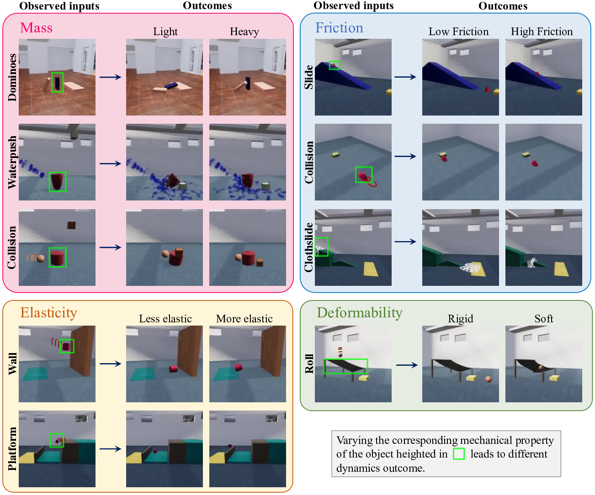

---
title: "Physion++: A New Benchmark for Physical Property Inference in AI"
date: 2024-11-05T11:06:11.876802
# weight: 1
# aliases: ["/first"]
tags: ['physical scene understanding', 'AI benchmarks', 'latent property inference', 'physics prediction', 'object-centric models', 'human-like reasoning']
author: "Me"
# author: ["Me", "You"] # multiple authors
showToc: true
TocOpen: true
draft: false
hidemeta: false
comments: false
description: ""
canonicalURL: "https://canonical.url/to/page"
disableHLJS: true # to disable highlightjs
disableShare: false
disableHLJS: false
hideSummary: false
searchHidden: false
ShowReadingTime: true
ShowBreadCrumbs: true
ShowPostNavLinks: true
ShowWordCount: true
ShowRssButtonInSectionTermList: true
UseHugoToc: true
cover:
    image: "<image path/url>" # image path/url
    alt: "<alt text>" # alt text
    caption: "<text>" # display caption under cover
    relative: false # when using page bundles set this to true
    hidden: true # only hide on current single page
editPost:
    URL: "https://github.com/<path_to_repo>/content"
    Text: "Suggest Changes" # edit text
    appendFilePath: true # to append file path to Edit link
---


# Physion++: Evaluating Physical Scene Understanding that Requires Online Inference of Different Physical Properties


*Figure 1: Overview of Physion++ scenarios testing different mechanical properties*

## TLDR

- Physion++ is a new benchmark for evaluating physical scene understanding in AI systems, focusing on the ability to infer latent physical properties like mass, friction, elasticity, and deformability.
- The benchmark includes 9 scenarios across 4 mechanical properties, requiring models to make predictions about object interactions based on inferred properties.
- Experiments show current state-of-the-art models struggle with this task, performing only slightly above chance and far below human performance.
- Results highlight the need for improved physical property inference capabilities in AI systems to achieve more human-like physical reasoning.

## Introduction

As AI systems become increasingly sophisticated, there's a growing need to evaluate their ability to understand and reason about the physical world in ways similar to humans. While we've seen impressive progress in areas like object recognition and tracking, truly understanding physical scenes requires more nuanced capabilities - particularly the ability to infer latent physical properties of objects and use that information to make predictions.

In this blog post, we'll dive into the Physion++ benchmark, a new dataset and evaluation framework designed to test exactly these capabilities in AI systems. Developed by researchers from MIT, Stanford, UC Berkeley, and other institutions, Physion++ presents a significant step forward in assessing physical scene understanding.

## The Challenge of Physical Property Inference

Before we get into the details of Physion++, let's consider why inferring physical properties is so crucial for general physical understanding. As humans, we don't just see objects - we perceive their mechanical properties as well. When we watch objects move and interact, we can infer things like:

- Mass: Is an object heavy or light?
- Friction: Is a surface slippery or rough?
- Elasticity: Will an object bounce or deform on impact?
- Deformability: Is an object rigid or soft?

These inferences allow us to make predictions about how objects will behave in new situations. For example, if we see a box sink into a couch cushion, we might infer it's heavy and adjust our expectations for how it will behave when picked up.

Current AI benchmarks for physical understanding often don't require this level of property inference. They might test prediction capabilities, but usually in scenarios where all objects have the same density, elasticity, etc. This means models can sometimes succeed without truly understanding the underlying physical principles at play.

## Introducing Physion++

Physion++ aims to address this gap by explicitly testing models' ability to infer latent physical properties and use them for prediction. Let's break down the key components of this benchmark:

### Dataset Design

The Physion++ dataset consists of 9 scenarios across 4 mechanical properties:

1. Mass
   - Mass-Dominoes
   - Mass-Waterpush
   - Mass-Collision
2. Elasticity
   - Elasticity-Wall
   - Elasticity-Platform
3. Friction
   - Friction-Slide
   - Friction-Collision
   - Friction-Clothslide
4. Deformability
   - Deform-Roll

Each scenario is designed so that the outcome depends critically on the latent physical properties of the objects involved. For example, in the Mass-Dominoes scenario, whether a chain of falling dominoes completes depends on the relative masses of the dominoes - something that can't be determined from visual appearance alone.

### Video Structure

The videos in Physion++ are structured to allow for property inference before prediction:

1. Inference Phase: The initial part of the video shows objects interacting in ways that reveal information about their physical properties.
2. Transition Phase (if needed): A curtain covers the scene while objects are rearranged for the prediction task.
3. Prediction Phase: Two objects are highlighted (in red and yellow), and the model must predict whether they will come into contact.

This structure ensures that models have the opportunity to infer properties before making predictions, mimicking the way humans might approach these scenarios.

### Dataset Composition

Physion++ includes three main components:

1. Dynamics Training Set: 2,000 trials per mechanical property, without labels, for training dynamics models.
2. Readout Fitting Set: 192 trials per property, with labels, for training the final prediction layer.
3. Testing Set: 192 trials per property, carefully balanced and paired to avoid superficial cues.

## Evaluating Model Performance

The researchers evaluated several state-of-the-art models on Physion++, representing different approaches to physical prediction:

1. Pixel-wise prediction models (e.g., MCVD)
2. Supervised visual encoders with unsupervised MLPs (e.g., pRESNET-mlp, pVGG-mlp, pDEIT-mlp)
3. Object-centric video models (e.g., SlotFormer, ALOE)
4. 3D particle-based graph neural networks (e.g., DPI-Net)

These models were tested under different training protocols (unified vs. separate for each property) and with different levels of observation (with property inference, without property inference, and fully observed).

### Key Findings

1. Most models performed only slightly above chance (around 55% accuracy), far below human performance (around 60%).
2. Training on all properties together (unified) typically led to worse performance than training separately on each property.
3. Models generally didn't show significant improvement when given the opportunity for property inference, suggesting they weren't effectively using this information.
4. Models with object-centric representations (like SlotFormer) tended to perform slightly better, but still far from human-level.
5. The 3D particle-based model (DPI-Net) performed best overall, likely due to its access to ground truth 3D information.

Here's a snippet of the results table for the overall performance across properties:

```
Model           | w/ property | w/o property | fully observed
----------------|-------------|--------------|----------------
MCVD            | 54.3        | 54.3         | 59.9
DeiT-mlp        | 55.4        | 54.1         | 63.9
ResNet-mlp      | 55.1        | 54.8         | 61.2
VGG-mlp         | 55.5        | 55.1         | 56.0
ALOE            | 53.4        | 52.5         | 55.5
SlotFormer      | 56.7        | 56.2         | 65.1
DPI-Net         | 60.2        | 57.5         | 92.2
```

## Human Performance and Comparison

To provide a baseline and assess how "human-like" the models' predictions were, the researchers also collected data from human participants. 200 people (50 for each mechanical property) were recruited to make predictions on the test set.

The human experiments revealed several interesting findings:

1. Humans performed above chance but not exceptionally well (around 60% accuracy), highlighting the challenging nature of the task.
2. All video-based models performed worse than humans, with only the 3D particle-based DPI-Net approaching human-level performance.
3. Importantly, no model correlated well with human predictions. The highest correlation was achieved by SlotFormer (r=0.12), far below the split-half human correlation (r=0.37).
4. Models tended to underperform humans on "easy" trials (where humans were very accurate) but outperform on "difficult" trials, suggesting they're using different strategies or cues than humans.

These results indicate that while current models can achieve some success in physical prediction tasks, they're not reasoning about physics in a human-like way, particularly when it comes to inferring and using latent physical properties.

## Implications and Future Directions

The Physion++ benchmark reveals significant gaps in current AI systems' ability to understand and reason about physics in ways similar to humans. Some key takeaways and areas for future research include:

1. **Improved Property Inference**: Future models need to develop better mechanisms for inferring latent physical properties from visual information and using these inferences in predictions.

2. **Object-Centric Approaches**: The slightly better performance of object-centric models suggests this may be a promising direction for further development.

3. **Bridging 2D and 3D**: While 3D particle-based models performed best, they rely on ground truth 3D information. Developing models that can bridge the gap between 2D visual input and 3D physical understanding is crucial.

4. **Human-Like Reasoning**: The low correlation between model and human predictions suggests we need to better understand and potentially mimic human strategies for physical reasoning.

5. **Handling Complexity**: Physion++ introduces scenarios with soft objects and fluids, areas that are less explored in previous benchmarks. Improving performance on these more complex physical interactions is an important challenge.

## Conclusion

Physion++ represents a significant step forward in evaluating AI systems' physical understanding capabilities. By explicitly testing the ability to infer and use latent physical properties, it reveals important limitations in current state-of-the-art models.

As we continue to develop AI systems aimed at general intelligence and real-world interaction, the ability to reason about physics in human-like ways will be crucial. Benchmarks like Physion++ provide valuable insights into our progress and highlight specific areas where improvement is needed.

For researchers and practitioners in the field, Physion++ offers a new challenge to tackle and a framework for evaluating progress in physical scene understanding. As models improve on this benchmark, we can expect to see AI systems that are better equipped to understand and interact with the physical world around us.

The full dataset, along with code and additional resources, is available at the [Physion++ project page](https://dingmyu.github.io/physion_v2/). I encourage interested readers to explore the dataset and consider how we might develop models that can truly understand the physical world in all its complexity.

## References

1. Bear, D. M., Wang, E., Mrowca, D., Binder, F. J., Tung, H. Y. F., Pramod, R. T., ... & Fan, J. E. (2021). Physion: Evaluating physical prediction from vision in humans and machines. arXiv preprint arXiv:2106.08261.

2. Riochet, R., Castro, M. Y., Bernard, M., Lerer, A., Fergus, R., Izard, V., & Dupoux, E. (2021). IntPhys 2019: A benchmark for visual intuitive physics understanding. IEEE Transactions on Pattern Analysis and Machine Intelligence, 44(9), 5016-5025.

3. Yi, K., Gan, C., Li, Y., Kohli, P., Wu, J., Torralba, A., & Tenenbaum, J. B. (2019). CLEVRER: Collision events for video representation and reasoning. arXiv preprint arXiv:1910.01442.

4. Voleti, V., Jolicoeur-Martineau, A., & Pal, C. (2022). Masked conditional video diffusion for prediction, generation, and interpolation. arXiv preprint arXiv:2205.09853.

5. Wu, Z., Dvornik, N., Greff, K., Kipf, T., & Garg, A. (2022). Slotformer: Unsupervised visual dynamics simulation with object-centric models. arXiv preprint arXiv:2210.05861.

6. Ding, D., Hill, F., Santoro, A., & Botvinick, M. (2020). Object-based attention for spatio-temporal reasoning: Outperforming neuro-symbolic models with flexible distributed architectures. arXiv preprint arXiv:2012.08508.

7. Li, Y., Wu, J., Tedrake, R., Tenenbaum, J. B., & Torralba, A. (2018). Learning particle dynamics for manipulating rigid bodies, deformable objects, and fluids. arXiv preprint arXiv:1810.01566.

