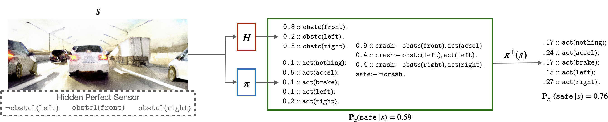
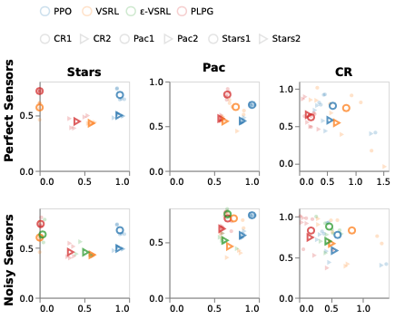

# Safe Reinforcement Learning via Probabilistic Logic Shields



*Figure 1: Overview of Probabilistic Logic Shields. The interaction between the base policy π, state abstraction H, and safety specification is encoded using a ProbLog program T. This provides a unified language to express many aspects of the shielding process. The shielded policy π+(s) decreases the probability of unsafe actions like acceleration and increases the likelihood of safe actions.*

## TLDR

- This paper introduces Probabilistic Logic Shields (PLS), a novel approach for safe reinforcement learning that uses probabilistic logic programming to model safety constraints as differentiable functions.
- PLS can be seamlessly integrated with any policy gradient algorithm while providing convergence guarantees.
- Experiments show that PLS learns safer and more rewarding policies compared to state-of-the-art shielding techniques.
- The method handles uncertainty in sensor readings and balances safety and reward in a principled way.

## Introduction

Safe Reinforcement Learning (Safe RL) is a critical area of research as we deploy AI systems in real-world scenarios where mistakes can have serious consequences. A popular approach to Safe RL is shielding, which uses logical safety specifications to prevent an RL agent from taking unsafe actions. However, traditional shielding techniques face challenges when integrated with continuous, end-to-end deep RL methods.

In this blog post, we'll dive into a new technique called Probabilistic Logic Policy Gradient (PLPG) introduced by Yang et al. PLPG is a model-based Safe RL approach that leverages probabilistic logic programming to model logical safety constraints as differentiable functions. This allows for seamless integration with policy gradient algorithms while maintaining convergence guarantees.

## Background

Before we delve into the details of PLPG, let's review some key concepts:

### Probabilistic Logic Programming

Probabilistic Logic Programming (PLP) extends traditional logic programming with probabilistic reasoning. In this paper, the authors use ProbLog, a probabilistic logic programming language. Here are some key components:

- **Atoms**: Predicate symbols followed by a tuple of logical variables and/or constants.
- **Literals**: Atoms or their negations.
- **Probabilistic facts**: Expressions of the form `p_i::f_i` where `p_i` is the probability of fact `f_i` being true.
- **Clauses**: Expressions of the form `h :- b_1, ..., b_n` where `h` is a literal and `b_1, ..., b_n` is a conjunction of literals.

For example:

```prolog
0.8::obstc(front).
safe :- not(crash).
```

This program states that there's an 80% chance of an obstacle in front, and it's safe if there's no crash.

### Shielding in Reinforcement Learning

Shielding is a technique in Safe RL that aims to prevent the agent from taking unsafe actions. Traditional shielding approaches use deterministic logic to define safety constraints. However, this can be limiting in real-world scenarios where uncertainty is inherent.

### Policy Gradients

Policy gradient methods are a class of reinforcement learning algorithms that directly optimize the policy. The general form of policy gradient methods is:

$$
\nabla_\theta J(\theta) = \mathbb{E}_{\pi_\theta}[\sum_{t=0}^{\infty} \Psi_t \nabla_\theta \log \pi_\theta(s_t,a_t)]
$$

where $J(\theta)$ is the expected return, $\pi_\theta$ is the policy parameterized by $\theta$, and $\Psi_t$ is an empirical expectation of the return.

## Probabilistic Logic Shields

The key innovation in this paper is the introduction of Probabilistic Logic Shields (PLS). Unlike traditional deterministic shields, PLS can handle uncertainty and provide a more nuanced view of safety.

### Probabilistic Safety Model

The authors introduce a safety-aware probabilistic model $\mathbf{P}(\mathtt{safe} | a, s)$, which indicates the probability that an action $a$ is safe to execute in state $s$. This model doesn't require full knowledge of the underlying MDP, but only needs to represent safety-relevant dynamics.

The safety of a policy $\pi$ is defined as:

$$
\mathbf{P}_\pi(\mathtt{safe} | s) = \sum_{a\in A} \mathbf{P} (\mathtt{safe}|s,a)\pi(a|s)
$$

### Probabilistic Shielding

The authors define probabilistic shielding as follows:

$$
\pi^+(a|s) = \mathbf{P}_\pi(a|s, \mathtt{safe} ) =\frac{\mathbf{P}(\mathtt{safe} | s, a)}{\mathbf{P}_{\pi}(\mathtt{safe} |s)} \pi(a|s)
$$

This shielded policy $\pi^+$ increases the probabilities of safer actions and decreases the probabilities of less safe actions.

### Implementation with ProbLog

The probabilistic safety model is implemented using ProbLog programs. The program consists of three parts:

1. An annotated disjunction representing the base policy.
2. A set of probabilistic facts representing an abstraction of the current state.
3. A safety specification defined by a set of clauses and annotated disjunctions.

For example:

```prolog
0.1::act(nothing); 0.5::act(accel); 
0.1::act(brake); 0.1::act(left); 
0.2::act(right).

0.8::obstc(front). 0.2::obstc(left). 
0.5::obstc(right).

crash:- act(accel), obstc(front).
safe:- not(crash).
```

This program defines a policy, state abstraction, and safety rules.

## Probabilistic Logic Policy Gradient (PLPG)

PLPG combines the shielded policy gradient with a safety gradient:

$$
\nabla_\theta J(\theta) = \mathbb{E}_{\pi^+_\theta}[\sum_{t=0}^{\infty} \Psi_t \nabla_\theta \log \pi^+_\theta(a_t|s_t) 
- \alpha\nabla_\theta\log \mathbf{P}_{\pi^+_\theta}(\mathtt{safe}|s_t)]
$$

where $\alpha$ is a safety coefficient that controls the weight of the safety gradient.

This approach has several advantages:

1. It provides a realistic safety function that balances safety and reward.
2. It uses a simpler safety model that doesn't require full knowledge of the MDP.
3. It allows for seamless integration with deep RL methods.
4. It comes with convergence guarantees.

## Experiments

The authors conducted experiments in three environments:

1. **Stars**: The agent must collect stars without going into stationary fires.
2. **Pacman**: The agent must collect stars without getting caught by moving fire ghosts.
3. **Car Racing**: The agent must drive around a track without going into the grass area.

They compared PLPG with three baselines:

- PPO: A standard safety-agnostic agent.
- VSRL: An agent with a deterministic rejection-based shield.
- ε-VSRL: A risk-taking variant of VSRL.



*Figure 2: Trade-off between Violation (x-axis) and Return (y-axis). Each small data point is an agent's policy, and the large data points are the average of five seeds. An ideal policy should lie in the upper-left corner.*

The results show that PLPG achieves the lowest violation rates while maintaining comparable or slightly higher returns compared to the baselines. For example, with noisy sensors, PLPG's violation rate is 51.3% lower than PPO, 24.5% lower than VSRL, and 13.5% lower than ε-VSRL.

## Key Insights and Future Directions

1. **Handling Uncertainty**: PLPG's ability to handle noisy sensor readings makes it more suitable for real-world applications where perfect information is rarely available.

2. **Balancing Safety and Reward**: The safety coefficient $\alpha$ allows for fine-tuning the trade-off between safety and reward optimization.

3. **Scalability**: The authors show that PLPG can handle multi-step safety look-ahead, although this increases computational cost.

4. **Integration with Deep RL**: PLPG's differentiable nature allows for seamless integration with various policy gradient algorithms.

Future work could explore:

- Extending PLPG to continuous action spaces.
- Investigating more complex safety specifications and their impact on learning.
- Applying PLPG to real-world robotics tasks with inherent safety concerns.

## Conclusion

Probabilistic Logic Shields and the PLPG algorithm represent a significant step forward in safe reinforcement learning. By combining the expressiveness of probabilistic logic programming with the power of deep RL, this approach offers a promising direction for developing AI systems that can learn to act safely in uncertain environments.

As we continue to deploy AI in critical domains like autonomous driving, healthcare, and robotics, techniques like PLPG will be crucial in ensuring that these systems can balance performance with safety constraints. The ability to handle uncertainty and provide probabilistic guarantees makes this approach particularly appealing for real-world applications.

## References

[1] Yang, W., Marra, G., Rens, G., & De Raedt, L. (2022). Safe Reinforcement Learning via Probabilistic Logic Shields. IJCAI 2022.

[2] Schulman, J., Wolski, F., Dhariwal, P., Radford, A., & Klimov, O. (2017). Proximal Policy Optimization Algorithms. arXiv preprint arXiv:1707.06347.

[3] De Raedt, L., & Kimmig, A. (2015). Probabilistic (logic) programming concepts. Machine Learning, 100(1), 5-47.

[4] Jansen, N., Könighofer, B., Junges, S., Serban, A., & Bloem, R. (2020). Safe reinforcement learning using probabilistic shields. In 31st International Conference on Concurrency Theory (CONCUR 2020).

[5] Sutton, R. S., & Barto, A. G. (2018). Reinforcement Learning: An Introduction. MIT press.

