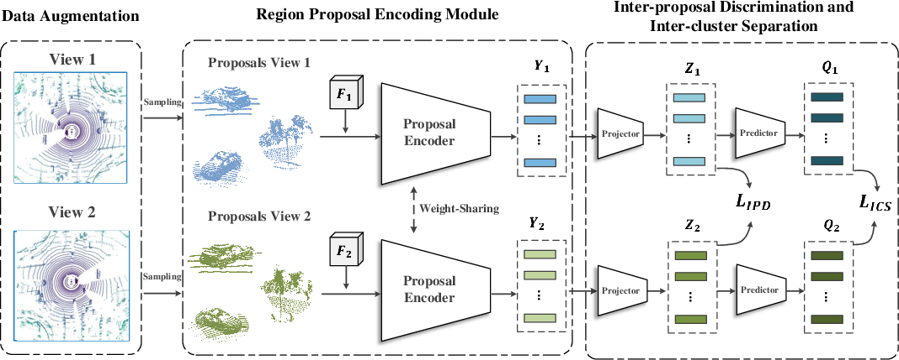
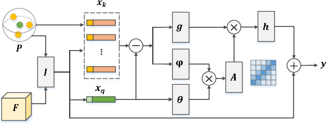

# ProposalContrast: Unsupervised Pre-training for LiDAR-based 3D Object Detection

*Figure 1: Overview of the ProposalContrast framework*

## TL;DR

- ProposalContrast is a novel unsupervised pre-training method for LiDAR-based 3D object detection
- It learns representations by contrasting region proposals, better aligning with 3D detection tasks
- The method incorporates both inter-proposal discrimination and inter-cluster separation
- Significant improvements are shown across multiple 3D detectors and datasets
- ProposalContrast can reduce annotation costs, achieving strong performance with only half the labeled data

## Introduction

3D object detection from LiDAR point clouds is a critical task for autonomous driving. However, annotating 3D point cloud data is expensive and time-consuming. Self-supervised learning offers a promising approach to leverage large amounts of unlabeled data, but existing methods for point cloud pre-training are often not well-aligned with the requirements of 3D object detection.

In this blog post, we'll dive deep into ProposalContrast, a novel unsupervised pre-training framework specifically designed for LiDAR-based 3D object detection. This method, proposed by Yin et al., addresses the limitations of previous approaches by learning representations at the proposal level, which is more suitable for detecting objects in 3D space.

## Background and Motivation

Contrastive learning has shown great success in self-supervised learning for 2D images. However, directly applying these techniques to 3D point clouds is suboptimal due to the unique characteristics of LiDAR data:

1. Objects in LiDAR point clouds are typically smaller and unevenly distributed across a wide range.
2. Each point cloud contains multiple objects, making scene-level contrastive learning less effective.
3. Point- or voxel-level methods lack the context needed to capture object-level characteristics.

ProposalContrast addresses these challenges by focusing on proposal-level representations, which are more aligned with the task of 3D object detection.

## The ProposalContrast Framework

Let's break down the key components of the ProposalContrast framework:

### 1. Data Augmentation

Given an input point cloud $X_0 \in \mathbb{R}^{L_0 \times 3}$, two different augmentation operators $\mathcal{T}_1$ and $\mathcal{T}_2$ are applied to produce two views:

$$
X_1 = \mathcal{T}_1(X_0) \in \mathbb{R}^{L_1 \times 3}, \quad X_2 = \mathcal{T}_2(X_0) \in \mathbb{R}^{L_2 \times 3}
$$

The augmentations include random rotation, scaling, flipping, and point dropout. Importantly, rotation is only applied around the upright axis to maintain the characteristics of self-driving scenarios.

### 2. Correspondence Mapping

A correspondence mapping $M$ is created between points in $X_1$ and $X_2$ by recording the index of each point in the original view $X_0$. This mapping is crucial for sampling and grouping region proposals.

### 3. Region Proposal Generation

Instead of using 3D bounding boxes, which would be computationally expensive, ProposalContrast adopts spherical proposals. The process involves:

1. Removing road plane points to reduce background sampling
2. Using Farthest Point Sampling (FPS) to select $N$ center points
3. Generating spherical proposals by searching for $K$ points within a radius $r$ around each center

This results in two sets of spherical proposals $P_1, P_2 \in \mathbb{R}^{N \times K \times 3}$ from the two views.

### 4. Region Proposal Encoding

A key innovation in ProposalContrast is the region proposal encoding module. Given scene-level representations $\mathbf{F}_1$ and $\mathbf{F}_2$ extracted by a backbone network, the encoding module outputs geometry-aware proposal representations:

$$
\mathbf{Y}_1 = f_\text{En}(P_1, \mathbf{F}_1), \quad \mathbf{Y}_2 = f_\text{En}(P_2, \mathbf{F}_2)
$$

The encoding module $f_\text{En}$ uses a neural attention mechanism to capture geometric relations between points within each proposal.

*Figure 2: Illustration of the region proposal encoding module*

The encoding process involves:

1. Setting the center point feature $\mathbf{x}_q \in \mathbb{R}^{1 \times C}$ as the query
2. Using neighbor features $\mathbf{x}_k \in \mathbb{R}^{K \times C}$ as keys
3. Computing attention weights based on normalized similarities
4. Aggregating information from all keys

The final proposal representation is given by:

$$
\mathbf{y} = \mathbf{x}_q + h(\mathbf{w}_o)
$$

where $h(\cdot)$ is a linear layer and $\mathbf{w}_o$ is the aggregated information from the attention mechanism.

### 5. Joint Optimization

ProposalContrast employs two complementary learning objectives:

1. **Inter-Proposal Discrimination (IPD)**: This task aims to make proposal representations discriminative across instances. The IPD loss is defined as:

$$
\mathcal{L}_\text{IPD} = \frac{1}{N}\sum_{\mathbf{z}^n_1 \in \mathbf{Z}_1} -\log{\frac{\exp(\mathbf{z}^{n\top}_1 \cdot \mathbf{z}^{n'}_2/\tau)}{\sum_{\mathbf{z}^m_2 \in \mathbf{Z}_2}\exp({\mathbf{z}^{n\top}_1 \cdot \mathbf{z}^m_2/\tau})}} + \frac{1}{N}\sum_{\mathbf{z}^m_2 \in \mathbf{Z}_2} -\log{\frac{\exp(\mathbf{z}^{m\top}_2 \cdot \mathbf{z}^{m'}_1/\tau)}{\sum_{\mathbf{z}^n_1 \in \mathbf{Z}_1}\exp({\mathbf{z}^{m\top}_2 \cdot \mathbf{z}^n_1/\tau})}}
$$

where $\tau$ is a temperature parameter, and $\mathbf{z}^n_1$ and $\mathbf{z}^{n'}_2$ correspond to the same proposal in different views.

2. **Inter-Cluster Separation (ICS)**: This task encourages class-discriminative representation learning by grouping proposals into clusters. The ICS loss is defined as:

$$
\mathcal{L}_\text{ICS} = \frac{1}{N}\sum_{\mathbf{q}^n_1} -\hat{\mathbf{q}}^n_1\log{\sigma(\mathbf{q}^{n'}_2)} + \frac{1}{N}\sum_{\mathbf{q}^m_2} -\hat{\mathbf{q}}^m_2\log{\sigma(\mathbf{q}^{m'}_1)}
$$

where $\hat{\mathbf{q}}^n_1$ is the cluster assignment for a proposal in view 1, and $\sigma(\mathbf{q}^{n'}_2)$ is the predicted class probability distribution for the corresponding proposal in view 2.

The overall loss is a weighted combination of these two objectives:

$$
\mathcal{L} = \alpha\mathcal{L}_\text{IPD} + \beta\mathcal{L}_\text{ICS}
$$

## Experimental Results

The authors conducted extensive experiments to validate the effectiveness of ProposalContrast. Let's look at some key findings:

### 1. Data-efficient 3D Object Detection on KITTI

ProposalContrast was pre-trained on the Waymo dataset and fine-tuned on KITTI with different label ratios. The results show consistent improvements across different detectors (PointRCNN and PV-RCNN) and label ratios.

Key observations:
- ProposalContrast outperforms other self-supervised methods like DepthContrast, PointContrast, GCC-3D, and STRL.
- With only 50% of labeled data, ProposalContrast achieves comparable or better performance than models trained from scratch with full annotations.
- Classes with fewer labeled instances (e.g., pedestrian and cyclist) show significant improvements.

### 2. Performance on Waymo Open Dataset

The authors evaluated ProposalContrast on the Waymo dataset using various 3D detectors.

Key findings:
- ProposalContrast consistently improves performance across different detectors (PV-RCNN, CenterPoint, CenterPoint-Stage2).
- The method outperforms GCC-3D, another recent self-supervised learning approach.

### 3. Data-efficient Detection on Waymo

To further demonstrate the data efficiency of ProposalContrast, the authors conducted experiments with varying amounts of labeled data:

Key observations:
- ProposalContrast shows significant improvements, especially when labeled data is scarce (e.g., 8.26% and 16.95% APH improvement with 1% labeled data for PointPillars and VoxelNet, respectively).
- Consistent improvements are observed across different label ratios and backbone architectures.

### 4. Transfer Learning to ONCE Dataset

To demonstrate transferability, the authors pre-trained on Waymo and fine-tuned on the ONCE dataset:

The results show that ProposalContrast improves the baseline CenterPoint model by 2.00% mAP, demonstrating good transferability to a different dataset.

## Ablation Studies

The authors conducted several ablation studies to analyze the effectiveness of different components in ProposalContrast:

1. **Comparison to Point-/Scene-level Pre-training**: ProposalContrast outperforms both PointContrast and DepthContrast, demonstrating the advantage of proposal-level representations.

2. **Effectiveness of Proposal Encoding Module**: The attentive proposal encoder shows significant improvements over simpler pooling methods, highlighting the importance of modeling geometry structures within proposals.

3. **Impact of Joint Optimization**: Both the IPD and ICS tasks contribute to the overall performance, with their combination yielding the best results.

## Conclusion and Future Directions

ProposalContrast presents a novel approach to unsupervised pre-training for LiDAR-based 3D object detection. By focusing on proposal-level representations and incorporating both instance-discriminative and class-discriminative learning objectives, it achieves significant improvements across various 3D detectors and datasets.

Key takeaways:
1. Proposal-level representations are more suitable for 3D object detection tasks than point- or scene-level approaches.
2. Combining inter-proposal discrimination and inter-cluster separation leads to more comprehensive and effective representations.
3. ProposalContrast can significantly reduce annotation costs, achieving strong performance with limited labeled data.

Future research directions could include:
1. Exploring ways to further improve the transferability of learned representations across different LiDAR sensors and environments.
2. Investigating the integration of ProposalContrast with other 3D perception tasks, such as semantic segmentation or instance segmentation.
3. Extending the approach to handle multi-modal data, combining LiDAR with camera images for more robust representations.

ProposalContrast opens up new possibilities for leveraging large-scale unlabeled point cloud data in autonomous driving applications. As self-supervised learning continues to advance, we can expect to see further improvements in the efficiency and effectiveness of 3D object detection systems.

## References

[1] Yin, J., Zhou, D., Zhang, L., Fang, J., Xu, C.Z., Shen, J., Wang, W.: ProposalContrast: Unsupervised Pre-training for LiDAR-based 3D Object Detection. In: ECCV (2022)

[2] Xie, S., Gu, J., Guo, D., Qi, C.R., Guibas, L.J., Litany, O.: PointContrast: Unsupervised pre-training for 3d point cloud understanding. In: ECCV (2020)

[3] Zhang, Z., Girdhar, R., Joulin, A., Misra, I.: Self-supervised pretraining of 3d features on any point-cloud. In: ICCV (2021)

[4] Liang, H., Jiang, C., Feng, D., Chen, X., Xu, H., Liang, X., Zhang, W., Li, Z., Van Gool, L.: Exploring geometry-aware contrast and clustering harmonization for self-supervised 3d object detection. In: ICCV (2021)

[5] Huang, S., Xie, Y., Zhu, S.C., Zhu, Y.: Spatio-temporal self-supervised representation learning for 3d point clouds. In: ICCV (2021)

[6] Shi, S., Guo, C., Jiang, L., Wang, Z., Shi, J., Wang, X., Li, H.: PV-RCNN: Point-voxel feature set abstraction for 3d object detection. In: CVPR (2020)

[7] Yin, T., Zhou, X., Krahenbuhl, P.: Center-based 3d object detection and tracking. In: CVPR (2021)

[8] Lang, A.H., Vora, S., Caesar, H., Zhou, L., Yang, J., Beijbom, O.: PointPillars: Fast encoders for object detection from point clouds. In: CVPR (2019)

[9] Shi, S., Wang, X., Li, H.: PointRCNN: 3d object proposal generation and detection from point cloud. In: CVPR (2019)

[10] Sun, P., Kretzschmar, H., Dotiwalla, X., Chouard, A., Patnaik, V., Tsui, P., Guo, J., Zhou, Y., Chai, Y., Caine, B., et al.: Scalability in perception for autonomous driving: Waymo open dataset. In: CVPR (2020)

[11] Geiger, A., Lenz, P., Urtasun, R.: Are we ready for autonomous driving? The KITTI vision benchmark suite. In: CVPR (2012)

[12] Mao, J., Niu, M., Jiang, C., Liang, H., Chen, J., Liang, X., Li, Y., Ye, C., Zhang, W., Li, Z., et al.: One million scenes for autonomous driving: ONCE dataset. In: NeurIPS Datasets and Benchmarks (2021)

