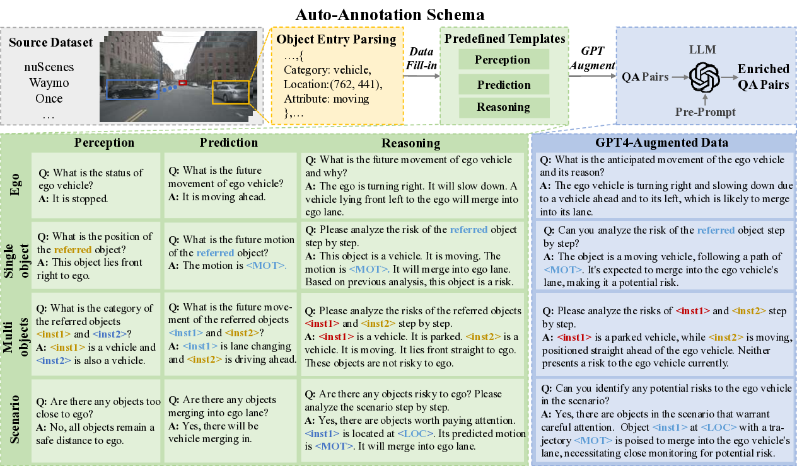
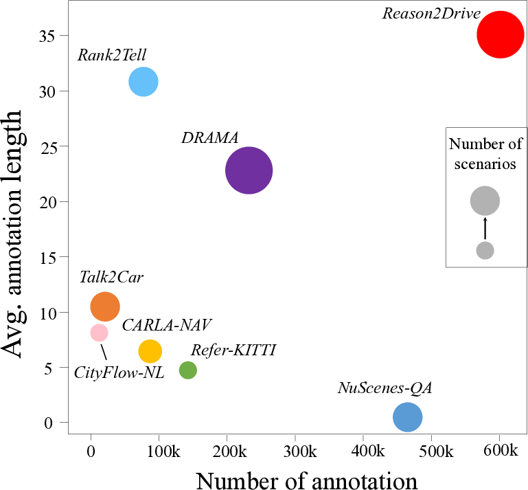
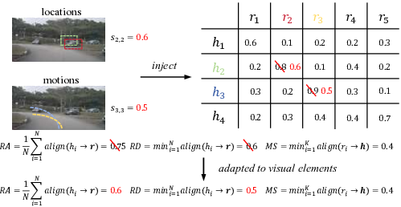

---
title: "Reason2Drive: Advancing Interpretable Reasoning for Autonomous Driving with Large Vision-Language Models"
date: 2024-10-05T11:01:53.708641
# weight: 1
# aliases: ["/first"]
tags: ['autonomous driving', 'vision-language models', 'interpretable reasoning', 'chain-based reasoning', 'benchmark dataset', 'evaluation metric', 'perception', 'prediction', 'reasoning']
author: "Me"
# author: ["Me", "You"] # multiple authors
showToc: true
TocOpen: true
draft: false
hidemeta: false
comments: false
description: ""
canonicalURL: "https://canonical.url/to/page"
disableHLJS: true # to disable highlightjs
disableShare: false
disableHLJS: false
hideSummary: false
searchHidden: false
ShowReadingTime: true
ShowBreadCrumbs: true
ShowPostNavLinks: true
ShowWordCount: true
ShowRssButtonInSectionTermList: true
UseHugoToc: true
cover:
    image: "<image path/url>" # image path/url
    alt: "<alt text>" # alt text
    caption: "<text>" # display caption under cover
    relative: false # when using page bundles set this to true
    hidden: true # only hide on current single page
editPost:
    URL: "https://github.com/<path_to_repo>/content"
    Text: "Suggest Changes" # edit text
    appendFilePath: true # to append file path to Edit link
---

# Reason2Drive: Towards Interpretable and Chain-based Reasoning for Autonomous Driving

*Figure 1: Overview of the Reason2Drive dataset construction process and examples*

## TLDR

- Reason2Drive is a new benchmark dataset with over 600K video-text pairs for interpretable reasoning in autonomous driving
- It includes detailed annotations for perception, prediction, and reasoning steps 
- A novel evaluation metric (ADRScore) is proposed to assess chain-based reasoning performance
- Experiments reveal insights into reasoning capabilities of various vision-language models (VLMs)
- An efficient approach is developed to enhance VLMs' ability to leverage object-level perceptual elements

## Introduction

Autonomous driving technology has made significant strides in recent years, but challenges remain in developing systems that can generalize across diverse scenarios and provide interpretable decision-making. While end-to-end approaches have shown promise, they often lack transparency in their reasoning process. Large vision-language models (VLMs) offer an intriguing alternative, with the potential to enhance both interpretability and generalization through their broad world knowledge and advanced reasoning abilities.

In this blog post, we'll dive into the paper "Reason2Drive: Towards Interpretable and Chain-based Reasoning for Autonomous Driving" by Ming Nie et al. This work introduces a novel benchmark dataset and evaluation framework to facilitate research on interpretable reasoning for autonomous driving systems using VLMs. We'll explore the key contributions, methodology, and findings of this important study.

## The Need for Interpretable Reasoning in Autonomous Driving

Current autonomous driving systems face two main challenges:

1. Generalization across diverse scenarios
2. Interpretability of decision-making processes

While end-to-end approaches have shown promise in deriving control signals directly from sensor inputs, they often treat the system as a black box, making it difficult to diagnose failures in real-world applications. Large Vision-Language Models (VLMs) offer a potential solution by providing more thorough understanding and explicit explanations for decision-making.

However, research in this area has been hindered by the lack of datasets with annotated reasoning chains that explain the decision-making processes in driving. Most existing datasets oversimplify the complex processes of driving into straightforward question-answering tasks with limited scope.

## Introducing Reason2Drive

To address these limitations, the authors introduce Reason2Drive, a new benchmark dataset comprising over 600K video-text pairs. This dataset is characterized by:

1. Intricate driving instructions
2. A series of perception, prediction, and reasoning steps
3. Annotations at both object and scenario levels

### Dataset Construction

Reason2Drive builds upon widely-used open-source driving datasets, including:

- nuScenes
- Waymo
- ONCE

The dataset construction process involves:

1. Parsing comprehensive annotations into an object-centric database
2. Integrating the database into manually crafted templates
3. Using GPT-4 and manual instructions for verification and enrichment

### Task Categories

The dataset is organized into three main task categories:

1. **Perception**: Identifying objects within the driving scenario
2. **Prediction**: Inferring future states of key objects
3. **Reasoning**: Analyzing current perceptual and predicted states to deduce reasoned inferences and decisions

Each category is further divided into object-level and scenario-level data:

- **Object-level**: Focuses on specific objects (e.g., location, attributes, future motion)
- **Scenario-level**: Addresses the global perspective of the driving environment and ego-driving instructions

### Dataset Statistics

*Figure 2: Comparison of Reason2Drive with other datasets in terms of scale and content*

As shown in Figure 2, Reason2Drive stands out as the largest language-based driving dataset available, surpassing others in terms of both dataset size and the inclusion of extensive long-text chain-based reasoning references.

The dataset exhibits a balanced distribution across different tasks and targets:

- Perception: 39%
- Prediction: 34%
- Reasoning: 27%

Multi-object tasks constitute the majority, followed by single-object and scenario-level questions. The fewest questions are related to the ego-vehicle.

## A Novel Evaluation Metric: ADRScore

One of the key contributions of this work is the introduction of a new evaluation metric called ADRScore (Autonomous Driving Reasoning Score). This metric addresses the limitations of existing caption-based metrics like BLEU and CIDEr, which fail to consider the causal relationship between reasoning steps and final conclusions.

ADRScore is designed to measure the correctness of reasoning chains in autonomous driving scenarios. It consists of three main components:

1. **Reasoning Alignment (RA)**: Measures the overlap between the hypothesis and reference reasoning chains.

   $$RA = \frac{1}{N} \sum_{i=1}^{N} align(h_i \rightarrow \Vec{r})$$

   where $N$ is the number of steps in the hypothesis, and $align(h_i \rightarrow \Vec{r})$ represents the semantic similarity between the hypothesis step $h_i$ and the most similar reference step.

2. **Redundancy (RD)**: Identifies hypothesis steps that are least aligned with the reference steps, penalizing unnecessary information.

   $$RD = min_{i=1}^{N} align(h_i \rightarrow \Vec{r})$$

3. **Missing Step (MS)**: Detects steps that are missing from the hypothesis but present in the reference.

   $$MS = min_{i=1}^{K} align(r_i \rightarrow \Vec{h})$$

   where $K$ is the number of steps in the reference.

The final ADRScore is calculated as the average of these three components:

$$ADRScore = \frac{1}{3} (RA + RD + MS)$$

Additionally, the authors introduce ADRScore-S, an adaptation of the metric that incorporates visual elements such as predicted locations and motions. This version uses mean square error to measure the similarity between visual elements instead of relying solely on semantic similarity.

## Enhancing VLMs for Autonomous Driving Reasoning

The authors observed that most VLMs struggle to effectively handle object-level perceptual information, which is crucial for autonomous driving scenarios. To address this challenge, they propose a framework that enhances existing VLMs with two new components:

1. **Prior Tokenizer**: Extracts and aligns visual features from perceptual priors
2. **Instructed Vision Decoder**: Generates accurate perceptual predictions

### Model Architecture

The proposed framework consists of the following components:

1. **Vision Encoder**: Extracts features from video frames using a pretrained ViT-G/14 model
2. **Prior Tokenizer**: A two-layer MLP that extracts local image features and positional embeddings from visual priors
3. **Q-former**: Aligns non-text features into the textual domain
4. **Language Model (LLM)**: Generates text output based on the aligned features
5. **Instructed Vision Decoder**: Decodes perceptual predictions based on textual and visual features

### Training Objectives

The model is trained end-to-end using two loss functions:

1. **Text Generation Loss** ($\mathcal{L}_{txt}$): Auto-regressive cross-entropy loss for text generation
2. **Perception Output Loss** ($\mathcal{L}_{per}$): Encourages accurate generation of locations and motions

The total loss is a weighted combination of these two components:

$$\mathcal{L} = \mathcal{L}_{txt} + \lambda_{per}\mathcal{L}_{per}$$

where $\lambda_{per}$ is a balancing term.

### Training Strategy

The training process consists of two stages:

1. **Pre-training**: Initialize weights from instructBLIP, freeze LLM and vision encoder parameters, and train the prior tokenizer, Q-former, and instructed vision decoder
2. **Fine-tuning**: Equip the LLM with reasoning abilities using the instructed vision decoder, employing efficient fine-tuning techniques like LoRA

## Experimental Results

The authors conducted extensive experiments to evaluate the performance of their proposed method and compare it with existing baselines. Here are some key findings:

### Reasoning Performance

*Figure 3: Illustration of ADRScore and its visual adaptation*

Table 1 shows the performance of different models on the Reason2Drive validation set:

| Method | LLM | ADRScore | ADRScore-S | B@4 | METEOR | ROUGE | CIDEr |
|--------|-----|----------|------------|-----|--------|-------|-------|
| Blip-2 | OPT-2.7B | 0.296 | 0.162 | 0.361 | 0.249 | 0.443 | 0.174 |
| InstructBLIP | Vicuna-7B | 0.351 | 0.214 | 0.408 | 0.294 | 0.484 | 0.211 |
| MiniGPT-4 | Vicuna-7B | 0.338 | 0.203 | 0.396 | 0.286 | 0.475 | 0.219 |
| Ours | Vicuna-7B | **0.463** | **0.432** | **0.457** | **0.356** | **0.529** | **0.298** |

The proposed method outperforms all baselines across all metrics, with particularly significant improvements in ADRScore and ADRScore-S.

### Ablation Studies

The authors conducted several ablation studies to analyze the contributions of different components and design choices:

1. **Task Contributions**: Training on reasoning tasks plays the most important role, with perception and prediction tasks providing additional enhancements.

2. **Quality of Predicted Visual Elements**: The proposed method achieves higher accuracy in predicting bounding boxes and trajectories compared to baselines like Kosmos-2.

3. **Effects of Tokenizers**: Multi-frame visual features and perceptual priors contribute to improved performance.

4. **Effects of Instructed Vision Decoder**: Pre-training and textual embedding bring major contributions to the performance.

### Generalization

To evaluate the method's generalization capabilities, the authors trained on the Reason2Drive benchmark using only the nuScenes dataset and tested on Waymo and ONCE. The results show that the proposed method suffers limited performance drops compared to other baselines, suggesting that the world knowledge of the LLM helps the model generalize to unseen scenarios.

### Downstream Tasks

The authors also investigated how the Reason2Drive benchmark contributes to downstream tasks, such as predicting control signals. They found that pre-training on Reason2Drive before fine-tuning for control signal prediction leads to improved performance, demonstrating the supportive effect of the benchmark on downstream planning tasks.

## Conclusion and Future Directions

The Reason2Drive benchmark and the proposed framework for enhancing VLMs represent significant steps towards developing interpretable and chain-based reasoning for autonomous driving systems. Key takeaways from this work include:

1. The importance of comprehensive datasets that capture the complexity of autonomous driving decision-making processes
2. The need for evaluation metrics that consider the causal relationships in reasoning chains
3. The potential of enhancing VLMs with specialized components for handling perceptual information in driving scenarios

Future research directions may include:

1. Exploring ways to further improve the generalization capabilities of VLMs across diverse driving scenarios
2. Investigating methods to enhance the encoding of dynamic displacement of the ego vehicle and improve recognition of distant objects
3. Developing more advanced reasoning frameworks that can handle increasingly complex driving situations
4. Integrating the proposed approach with real-world autonomous driving systems to evaluate its practical impact

By providing a comprehensive benchmark and novel evaluation framework, Reason2Drive opens up new avenues for research in interpretable and chain-based reasoning for autonomous driving. As the field continues to evolve, we can expect to see more advanced systems that combine the power of large language models with specialized components for perception and decision-making in complex driving environments.

## References

1. Caesar, H., et al. (2020). nuScenes: A multimodal dataset for autonomous driving. In CVPR.
2. Sun, P., et al. (2020). Scalability in perception for autonomous driving: Waymo open dataset. In CVPR.
3. Mao, J., et al. (2021). One million scenes for autonomous driving: ONCE dataset. arXiv preprint.
4. Li, J., et al. (2023). BLIP-2: Bootstrapping language-image pre-training with frozen image encoders and large language models. arXiv preprint.
5. Dai, W., et al. (2023). InstructBLIP: Towards general-purpose vision-language models with instruction tuning. arXiv preprint.
6. Zhu, D., et al. (2023). MiniGPT-4: Enhancing vision-language understanding with advanced large language models. arXiv preprint.
7. Peng, Z., et al. (2023). Kosmos-2: Grounding multimodal large language models to the world. arXiv preprint.
8. Hu, E.J., et al. (2021). LoRA: Low-rank adaptation of large language models. arXiv preprint.

For more information and access to the Reason2Drive dataset, visit the [project GitHub repository](https://github.com/fudan-zvg/reason2drive).

