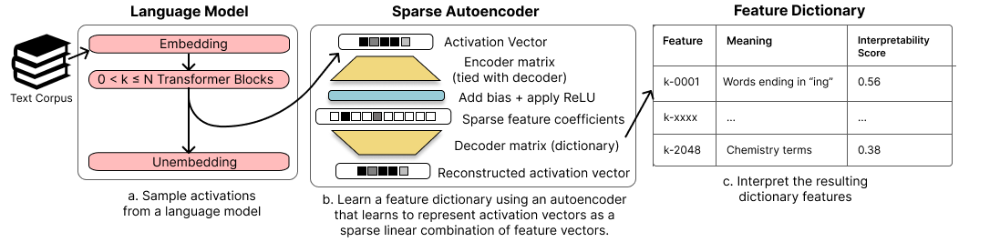
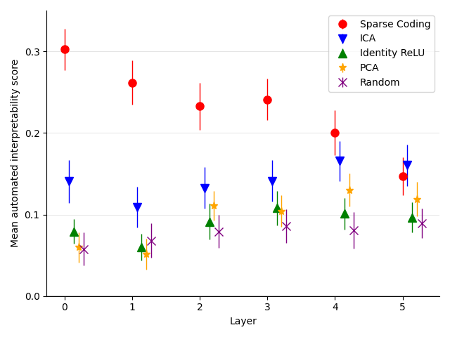
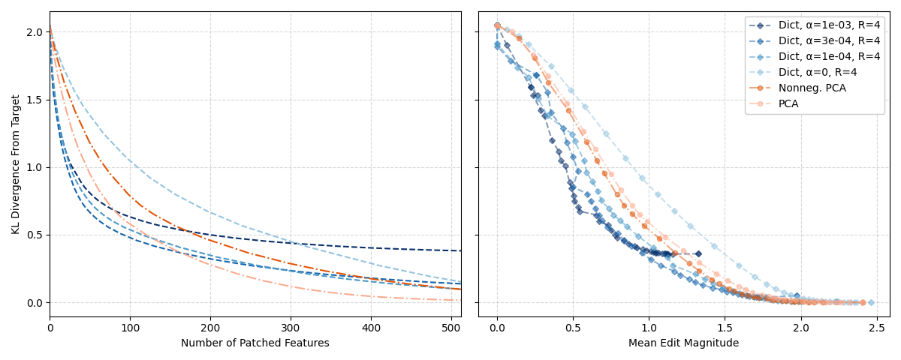
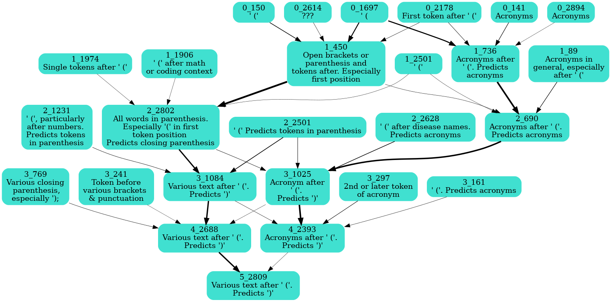

*Figure 1: An overview of the sparse autoencoder method for interpreting language model features.*

## TLDR

- Researchers develop a sparse autoencoder approach to disentangle features in language models
- The method finds more interpretable and monosemantic features compared to existing techniques
- Learned features enable precise identification of causal components for specific model behaviors
- This work provides a scalable, unsupervised way to improve interpretability of language models

## Introduction

As artificial intelligence systems become increasingly complex and influential in our lives, understanding their inner workings has never been more crucial. However, interpreting the internal representations of large language models remains a significant challenge. One key obstacle is the phenomenon of polysemanticity, where individual neurons or components appear to encode multiple, unrelated concepts.

In this blog post, we'll dive into an exciting new paper titled "Sparse Autoencoders Find Highly Interpretable Features in Language Models" by Hoagy Cunningham, Aidan Ewart, Logan Riggs, Robert Huben, and Lee Sharkey. This work introduces a novel approach to uncovering interpretable features in language models using sparse autoencoders, potentially opening new avenues for model transparency and targeted modifications.

## The Challenge of Polysemanticity

Before we delve into the solution, let's first understand the problem. In neural networks, especially large language models, individual neurons often activate in response to multiple, semantically distinct inputs. This phenomenon, known as polysemanticity, makes it difficult to assign clear, human-understandable meanings to specific components of the network.

The authors hypothesize that polysemanticity arises from a phenomenon called superposition. In superposition, neural networks represent more features than they have neurons by assigning features to an overcomplete set of directions in activation space, rather than to individual neurons.

## Sparse Autoencoders: A Novel Approach

To address this challenge, the researchers propose using sparse autoencoders to reconstruct the internal activations of a language model. The key idea is to learn a set of sparsely activating features that can better represent the underlying computations of the model.

### The Sparse Autoencoder Architecture

The sparse autoencoder used in this work is a neural network with a single hidden layer. It's designed to reconstruct input vectors while enforcing sparsity in the hidden layer activations. Here's how it works:

1. **Encoder**: The input vector $\mathbf{x}$ is transformed into a hidden representation $\mathbf{c}$:

   $\mathbf{c} = \mathrm{ReLU}(M\mathbf{x}+\mathbf{b})$

2. **Decoder**: The hidden representation is then used to reconstruct the input:

   $\mathbf{\hat x} = M^T \mathbf{c} = \sum_{i = 0}^{d_{\text{hid}}-1} c_i \mathbf{f}_i$

Here, $M \in \mathbb{R}^{d_{\text{hid}} \times d_{\text{in}}}$ is the weight matrix (normalized row-wise), $\mathbf{b} \in \mathbb{R}^{d_{\text{hid}}}$ is the bias vector, and $\mathbf{f}_i$ are the learned dictionary features.

### Training Objective

The autoencoder is trained to minimize a loss function that balances reconstruction accuracy with sparsity:

$\mathcal{L}(\mathbf{x}) = \underbrace{||\mathbf{x}- \mathbf{\hat x}||_2^2}_{\text{Reconstruction loss}} + \underbrace{\alpha ||\mathbf{c}||_1}_{\text{Sparsity loss}}$

The $\ell_1$ penalty on $\mathbf{c}$ encourages sparse activations in the hidden layer, while $\alpha$ is a hyperparameter controlling the strength of this sparsity constraint.

## Evaluating Interpretability

To assess whether the learned features are indeed more interpretable, the authors employ an automated interpretability scoring method introduced by [Bills et al. (2023)](https://openaipublic.blob.core.windows.net/neuron-explainer/paper/index.html). This approach uses language models to generate and evaluate interpretations of the learned features.

The process involves:

1. Sampling text fragments where the feature activates
2. Using GPT-4 to generate a human-readable interpretation
3. Prompting GPT-3.5 to predict feature activations on new samples based on this interpretation
4. Computing the correlation between predicted and actual activations as the interpretability score

## Key Findings

The researchers applied their method to various components of the Pythia language model family, focusing primarily on the residual stream. Here are some of the most significant results:

1. **Improved Interpretability**: The sparse autoencoder features consistently achieved higher interpretability scores compared to baseline methods like PCA, ICA, and the default neuron basis.

   
   *Figure 2: Comparison of interpretability scores across different feature extraction methods.*

2. **Monosemantic Features**: Many of the learned features corresponded to single, human-understandable concepts. For example, they found features that specifically activated for apostrophes, periods, and specific word patterns.

3. **Precise Causal Identification**: The learned features allowed for more precise identification of components responsible for specific model behaviors, such as indirect object identification.

   
   *Figure 3: Comparison of feature patching effectiveness for the Indirect Object Identification (IOI) task.*

4. **Automatic Circuit Detection**: The method enabled the automatic detection of feature circuits across layers, providing insights into how the model processes information hierarchically.

   
   *Figure 4: Automatically detected circuit for the closing parenthesis feature.*

## Implications and Future Directions

The work presented in this paper has several important implications for the field of AI interpretability:

1. **Scalable Interpretability**: The sparse autoencoder approach provides a scalable, unsupervised method for uncovering interpretable features in large language models.

2. **Model Transparency**: By disentangling features from superposition, this technique could lead to more transparent AI systems, addressing concerns about the "black box" nature of deep learning models.

3. **Targeted Modifications**: The ability to identify specific, interpretable features could enable more precise modifications of model behavior, potentially improving safety and reliability.

4. **Circuit Mapping**: The automatic detection of feature circuits across layers paves the way for a more comprehensive understanding of how language models process information.

Future work in this direction could focus on:

- Applying the method to other model components, such as attention heads
- Investigating how the learned features relate to specific model capabilities or behaviors
- Developing techniques to modify or steer model behavior based on the identified interpretable features
- Exploring the potential for "enumerative safety" - providing guarantees about model behavior through a complete understanding of its internal features

## Conclusion

The sparse autoencoder approach introduced in this paper represents a significant step forward in our ability to interpret and understand large language models. By learning sets of sparsely activating, highly interpretable features, this method provides a new lens through which we can examine the inner workings of these powerful AI systems.

As we continue to deploy AI in increasingly critical domains, the importance of model interpretability cannot be overstated. This work not only advances our theoretical understanding of neural networks but also offers practical tools for improving the transparency and trustworthiness of AI systems.

The code to replicate the experiments in this paper is available at [https://github.com/HoagyC/sparse_coding](https://github.com/HoagyC/sparse_coding).

## References

1. Bills, S., Cammarata, N., Mossing, D., Tillman, H., Gao, L., Goh, G., Sutskever, I., Leike, J., Wu, J., & Saunders, W. (2023). Language models can explain neurons in language models. [URL](https://openaipublic.blob.core.windows.net/neuron-explainer/paper/index.html)

2. Biderman, S., Schoelkopf, H., Anthony, Q. G., Bradley, H., O'Brien, K., Hallahan, E., Khan, M. A., Purohit, S., Prashanth, U. S., Raff, E., et al. (2023). Pythia: A suite for analyzing large language models across training and scaling. In International Conference on Machine Learning (pp. 2397-2430). PMLR.

3. Olshausen, B. A., & Field, D. J. (1997). Sparse coding with an overcomplete basis set: A strategy employed by v1? Vision research, 37(23), 3311-3325.

4. Wang, K., Variengien, A., Conmy, A., Shlegeris, B., & Steinhardt, J. (2022). Interpretability in the wild: a circuit for indirect object identification in gpt-2 small. arXiv preprint arXiv:2211.00593.

5. Elhage, N., Nanda, N., Olsson, C., Henighan, T., Joseph, N., Mann, B., Askell, A., Bai, Y., Chen, A., Conerly, T., et al. (2021). A mathematical framework for transformer circuits. Transformer Circuits Thread, 1.

6. Gao, L., Biderman, S., Black, S., Golding, L., Hoppe, T., Foster, C., Phang, J., He, H., Thite, A., Nabeshima, N., et al. (2020). The pile: An 800gb dataset of diverse text for language modeling. arXiv preprint arXiv:2101.00027.