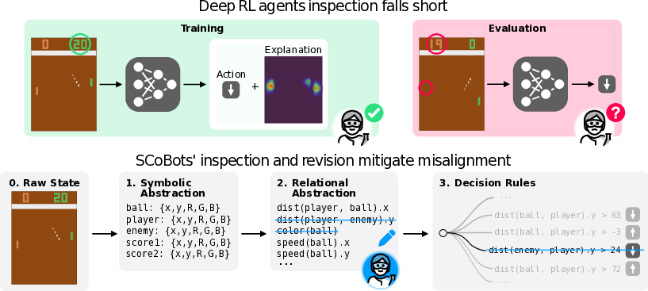
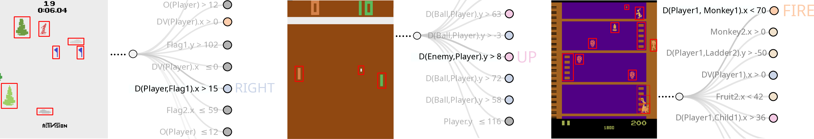

# Interpretable Concept Bottlenecks to Align Reinforcement Learning Agents



## TLDR
This paper introduces Successive Concept Bottleneck Agents (SCoBots), a novel approach to making reinforcement learning (RL) agents more interpretable and aligned with human goals. SCoBots use multiple concept bottleneck layers to represent both object properties and relations, allowing for easier inspection and modification of agent behavior. The authors demonstrate that SCoBots can achieve competitive performance on Atari games while enabling the detection and correction of misalignment issues, such as an previously unknown shortcut in the game Pong.

## Introduction

Reinforcement learning (RL) has made significant strides in recent years, with agents mastering complex games and tasks. However, the black-box nature of deep neural networks used in most RL approaches makes it challenging to understand and align these agents with human goals. This lack of interpretability can lead to several issues, including:

1. Goal misalignment
2. Reward sparsity
3. Difficult credit assignment

In this blog post, we'll dive into a new approach called Successive Concept Bottleneck Agents (SCoBots), which aims to address these challenges by making RL agents more transparent and easier to inspect and modify.

## The Problem: Black-Box RL Agents

Before we delve into SCoBots, let's briefly discuss why traditional deep RL agents can be problematic. Consider the iconic video game Pong:


In Pong, the agent's goal is to catch and return the ball past the opponent's paddle. However, the authors discovered that deep RL agents often learn to focus on the position of the enemy paddle rather than the ball itself. This shortcut works well during training but fails when the enemy is hidden or behaves differently.

This type of misalignment is difficult to detect with traditional black-box models, as importance map explanations may suggest that the agent is considering all relevant factors (player, ball, and enemy positions). However, when tested in modified environments, these agents fail catastrophically.

## Enter SCoBots: Making RL Agents Interpretable

SCoBots address this issue by introducing multiple concept bottleneck layers into the agent's decision-making process. These layers provide interpretable representations of both object properties and relations between objects, allowing for easier inspection and modification of the agent's behavior.

### Key Components of SCoBots

1. **Object Detector (ω)**: Extracts object properties from raw input states.
2. **Relation Extractor (μ)**: Computes relational concepts based on object properties.
3. **Action Selector (ρ)**: Chooses actions based on the extracted concepts.

Formally, we can represent the SCoBot policy as:

$$ s_t \xrightarrow{\omega_{\theta_1}} \Omega_t \xrightarrow{\mu_{\mathcal{F}}} \Gamma_t \xrightarrow{\rho_{\theta_2}} a_t $$

Where:
- $s_t$ is the raw input state
- $\Omega_t$ is the set of extracted object properties
- $\Gamma_t$ is the set of relational concepts
- $a_t$ is the selected action

Let's break down each component in more detail:

### 1. Object Detector (ω)

The object detector takes raw input states (e.g., game frames) and extracts object properties. For each frame, it provides a set of object representations:

$$ \omega_{\theta_1}(s_t) = \Omega_t=\{\{o_i^j\}_{j=1}^{c_i}\}_{i=t-n}^t $$

Where $o_i^j$ represents the properties of object $j$ in frame $i$, such as position, size, and color.

### 2. Relation Extractor (μ)

The relation extractor computes relational concepts based on the extracted object properties. It uses a set of predefined functions $\mathcal{F}$ to calculate these relations:

$$ \mu_{\mathcal{F}}(\Omega_t) = \Gamma_t=\{g_t^k\}_{k=1}^{d_t} $$

Where $g_t^k$ represents the $k$-th relational concept at time $t$. These concepts can include distances between objects, relative velocities, and other higher-level features.

### 3. Action Selector (ρ)

The action selector uses the extracted relational concepts to choose the best action for the current state. To maintain interpretability, SCoBots use a decision tree-based action selector:

$$ \rho_{\theta_2}: \Gamma_t \rightarrow a_t $$

This decision tree can be easily inspected and modified by human experts.

## Advantages of SCoBots

1. **Interpretability**: The concept bottleneck layers allow for easy inspection of the agent's decision-making process at multiple levels.
2. **Modularity**: Each component (object detection, relation extraction, and action selection) can be optimized independently.
3. **Flexibility**: Human experts can easily modify the set of relational functions or prune unnecessary concepts.
4. **Alignment**: The transparent nature of SCoBots makes it easier to detect and correct misalignment issues.

## Experimental Results

The authors evaluated SCoBots on nine Atari games from the Arcade Learning Environment (ALE) and compared their performance to traditional deep RL agents. Here are some key findings:

1. **Competitive Performance**: SCoBots achieved similar or better scores than deep RL agents on all tested games, despite the constraints of multiple bottlenecks in their architecture.

2. **Misalignment Detection**: The interpretable nature of SCoBots allowed the authors to identify a previously unknown misalignment in Pong, where agents were relying on the enemy paddle's position instead of the ball's position.

3. **Easy Correction**: By simply removing the enemy paddle from the set of considered objects, the authors were able to create SCoBots that could play Pong effectively, even when the enemy was hidden.

4. **Addressing RL-specific Issues**: SCoBots demonstrated the ability to mitigate various RL challenges, such as reward sparsity and ill-defined objectives, through simple guidance from domain experts.

Let's take a closer look at how SCoBots can be used to address some specific RL challenges:

### Reward Sparsity in Pong

In Pong, the reward signal is sparse, as the agent only receives a reward when scoring a point. This can make learning difficult. With SCoBots, we can easily add an additional reward signal based on the distance between the agent's paddle and the ball:

$$ R^{\text{exp}} = D(Player, Ball).y $$

This encourages the agent to keep its paddle close to the ball's vertical position, making it easier to learn effective strategies.

### Ill-defined Objectives in Kangaroo

In the game Kangaroo, the original objective (reaching the top floor to save the joey) is not well-reflected in the reward structure. Agents tend to learn to kick enemies on the bottom floor instead. With SCoBots, we can add a reward signal based on the distance to the joey:

```python
player = _get_game_objects_by_category(game_objects, ["Player"])
platform = np.ceil((player.xy[1] - player.h - 16) / 48)

if not episode_starts and not last_crashed:
    if platform % 2 == 0:  # even platform, encourage left movement
        reward = - player.dx
    else:  # encourage right movement
        reward = player.dx

    # Encourage upward movement
    reward -= player.dy / 5
else:
    reward = 0
```

This additional reward helps align the agent's behavior with the intended goal of the game.

## Inspecting SCoBot Decision Processes

One of the key advantages of SCoBots is the ability to inspect their decision-making process at multiple levels. Let's look at some examples:



1. **Skiing**: The SCoBot selects the RIGHT action because the signed distance between the Player and Flag1 on the x-axis is greater than 15 pixels. This shows that the agent is basing its decision on relevant relational concepts.

2. **Pong**: The unguided SCoBot bases its decision on the vertical positions of the enemy and its own paddle. This reveals the shortcut behavior we discussed earlier, where the agent ignores the ball's position.

3. **Kangaroo**: The decision process shows how the agent considers the player's position and movement to navigate the game environment.

These visualizations make it easy for human experts to understand and modify the agent's behavior if necessary.

## Guiding SCoBots

The interpretable nature of SCoBots allows for two main types of guidance:

1. **Concept Pruning**: Experts can remove unnecessary concepts or object properties to focus the agent on relevant information. For example, in Pong, we can remove the enemy paddle from the set of considered objects to force the agent to focus on the ball's position.

2. **Object-centric Reward Shaping**: We can use the extracted relational concepts to create additional reward signals. The general form of this expert reward is:

$$ R^{\text{exp}}(\Gamma_t) := \sum_{g_t \in \Gamma_t} \alpha_{g_t} \cdot g_t $$

Where $\alpha_{g_t}$ is a coefficient used to penalize or reward the agent based on specific relational concepts.

## Limitations and Future Work

While SCoBots show promising results, there are some limitations and areas for future research:

1. **Object Extraction**: The current implementation relies on a quasi-perfect object extractor (OCAtari). Future work could focus on developing more robust, unsupervised object extraction methods.

2. **Computational Efficiency**: SCoBots currently require sequential computation of concept bottleneck values on the CPU. Optimizing these computations for GPUs could significantly improve training time.

3. **Extending to More Complex Environments**: The current approach works well for Atari games but may need to be adapted for environments with more complex state representations, such as maze navigation or 3D environments.

4. **Incorporating Language Models**: Future research could explore using language models to generate additional reward signals or interpret game manuals for better alignment.

## Conclusion

Successive Concept Bottleneck Agents (SCoBots) represent a significant step forward in creating interpretable and aligned reinforcement learning agents. By integrating multiple concept bottleneck layers and allowing for easy inspection and modification of agent behavior, SCoBots address many of the challenges faced by traditional deep RL approaches.

The ability to detect and correct misalignment issues, even in simple games like Pong, demonstrates the power of this approach. As we continue to develop more complex AI systems, the principles behind SCoBots could play a crucial role in ensuring that these systems are not just performant, but also aligned with human values and goals.

## References

1. Delfosse, Q., Sztwiertnia, S., Rothermel, M., Stammer, W., & Kersting, K. (2024). Interpretable Concept Bottlenecks to Align Reinforcement Learning Agents. [GitHub Repository](https://github.com/k4ntz/SCoBots)

2. Koh, P. W., Nguyen, T., Tang, Y. S., Mussmann, S., Pierson, E., Kim, B., & Liang, P. (2020). Concept bottleneck models. In Proceedings of the 37th International Conference on Machine Learning.

3. Mnih, V., Kavukcuoglu, K., Silver, D., Rusu, A. A., Veness, J., Bellemare, M. G., ... & Hassabis, D. (2015). Human-level control through deep reinforcement learning. Nature, 518(7540), 529-533.

4. Schulman, J., Wolski, F., Dhariwal, P., Radford, A., & Klimov, O. (2017). Proximal policy optimization algorithms. arXiv preprint arXiv:1707.06347.

5. Bellemare, M. G., Naddaf, Y., Veness, J., & Bowling, M. (2013). The arcade learning environment: An evaluation platform for general agents. Journal of Artificial Intelligence Research, 47, 253-279.

