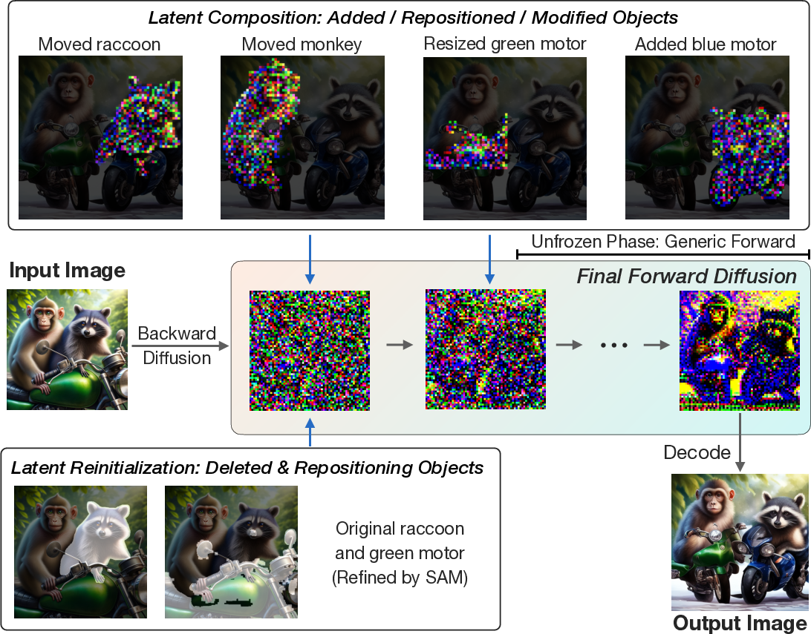

*Figure 1: Self-correcting LLM-controlled Diffusion (SLD) framework enhances text-to-image alignment through iterative self-correction.*

## TLDR

- SLD is a novel framework that integrates Large Language Models (LLMs) and object detectors to improve text-to-image alignment in diffusion models.
- It introduces a closed-loop process for image generation, allowing for iterative self-correction and refinement.
- SLD significantly improves performance in tasks involving numeracy, attribute binding, and spatial relationships.
- The framework is compatible with various generative models, including proprietary ones like DALL-E 3.
- SLD unifies text-to-image generation and image editing tasks under a single pipeline.

## Introduction

Text-to-image generation has made remarkable strides in recent years, particularly with the advent of diffusion models. However, these models often struggle with interpreting complex input text prompts, especially those requiring skills such as understanding numeracy, spatial relationships, and attribute binding with multiple objects. In this blog post, we'll dive deep into a groundbreaking paper that introduces Self-correcting LLM-controlled Diffusion (SLD), a framework designed to address these challenges and significantly enhance text-to-image alignment.

## The Challenge of Text-to-Image Alignment

Current state-of-the-art diffusion models, despite their impressive capabilities, often fall short when it comes to accurately interpreting and following complex input text prompts. This limitation is particularly evident in scenarios involving:

1. Numeracy (e.g., generating exactly five objects)
2. Spatial relationships (e.g., positioning objects relative to each other)
3. Attribute binding with multiple objects (e.g., assigning specific colors to different objects)

These challenges persist even in advanced models like DALL-E 3, which have undergone extensive training with high-quality captions. The authors of the SLD paper argue that this is due to the open-loop nature of current text-to-image generation processes.

## The SLD Framework: Closing the Loop

The key innovation of SLD lies in its approach to image generation as a closed-loop process. Unlike traditional methods that generate images in a single pass, SLD introduces an iterative self-correction mechanism. This approach is inspired by the way human artists work, constantly checking their progress against the initial requirements and making adjustments as needed.


*Figure 2: The SLD pipeline, illustrating the iterative self-correction process.*

The SLD framework consists of two main components:

1. LLM-driven object detection
2. LLM-controlled assessment and correction

Let's explore each of these components in detail.

### LLM-driven Object Detection

This component involves two key steps:

1. **LLM Parser**: An LLM is used to parse the user prompt and extract key phrases that are potentially relevant to image assessment. For example, given the prompt "A green motorcycle and a blue motorcycle," the LLM would identify "green" and "blue" as attributes associated with "motorcycle."

2. **Open-vocabulary Detector**: The extracted key phrases are then passed to an open-vocabulary object detector, which localizes and identifies objects within the generated image.


*Figure 3: The LLM parser extracts key object information, while the LLM controller suggests bounding box adjustments.*

### LLM-controlled Assessment and Correction

This component is responsible for analyzing the detected objects and proposing corrections:

1. **LLM Controller**: Taking both the user prompt and the currently detected bounding boxes as input, the LLM controller suggests new bounding boxes that better align with the prompt.

2. **Latent Space Operations**: The suggested changes are transformed into a set of latent space operations for image manipulation. These operations include addition, deletion, repositioning, and attribute modification of objects.



*Figure 4: Illustration of latent space operations in SLD.*

The latent space operations are implemented as follows:

- **Addition**: Pre-generate an object using a diffusion model, segment it precisely, and merge its latent representation into the original image's latent space.
- **Deletion**: Reset the latent layers associated with the object to Gaussian noise.
- **Repositioning**: Shift and resize the object's bounding box, then apply the addition and deletion operations as needed.
- **Attribute Modification**: Refine the object boundary and apply attribute modifications using techniques like DiffEdit.

After applying these operations, the modified latent representation undergoes a final forward diffusion process to generate the corrected image.

## Iterative Self-Correction Process

The SLD framework implements an iterative self-correction process, as outlined in Algorithm 1:

```
Algorithm 1: Self-correction for Image Generation
Input: User prompt P, Initial generated image I, Maximum number of self-correction rounds K
Output: Corrected image I

for k = 1 to K do
    S ← LLM-Parser(P)
    B_curr ← Detector(S)
    B_next ← LLM-Analysis(P, B_curr)
    Ops ← Diff(B_curr, B_next)
    if Ops ≠ ∅ then
        I = Correction(Ops, B_next, B_curr)
    else
        break
    end if
end for
```

This process continues until either the LLM controller suggests no further changes or the maximum number of correction rounds is reached.

## Experimental Results

The authors evaluated SLD using the LMD benchmark, which is designed to assess generation methods on complex tasks such as handling negation, numeracy, accurate attribute binding, and spatial reasoning.


*Figure 5: SLD enhances text-to-image alignment across various diffusion-based generative models.*

The results, summarized in Table 1, show significant improvements across all tasks when SLD is applied to both open-source (LMD+) and proprietary (DALL-E 3) models:

| Method | Negation | Numeracy | Attribute | Spatial | Average |
|--------|----------|----------|-----------|---------|---------|
| DALL-E 3 | 25% | 38% | 74% | 71% | 52.0% |
| + 1-round SLD | 90% | 61% | 80% | 83% | 78.5% |
| LMD+ | 100% | 82% | 49% | 86% | 79.3% |
| + 1-round SLD | 100% | 98% | 63% | 92% | 88.3% |

These results demonstrate that SLD can significantly enhance the performance of existing text-to-image generation models, particularly in areas where they traditionally struggle.

## Application to Image Editing

One of the most exciting aspects of SLD is its ability to unify text-to-image generation and image editing tasks under a single pipeline. By simply adjusting the instructions given to the LLM, SLD can perform a wide range of image editing tasks, including:

- Object addition, deletion, and replacement
- Attribute modification (e.g., changing colors or materials)
- Complex spatial adjustments (e.g., resizing, moving, or swapping objects)


*Figure 6: SLD's image editing capabilities, guided by natural language instructions.*

This unified approach offers several advantages over existing image editing methods:

1. **Precision**: SLD can perform highly precise edits, such as enlarging an object by an exact factor or positioning objects with specific spatial relationships.
2. **Flexibility**: The framework can handle a wide range of editing tasks without requiring separate models or pipelines for each type of edit.
3. **Natural Language Interface**: Users can specify edits using natural language instructions, making the editing process more intuitive and accessible.

## Limitations and Future Work

While SLD represents a significant advancement in text-to-image generation and editing, the authors acknowledge some limitations:

1. **Complex Shapes**: SLD may struggle with objects of complex shapes, as the segmentation module (SAM) can sometimes unintentionally segment adjacent parts during the process.

2. **Computational Cost**: The iterative nature of SLD may increase the computational requirements compared to single-pass generation methods.

3. **Dependence on External Models**: The performance of SLD is influenced by the capabilities of the underlying LLMs and object detectors used in the pipeline.

Future work could focus on addressing these limitations and further improving the framework's capabilities. Potential directions include:

- Developing more robust segmentation techniques for handling complex shapes
- Optimizing the iterative process to reduce computational overhead
- Exploring the integration of more advanced LLMs and object detectors as they become available

## Conclusion

Self-correcting LLM-controlled Diffusion (SLD) represents a significant step forward in the field of text-to-image generation and editing. By introducing a closed-loop, iterative self-correction process, SLD addresses many of the limitations of current diffusion models, particularly in handling complex prompts involving numeracy, spatial relationships, and attribute binding.

The framework's ability to unify text-to-image generation and image editing tasks under a single pipeline opens up exciting possibilities for more intuitive and powerful image manipulation tools. As research in this area continues to advance, we can expect to see further improvements in the accuracy, flexibility, and user-friendliness of AI-powered image generation and editing systems.

## References

1. Rombach, R., Blattmann, A., Lorenz, D., Esser, P., & Ommer, B. (2022). High-resolution image synthesis with latent diffusion models. In Proceedings of the IEEE/CVF Conference on Computer Vision and Pattern Recognition (pp. 10684-10695).

2. Ramesh, A., Dhariwal, P., Nichol, A., Chu, C., & Chen, M. (2022). Hierarchical text-conditional image generation with clip latents. arXiv preprint arXiv:2204.06125.

3. Saharia, C., Chan, W., Saxena, S., Li, L., Whang, J., Denton, E., ... & Norouzi, M. (2022). Photorealistic text-to-image diffusion models with deep language understanding. Advances in Neural Information Processing Systems, 35, 36479-36494.

4. Zhang, H., Xu, T., & Li, H. (2023). Adding conditional control to text-to-image diffusion models. In Proceedings of the IEEE/CVF International Conference on Computer Vision (pp. 3836-3846).

5. Li, W., Zhang, C., Liang, X., Zhong, Y., Xue, X., & Gu, J. (2023). GLIGEN: Open-set grounded text-to-image generation. In Proceedings of the IEEE/CVF Conference on Computer Vision and Pattern Recognition (pp. 22367-22377).

6. Yang, J., Jiang, Y., Huang, Y., Luo, L., & Zhao, Y. (2023). ReCo: Region-controlled text-to-image generation. In Proceedings of the IEEE/CVF Conference on Computer Vision and Pattern Recognition (pp. 10623-10633).

7. Chen, L., Zhu, Y., Papandreou, G., Schroff, F., & Adam, H. (2023). Training-free layout control with cross-attention guidance. In Proceedings of the IEEE/CVF International Conference on Computer Vision (pp. 3847-3857).

8. Yang, Z., Dong, Y., Peng, C., Chen, D., Ye, H., Ji, P., ... & Dai, J. (2023). Paint by Example: Exemplar-based Image Editing with Diffusion Models. In Proceedings of the IEEE/CVF Conference on Computer Vision and Pattern Recognition (pp. 22530-22539).

9. Patashnik, O., Wu, Z., Shechtman, E., Cohen-Or, D., & Lischinski, D. (2023). Localizing object-level shape variations with text-to-image diffusion models. In Proceedings of the IEEE/CVF International Conference on Computer Vision (pp. 3858-3868).

10. Lian, L., Wu, T., Liu, S., Zhou, B., Jiang, L., Bai, X., & Darrell, T. (2023). LLM-grounded diffusion: Enhancing prompt understanding of text-to-image diffusion models with large language models. arXiv preprint arXiv:2305.13655.

11. Feng, Y., Chen, Z., Xie, J., Wu, F., & Tian, Q. (2023). LayoutGPT: Compositional visual planning and generation with large language models. arXiv preprint arXiv:2305.15393.

12. Lin, Z., Geng, S., Zhang, Y., Li, S., Xiao, T., Guo, P., ... & Han, J. (2023). VideoDirectorGPT: Consistent multi-scene video generation via LLM-guided planning. arXiv preprint arXiv:2309.15091.

13. Zhang, Y., Ling, H., Gao, J., Yin, K., Lafleche, J. F., Barriuso, A., ... & Fidler, S. (2023). Adding conditional control to text-to-image diffusion models. In Proceedings of the IEEE/CVF International Conference on Computer Vision (pp. 3836-3846).

14. Hertz, A., Mokady, R., Tenenbaum, J., Aberman, K., Pritch, Y., & Cohen-Or, D. (2022). Prompt-to-prompt image editing with cross attention control. arXiv preprint arXiv:2208.01626.

15. Brooks, T., Holynski, A., & Efros, A. A. (2023). InstructPix2Pix: Learning to follow image editing instructions. In Proceedings of the IEEE/CVF Conference on Computer Vision and Pattern Recognition (pp. 23475-23485).

16. Meng, C., He, Y., Song, Y., Song, J., Wu, J., Zhu, J. Y., & Ermon, S. (2022). SDEdit: Guided image synthesis and editing with stochastic differential equations. In International Conference on Learning Representations.

17. Couairon, G., Gong, K., Lafleche, J. F., Ren, J., & Barriuso, A. (2023). DiffEdit: Diffusion-based semantic image editing with mask guidance. In Proceedings of the IEEE/CVF International Conference on Computer Vision (pp. 3859-3869).

18. Tumanyan, N., Geyer, M., Balachandar, N., Bar-Tal, O., & Wetzler, A. (2023). Plug-and-play diffusion features for text-driven image-to-image translation. In Proceedings of the IEEE/CVF Conference on Computer Vision and Pattern Recognition (pp. 7935-7945).

19. Epstein, D., Liao, C. L., & Bepler, T. (2023). Self-guided diffusion models. arXiv preprint arXiv:2210.00939.

20. White, J., Fu, Q., Hays, S., Sandborn, M., Olea, C., Gilbert, H., ... & Schmidt, D. C. (2023). A prompt pattern catalog to enhance prompt engineering with ChatGPT. arXiv preprint arXiv:2302.11382.

21. Wei, J., Wang, X., Schuurmans, D., Bosma, M., Chi, E., Le, Q., & Zhou, D. (2022). Chain of thought prompting elicits reasoning in large language models. Advances in Neural Information Processing Systems, 35, 24824-24837.

22. Minderer, M., Gritsenko, A., Stone, A., Neumann, M., Weissenborn, D., Dosovitskiy, A., ... & Tran, D. (2022). Simple open-vocabulary object detection with vision transformers. In Computer Vision–ECCV 2022: 17th European Conference, Tel Aviv, Israel, October 23–27, 2022, Proceedings, Part XXXVI (pp. 99-116). Springer Nature Switzerland.

23. Minderer, M., Gritsenko, A., Stone, A., Neumann, M., Weissenborn, D., Dosovitskiy, A., ... & Tran, D. (2023). Scaling open-vocabulary object detection. arXiv preprint arXiv:2306.09683.

24. Kirillov, A., Mintun, E., Ravi, N., Mao, H., Rolland, C., Gustafson, L., ... & Girshick, R. (2023). Segment anything. In Proceedings of the IEEE/CVF International Conference on Computer Vision (pp. 1687-1697).

25. Liu, Y., Zhu, L., Jiang, P., Jiang, S., Jiang, M., Yuan, J., & Wang, Z. (2023). Visual instruction tuning. arXiv preprint arXiv:2304.08485.

26. Liu, Y., Jiang, M., Jiang, P., Wang, Z., Zhu, L., Jiang, S., & Yuan, J. (2023). Improved baselines with visual instruction tuning. arXiv preprint arXiv:2310.03744.