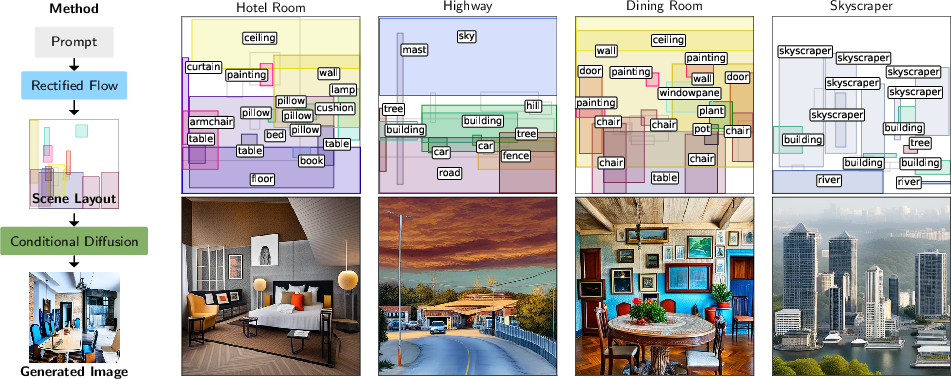
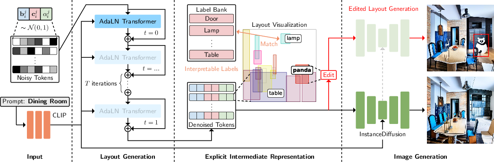

# SLayR: Scene Layout Generation with Rectified Flow

*Figure 1: Overview of SLayR - Scene Layout Generation with Rectified Flow*

## TLDR

- SLayR introduces a novel transformer-based rectified flow model for scene layout generation
- The method generates editable and interpretable layouts that can be rendered into images
- SLayR outperforms baselines in both plausibility and variety of generated layouts
- New evaluation metrics and a human study are introduced to assess layout quality
- The approach is significantly smaller and faster than competing methods

## Introduction

The field of text-to-image generation has seen remarkable progress in recent years, with models like DALL-E 2 and Stable Diffusion producing impressive results. However, these end-to-end approaches often lack fine-grained control and interpretability. In this blog post, we'll dive into a new method called SLayR (Scene Layout Generation with Rectified Flow) that aims to address these limitations by introducing an intermediate layout generation step.

SLayR, introduced by Braunstein et al., presents a novel transformer-based rectified flow model for layout generation. This approach allows for the creation of editable and interpretable scene layouts, which can then be transformed into images using existing conditional image diffusion models. The result is a text-to-image pipeline that offers greater control and variety compared to end-to-end methods.

Let's explore the key components of SLayR and understand how it pushes the boundaries of scene layout generation.

## The Challenge of Layout Generation

Before diving into SLayR, it's important to understand the challenges in layout generation:

1. **Plausibility**: Generated layouts must be realistic and coherent.
2. **Variety**: The model should produce diverse layouts for the same prompt.
3. **Controllability**: Users should be able to edit and refine the generated layouts.
4. **Efficiency**: The generation process should be fast and computationally efficient.

Existing methods often struggle to balance these aspects, either producing implausible layouts or lacking in variety. SLayR aims to address these challenges through its novel architecture and training approach.

## SLayR: A Novel Approach to Layout Generation

### Layout Representation

At the core of SLayR is a carefully designed layout representation. Each layout is composed of a set of object tokens, where each token $\mathbf{x}_i^j$ is defined as:

$$\mathbf{x}_i^j = (\mathbf{b}_i^j \Vert \mathbf{c}_i^j \Vert \alpha_i^j)$$

Here:
- $\mathbf{b}_i^j \in \mathbb{R}^4$ represents the bounding box coordinates (x, y, width, height)
- $\mathbf{c}_i^j \in \mathbb{R}^d$ is a PCA-reduced CLIP embedding of the object label
- $\alpha_i^j \in \mathbb{R}$ is an opacity value indicating the existence of the bounding box

This representation allows for a compact yet expressive encoding of scene layouts.

### Rectified Flow for Layout Generation

SLayR employs rectified flow, a recent advancement in generative modeling, to create layouts. The key idea is to learn a model that can predict the direction from a noisy sample towards the target distribution. The training objective for the rectified flow model $v$ is:

$$\min_v \int_0^1\mathbb{E}_i[ \Vert (\mathbf{x}_i(1) - \mathbf{x}_i(0)) - v(\mathbf{x}_i(t),t)\Vert^2]dt$$

During inference, the model generates layouts by integrating over multiple timesteps:

$$\mathbf{x}_i(1) = \mathbf{x}_i(0) +  \sum_{t=1}^T v(x((t-1)/{T}),t/T)\cdot \frac{1}{T}$$

This approach allows for stable and high-quality layout generation.

### Model Architecture

SLayR's architecture is built on multihead AdaLN transformer blocks, which can process tokens to iteratively denoise them. The model takes as input:

1. Timestep $t$
2. Bounding box coordinates $\mathbf{b}_i^j(t)$
3. Opacity values $\alpha_i^j(t)$
4. A linear projection of the global label's CLIP encoding

These inputs are processed through the transformer blocks to update the layout tokens. The output represents the rate of change of $\mathbf{x}_i^j(t)$, which is then used to update the layout.

### Training Process

The training process for SLayR involves the following steps:

1. Create training samples from ground-truth image layouts
2. Sample noise and interpolate between noise and ground-truth samples
3. Train the model to predict the derivative of the path between noisy and clean samples

The loss function is derived from the rectified flow objective:

$$\mathcal{L} = \sum_{i \in I, j \in J} \Vert \mathbf{x}_i^j(1) - \mathbf{x}_i^j(0)  -v(\{\mathbf{x}_i^j(t)\}_{j \in J},t,P_i)_j \Vert^2$$

Where $P_i$ is the global prompt for the layout.

## Evaluation Metrics and Human Study

One of the key contributions of this work is the introduction of new metrics for evaluating generated layouts. The authors found that traditional image quality metrics like FID and KID were not conclusive for assessing layout quality. To address this, they introduced four new metrics:

1. **Object Numeracy Score** ($O_{\text{Num}}$): Measures how well the generated layouts match the expected object frequencies.

2. **First Order Positional Likelihood** ($l_{\text{Pos}}^{(1)}$): Assesses how plausible the positions of individual objects are.

3. **Second Order Positional Likelihood** ($l_{\text{Pos}}^{(2)}$): Evaluates the plausibility of spatial relationships between pairs of objects.

4. **Positional Variance Score** ($\sigma^2_{\text{Pos}}$): Measures the variety of bounding box positions across generated layouts.

In addition to these numerical metrics, the authors conducted a human evaluation study to assess the plausibility and variety of generated layouts. This study provides a more holistic assessment of layout quality that complements the numerical metrics.

## Results and Comparisons

SLayR was evaluated against several baselines, including LayoutTransformer, GPT-4, and a no-layout condition. The results demonstrate that SLayR outperforms these baselines in several key areas:

1. **Plausibility and Variety**: SLayR achieves the best trade-off between generating plausible layouts and maintaining high variety.

2. **Efficiency**: The model is at least 5x smaller in terms of parameters and 37% faster than the baselines.

3. **Controllability**: SLayR's intermediate layout representation allows for easy editing and refinement of generated scenes.

Let's take a closer look at some visual results.

As we can see, SLayR produces layouts that are both plausible and diverse, leading to high-quality generated images that accurately represent the given prompts.

## Additional Features and Applications

### Partial Layout Conditioning

SLayR supports partial layout conditioning, allowing users to specify some aspects of the layout while letting the model complete the rest. This feature enables fine-grained control over the generation process. The authors adapted the RePaint technique for rectified flow to enable this functionality.

### Editing Capabilities

The two-stage pipeline of SLayR (layout generation followed by image generation) naturally supports editing of the intermediate layout. Users can modify, add, or remove objects in the layout before generating the final image.

## Implementation Details

SLayR is implemented using a transformer-based architecture with 20 AdaLN blocks and 12-headed attention. The model uses sinusoidal encoding for various input components and employs PCA reduction for CLIP embeddings to manage computational complexity.

The training process involves 2000 epochs using stochastic gradient descent with a learning rate of 0.0005 and a batch size of 32. The authors used the ADE20K dataset for training, which provides a rich collection of indoor and outdoor scenes with semantic segmentations.

## Limitations and Future Work

While SLayR demonstrates impressive results, there are some limitations and areas for future improvement:

1. **Dataset Size**: The current model is trained on the relatively small ADE20K dataset. Scaling up to larger datasets could potentially improve performance and generalization.

2. **Image Generation Quality**: The quality of the final images depends on the chosen conditional image generator. Improving this component could lead to even better results.

3. **3D Scene Generation**: The current model focuses on 2D layouts. Extending the approach to 3D scene generation could be an interesting direction for future research.

4. **Fine-grained Control**: While SLayR offers more control than end-to-end methods, there's still room for improvement in terms of fine-grained manipulation of generated layouts.

## Conclusion

SLayR represents a significant step forward in the field of scene layout generation. By introducing an interpretable and editable intermediate representation, it offers a compelling alternative to end-to-end text-to-image generation methods. The model's ability to generate plausible and diverse layouts, combined with its efficiency and controllability, makes it a valuable tool for various applications in computer vision and graphics.

As the field of AI-generated content continues to evolve, approaches like SLayR that prioritize interpretability and user control are likely to play an increasingly important role. By bridging the gap between high-level text descriptions and detailed visual representations, SLayR opens up new possibilities for creative expression and automated content generation.

## References

1. Braunstein, C., Petekkaya, H., Lenssen, J. E., Toneva, M., & Ilg, E. (2025). SLayR: Scene Layout Generation with Rectified Flow. CVPR 2025.

2. Liu, C., Gu, J., Furukawa, Y., & Kautz, J. (2022). Flow Straight and Fast: Learning to Generate and Transfer 3D Shapes from Few Images. arXiv preprint arXiv:2201.05139.

3. Peebles, W., Pang, S., & Zhu, J. Y. (2023). Scalable Diffusion Models with Transformers. arXiv preprint arXiv:2212.09748.

4. Wang, J., Gu, J., & Liu, C. (2024). InstanceDiffusion: Instance-level Control for Image Generation. arXiv preprint arXiv:2402.03290.

5. Gupta, A., Duggal, S., Chakraborty, S., Kakaraparthy, R., & Kopf, J. (2021). LayoutTransformer: Layout Generation and Completion with Self-attention. In Proceedings of the IEEE/CVF International Conference on Computer Vision (pp. 1004-1014).

6. OpenAI. (2024). GPT-4 Technical Report. arXiv preprint arXiv:2303.08774.

7. Zhou, B., Zhao, H., Puig, X., Xiao, T., Fidler, S., Barriuso, A., & Torralba, A. (2018). Semantic understanding of scenes through the ade20k dataset. International Journal of Computer Vision, 127(3), 302-321.

