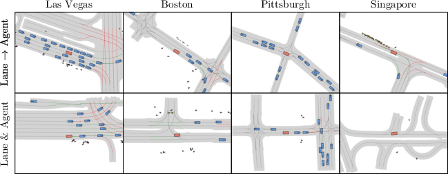

# SLEDGE: Synthesizing Driving Environments with Generative Models and Rule-Based Traffic

*Figure 1: SLEDGE generates simulation environments in 4 cities, showing lanes, vehicles, pedestrians, obstacles, and traffic lights.*

## TLDR

- SLEDGE is a novel generative simulator for vehicle motion planning trained on real-world driving logs
- It uses a learned model to generate agent bounding boxes and lane graphs, which serve as initial states for rule-based traffic simulation
- The core component is a raster-to-vector autoencoder that encodes agents and lane graphs into distinct channels in a rasterized latent map
- SLEDGE enables greater control over simulations, supports 500m long routes, and presents new challenges for planning algorithms
- Compared to existing simulators like nuPlan, SLEDGE requires 500x less storage (<4 GB) while offering more flexibility and scalability

## Introduction

Autonomous driving has seen remarkable progress in recent years, but developing and evaluating robust planning algorithms remains a significant challenge. Simulators play a crucial role in this process, allowing researchers to test and refine their algorithms in a safe and controlled environment. However, existing data-driven simulators often rely on replaying logs of real-world driving scenarios, which limits their flexibility and scalability.

In this blog post, we'll dive deep into SLEDGE (Synthesizing Driving Environments with Generative models and rule-based traffic), a groundbreaking approach to generative simulation for autonomous driving. Developed by researchers Kashyap Chitta, Daniel Dauner, and Andreas Geiger from the University of Tübingen and the Tübingen AI Center, SLEDGE addresses many of the limitations of current simulators while opening up new possibilities for testing and improving planning algorithms.

Let's explore the key components of SLEDGE, its innovative architecture, and the implications it has for the future of autonomous driving research.

## The Challenge of Abstract Scene Generation

Before we delve into the specifics of SLEDGE, it's important to understand the unique challenges posed by generating abstract representations of driving scenes. Unlike natural images, which have a regular pixel grid, autonomous driving planners typically work with bird's eye view (BEV) representations that characterize key scene elements (lanes, traffic lights, static and dynamic objects) in a compact, vectorized format.

These abstract representations have several characteristics that make them difficult to model using traditional generative approaches:

1. Topological connectivity: Lane graphs and other scene elements must maintain accurate connections and relationships.
2. Variable entity counts: The number of vehicles, pedestrians, and other objects can vary widely between scenes.
3. Precise geometry: Elements like parallel lanes require accurate modeling of their spatial relationships.

These factors make it challenging to apply existing generative models that operate on uniformly sized representations (e.g., images) to the task of data-driven simulation for autonomous driving.

## The SLEDGE Architecture

To address these challenges, the researchers behind SLEDGE developed a novel architecture that combines several key components:

1. A raster-to-vector autoencoder (RVAE)
2. A Diffusion Transformer (DiT) for generating rasterized latent maps
3. A rule-based traffic simulation system

Let's break down each of these components and see how they work together to create a powerful and flexible generative simulator.

### Raster-to-Vector Autoencoder (RVAE)

The RVAE is at the heart of SLEDGE's ability to generate realistic and diverse driving scenes. It consists of two main parts:

1. An encoder that converts the input scene representation into a compact, fixed-size latent space
2. A decoder that reconstructs the scene from this latent representation

The key innovation here is the use of a rasterized latent map (RLM) as an intermediate representation. This RLM has several important properties:

- It has a fixed size (8x8x64 in the paper's implementation)
- It separates information about lanes and agents into distinct channel groups
- It can be easily processed by transformer-based architectures

The RVAE is trained to reconstruct the full scene state, including:

- Lane polylines and their connectivity (adjacency matrix)
- Traffic light states
- Agent bounding boxes (vehicles, pedestrians, static objects)
- Ego vehicle velocity

The loss function for training the RVAE includes reconstruction losses for each entity type, as well as a KL divergence loss on the RLM to encourage a well-behaved latent space.

### Diffusion Transformer (DiT)

With the RVAE in place, the next step is to learn a generative model that can produce diverse and realistic RLMs. For this, the authors turn to the Diffusion Transformer (DiT) architecture, which combines the power of diffusion models with the flexibility of transformers.

The DiT is trained using the DDPM (Denoising Diffusion Probabilistic Models) algorithm, which involves:

1. Adding Gaussian noise to the RLMs produced by the RVAE encoder
2. Training the DiT to predict and remove this noise

The DiT architecture uses self-attention blocks to process the tokenized input, with conditioning on both the city label and the noise level.

One of the key advantages of using a DiT is its ability to perform conditional generation and inpainting. This allows SLEDGE to:

1. Generate agents conditioned on a given lane layout
2. Extrapolate scenes along a route by iteratively generating new tiles

### Rule-Based Traffic Simulation

The final component of SLEDGE is a rule-based traffic simulation system that takes the generated initial scene state and evolves it over time. This includes:

- Projecting vehicles onto lane centerlines
- Using the Intelligent Driver Model (IDM) for longitudinal control of vehicles
- Simulating pedestrian movement with constant velocity and heading
- Implementing traffic light state changes

Importantly, SLEDGE introduces the concept of a "simulation radius," where only agents within a certain distance of the ego vehicle are actively simulated. This allows for efficient simulation of long routes and large scenes.

## Key Innovations and Results

Now that we've covered the main components of SLEDGE, let's look at some of the key innovations and results presented in the paper:

### Rasterized Latent Map (RLM) Representation

The authors conducted a systematic study of different lane graph representations and found that their proposed RLM outperformed other approaches in terms of reconstruction quality and compactness. Here's a comparison of different representations:

| Representation | Size (KB) | GEO F1 | TOPO F1 |
|----------------|-----------|--------|---------|
| RSI            | 524.3     | 0.933  | 0.851   |
| RLM (w/o split)| 16.0      | 0.981  | 0.945   |
| RLM (w/ split) | 8.0       | 0.980  | 0.944   |
| Vector         | 4.8       | 0.997  | 0.990   |

The RLM achieves a good balance between reconstruction quality and fixed size, making it well-suited for generative modeling.

### Lane Graph Generation

The authors compared their DiT-based approach to several baselines for lane graph generation:

| Architecture | Route Length | Precision (RVEnc) | Recall (RVEnc) | Frechet (Reach) |
|--------------|--------------|-------------------|----------------|-----------------|
| VAE (RSI)    | 2.68 ± 3.66  | 0.00              | 0.16           | 2.86            |
| RVAE         | 23.79 ± 9.96 | 4.56              | 8.14           | 3.08            |
| HDMapGen     | 28.17 ± 14.81| 7.48              | 12.45          | 2.49            |
| DiT-L (RSI)  | 24.78 ± 10.38| 19.20             | 5.94           | 1.90            |
| DiT-L (RLM)  | 32.51 ± 9.93 | 63.99             | 61.60          | 0.88            |
| DiT-XL (RLM) | 35.37 ± 10.28| 78.07             | 72.63          | 0.20            |

The DiT-based models, especially when using the RLM representation, significantly outperform other approaches in terms of generation quality and diversity.

### Planner Evaluation

One of the most exciting aspects of SLEDGE is its ability to create challenging scenarios for testing planning algorithms. The authors evaluated the state-of-the-art PDM-Closed planner on various SLEDGE-generated scenarios:

| Task | Length | Routes | Traffic | Turns | Agents | Planner Failure Rate |
|------|--------|--------|---------|-------|--------|----------------------|
| Lane → Agent | 100m | Easy | Easy | 0.89 | 44.61 | 0.07 |
| Lane → Agent | 500m | Hard | Hard | 4.20 | 170.87 | 0.44 |
| Lane & Agent | 100m | Hard | Hard | 1.07 | 39.03 | 0.30 |
| Lane & Agent | 500m | Hard | Hard | 3.82 | 169.66 | 0.49 |

These results show that SLEDGE can generate scenarios that are significantly more challenging than those typically used in existing benchmarks, with failure rates of over 40% in the most difficult settings.

## Implications and Future Directions

SLEDGE represents a significant step forward in the field of autonomous driving simulation. Its ability to generate diverse, realistic, and challenging scenarios while requiring minimal storage (< 4 GB compared to nuPlan's 2 TB) opens up new possibilities for research and development in this area.

Some key implications and potential future directions include:

1. **Improved Planner Evaluation**: SLEDGE's ability to generate long routes and control traffic density allows for more comprehensive testing of planning algorithms, potentially uncovering failure modes that are not apparent in shorter, simpler scenarios.

2. **Scalable Simulation**: The "simulation radius" concept introduced in SLEDGE enables efficient simulation of large scenes and long routes, which could be crucial for testing long-term planning and decision-making capabilities.

3. **Controllable Scene Generation**: The conditional generation capabilities of SLEDGE (e.g., generating agents for a given lane layout) provide researchers with fine-grained control over test scenarios, allowing for targeted evaluation of specific planning challenges.

4. **Data Augmentation**: While not explored in the paper, the generative capabilities of SLEDGE could potentially be used for data augmentation in training perception and planning models, helping to improve their robustness and generalization.

5. **Integration with Learned Behaviors**: While SLEDGE currently uses rule-based traffic simulation, future work could explore integrating more sophisticated, learned behavior models for agents, potentially leading to even more realistic and challenging scenarios.

6. **Extension to Other Domains**: The principles behind SLEDGE, particularly the use of the raster-to-vector autoencoder and diffusion transformer, could potentially be applied to other domains that involve complex, structured data with variable-sized entities.

## Conclusion

SLEDGE represents a significant advance in the field of autonomous driving simulation, offering a powerful and flexible framework for generating diverse and challenging scenarios. By combining innovative representations (RLM) with state-of-the-art generative models (DiT) and efficient simulation techniques, SLEDGE addresses many of the limitations of existing data-driven simulators.

As autonomous driving research continues to progress, tools like SLEDGE will play a crucial role in developing and evaluating robust planning algorithms. The ability to generate long, complex scenarios with fine-grained control over route difficulty and traffic density opens up new possibilities for comprehensive testing and evaluation.

While there are still areas for improvement and exploration (e.g., incorporating more sophisticated behavior models, further scaling the model size and compute), SLEDGE provides a solid foundation for future work in this area. Its open-source implementation (available at [https://github.com/autonomousvision/sledge](https://github.com/autonomousvision/sledge)) will undoubtedly contribute to accelerating progress in the field of autonomous driving simulation and planning.

As researchers and practitioners in the field of autonomous driving, we should be excited about the possibilities that SLEDGE opens up. It challenges us to develop more robust planning algorithms capable of handling a wider range of scenarios, and provides a powerful tool for evaluating and improving these algorithms. The future of autonomous driving simulation looks brighter with SLEDGE lighting the way.

## References

1. Chitta, K., Dauner, D., & Geiger, A. (2024). SLEDGE: Synthesizing Driving Environments with Generative Models and Rule-Based Traffic. [https://github.com/autonomousvision/sledge](https://github.com/autonomousvision/sledge)

2. Karnchanachari, N., et al. (2024). Towards learning-based planning: The nuPlan benchmark for real-world autonomous driving. In Proc. IEEE International Conf. on Robotics and Automation (ICRA).

3. Dauner, D., Hallgarten, M., Geiger, A., & Chitta, K. (2023). Parting with misconceptions about learning-based vehicle motion planning. In Proc. Conf. on Robot Learning (CoRL).

4. Rombach, R., Blattmann, A., Lorenz, D., Esser, P., & Ommer, B. (2022). High-Resolution Image Synthesis with Latent Diffusion Models. In Proc. IEEE Conf. on Computer Vision and Pattern Recognition (CVPR).

5. Peebles, W., & Xie, S. (2023). Scalable diffusion models with transformers. In Proc. of the IEEE International Conf. on Computer Vision (ICCV).

6. Ho, J., Jain, A., & Abbeel, P. (2020). Denoising diffusion probabilistic models. arXiv preprint arXiv:2006.11239.

7. Treiber, M., Hennecke, A., & Helbing, D. (2000). Congested traffic states in empirical observations and microscopic simulations. Physical review E.

