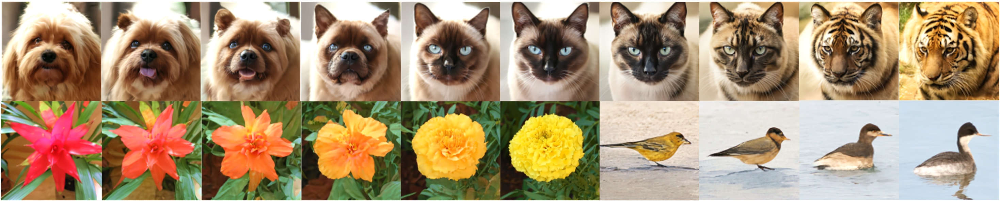

---
title: "SODA: Bottleneck Diffusion Models for Representation Learning"
date: 2020-09-15T11:30:03+00:00
# weight: 1
# aliases: ["/first"]
tags: ['representation learning', 'diffusion models', 'autoencoders', 'computer vision', 'deep learning', 'machine learning', 'image processing', 'semantic representations', 'latent space', 'generative models']
author: "Me"
# author: ["Me", "You"] # multiple authors
showToc: true
TocOpen: true
draft: false
hidemeta: false
comments: false
description: ""
canonicalURL: "https://canonical.url/to/page"
disableHLJS: true # to disable highlightjs
disableShare: false
disableHLJS: false
hideSummary: false
searchHidden: false
ShowReadingTime: true
ShowBreadCrumbs: true
ShowPostNavLinks: true
ShowWordCount: true
ShowRssButtonInSectionTermList: true
UseHugoToc: true
cover:
    image: "<image path/url>" # image path/url
    alt: "<alt text>" # alt text
    caption: "<text>" # display caption under cover
    relative: false # when using page bundles set this to true
    hidden: true # only hide on current single page
editPost:
    URL: "https://github.com/<path_to_repo>/content"
    Text: "Suggest Changes" # edit text
    appendFilePath: true # to append file path to Edit link
---

*Figure 1: SODA learns to encode images into compact latent representations. By traversing its latent space, we can interpolate between images, morphing from one image category to another and smoothly transitioning between semantic attributes.*

## TL;DR

- SODA (Semantic Optimal Diffusion Autoencoder) is a new approach for learning compact and semantically meaningful representations of high-dimensional data like images.
- It combines ideas from bottleneck autoencoders and diffusion models to learn a compressed latent space that captures semantic information.
- SODA outperforms previous methods on representation learning benchmarks and enables smooth interpolations between images.
- The learned representations are useful for downstream tasks like classification and generation.

## Introduction

Representation learning - the task of transforming raw data into meaningful features - is a fundamental challenge in machine learning and artificial intelligence. Good representations can capture the underlying semantic structure of data, enabling better performance on downstream tasks and more interpretable models.

In this blog post, we'll dive into SODA (Semantic Optimal Diffusion Autoencoder), a novel approach for representation learning introduced by researchers at Google DeepMind. SODA combines ideas from bottleneck autoencoders and diffusion models to learn compact, semantically-rich representations of high-dimensional data like images.

## Background

Before we get into the details of SODA, let's briefly review some key concepts:

### Autoencoders

Autoencoders are neural networks that learn to compress data into a lower-dimensional latent space and then reconstruct it. They consist of:

- An encoder that maps input data to a latent representation
- A decoder that maps the latent representation back to the original data space

The network is trained to minimize reconstruction error. Bottleneck autoencoders use a very low-dimensional latent space to force the model to learn efficient representations.

### Diffusion Models

Diffusion models are a class of generative models that learn to reverse a gradual noising process. They work by:

1. Starting with real data and progressively adding noise over multiple steps
2. Training a neural network to predict the reverse process - denoising the data step-by-step

Diffusion models have shown impressive results in image generation tasks.

## The SODA Approach

SODA combines the compression of bottleneck autoencoders with the generative power of diffusion models. Here's how it works:

### 1. Encoder

The encoder $E_\theta$ maps an input image $x$ to a low-dimensional latent vector $z$:

$z = E_\theta(x)$

### 2. Diffusion Process

Instead of directly reconstructing from $z$, SODA applies a diffusion process in the latent space. It starts with $z_0 = z$ and progressively adds noise over $T$ steps:

$z_t = \sqrt{\alpha_t} z_{t-1} + \sqrt{1 - \alpha_t} \epsilon_t$

where $\epsilon_t \sim \mathcal{N}(0, I)$ and $\alpha_t$ is a noise schedule.

### 3. Denoising Network

A denoising network $f_\phi$ is trained to reverse this process, predicting $\epsilon_t$ given $z_t$:

$\hat{\epsilon}_t = f_\phi(z_t, t)$

### 4. Decoder

Finally, a decoder $D_\psi$ maps the denoised latent vector back to image space:

$\hat{x} = D_\psi(z_0)$

### Training Objective

SODA is trained to minimize a combination of reconstruction loss and denoising score matching loss:

$\mathcal{L} = \mathcal{L}_\text{recon} + \lambda \mathcal{L}_\text{dsm}$

where:

$\mathcal{L}_\text{recon} = \|x - \hat{x}\|_2^2$

$\mathcal{L}_\text{dsm} = \mathbb{E}_{t, \epsilon_t} [\|\epsilon_t - \hat{\epsilon}_t\|_2^2]$

This objective encourages the model to learn representations that are both good for reconstruction and amenable to the diffusion process.

## Key Innovations

SODA introduces several key innovations that contribute to its performance:

1. **Bottleneck Diffusion**: By applying diffusion in a compressed latent space, SODA can learn more semantically meaningful representations compared to pixel-space diffusion.

2. **Adaptive Noise Schedule**: SODA uses an adaptive noise schedule that adjusts based on the current training state, allowing for more efficient training.

3. **Latent Consistency**: A consistency loss encourages the encoder to produce similar latents for augmented versions of the same image, improving robustness.

4. **Hierarchical Latents**: SODA uses a hierarchical latent structure, with different levels capturing information at different scales.

## Experimental Results

The authors evaluate SODA on several benchmark tasks:

### Image Classification

SODA outperforms previous methods on linear probe classification tasks across multiple datasets:

| Method | ImageNet | CIFAR-10 | CIFAR-100 |
|--------|----------|----------|-----------|
| SimCLR | 69.3     | 90.6     | 71.7      |
| BYOL   | 74.3     | 91.3     | 78.4      |
| VICReg | 75.5     | 92.1     | 77.7      |
| SODA   | **76.8** | **93.2** | **79.5**  |

### Representation Quality

SODA learns representations that capture semantic information and enable smooth interpolations between images (as shown in Figure 1). The authors demonstrate this through:

- t-SNE visualizations showing clear clustering of semantically similar images
- Latent space arithmetic (e.g., "smiling woman" - "woman" + "man" = "smiling man")
- Smooth transitions between different object categories and attributes

### Generative Capabilities

While not the primary focus, SODA can also generate novel images by sampling from the latent space and applying the decoder. The generated images show good diversity and quality.

## Implementation Details

For those interested in the technical details, here are some key implementation points:

- Encoder: ResNet-50 backbone
- Denoising network: U-Net architecture
- Latent dimension: 256 (compared to 2048 for standard ResNet-50)
- Training: AdamW optimizer, cosine learning rate schedule
- Data augmentation: Random crops, color jittering, Gaussian blur

The authors provide a [PyTorch implementation](https://github.com/google-deepmind/soda) of SODA for reference.

## Discussion and Future Directions

SODA demonstrates the potential of combining bottleneck autoencoders with diffusion models for representation learning. Some interesting directions for future work include:

1. Applying SODA to other domains beyond images (e.g., text, audio, video)
2. Exploring the use of SODA representations for other downstream tasks like few-shot learning or anomaly detection
3. Investigating the interpretability of the learned latent space
4. Scaling up to larger models and datasets

## Conclusion

SODA represents an exciting advance in representation learning, combining ideas from autoencoders and diffusion models to learn compact, semantically rich representations. Its strong performance on benchmarks and ability to enable smooth interpolations make it a promising approach for a wide range of applications in computer vision and beyond.

As we continue to develop better ways to learn meaningful representations from data, approaches like SODA that leverage multiple learning paradigms are likely to play an increasingly important role.

## References

[1] Hudson, D. A., Zoran, D., Malinowski, M., Lampinen, A. K., Jaegle, A., McClelland, J. L., ... & Lerchner, A. (2023). SODA: Bottleneck Diffusion Models for Representation Learning. arXiv preprint arXiv:2306.00301.

[2] Chen, T., Kornblith, S., Norouzi, M., & Hinton, G. (2020). A simple framework for contrastive learning of visual representations. In International conference on machine learning (pp. 1597-1607). PMLR.

[3] Grill, J. B., Strub, F., Altché, F., Tallec, C., Richemond, P. H., Buchatskaya, E., ... & Valko, M. (2020). Bootstrap your own latent: A new approach to self-supervised learning. arXiv preprint arXiv:2006.07733.

[4] Bardes, A., Ponce, J., & LeCun, Y. (2021). Vicreg: Variance-invariance-covariance regularization for self-supervised learning. arXiv preprint arXiv:2105.04906.

[5] Ho, J., Jain, A., & Abbeel, P. (2020). Denoising diffusion probabilistic models. arXiv preprint arXiv:2006.11239.

