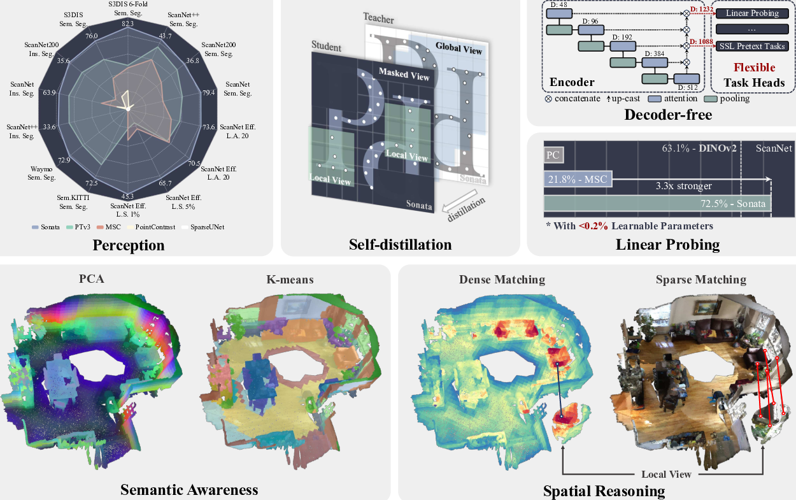

# Sonata: Self-Supervised Learning of Reliable Point Representations

## TLDR
- Sonata is a new self-supervised learning approach for 3D point clouds that addresses the "geometric shortcut" problem unique to 3D data
- It achieves state-of-the-art results on 3D perception tasks with strong linear probing performance and zero-shot capabilities
- Key innovations include coarse-scale losses, spatial disturbance of masked points, and progressive difficulty increases during training
- Sonata demonstrates superior data efficiency and parameter efficiency compared to previous methods

## Introduction

3D point cloud understanding is crucial for many applications like autonomous driving, robotics, and augmented reality. While self-supervised learning has made great strides in 2D computer vision, progress in 3D has lagged behind. The authors of this paper set out to investigate a critical question:

*Do we have a reliable self-supervised point cloud model that can be used for diverse 3D tasks via simple linear probing, even with limited data and minimal computation?*

Their findings reveal that existing 3D self-supervised learning approaches fall short when evaluated on representation quality through linear probing. The authors hypothesize this is due to what they term the "geometric shortcut" - a tendency for models to collapse to low-level spatial features that are easily accessible in sparse point cloud data.

To address this challenge, the authors introduce Sonata - a new self-supervised learning framework for point clouds. Sonata employs two key strategies:

1. Obscuring spatial information 
2. Enhancing reliance on input features

Through careful design and scaling to 140,000 point cloud scenes, Sonata achieves remarkable results:

- Zero-shot visualizations demonstrate semantic grouping and strong spatial reasoning
- 3x improvement in linear probing accuracy on ScanNet (from 21.8% to 72.5%)
- Nearly 2x performance with only 1% of training data compared to previous approaches
- State-of-the-art results on both indoor and outdoor 3D perception tasks with full fine-tuning

Let's dive deeper into the key ideas behind Sonata and its impressive capabilities.

## The Geometric Shortcut Problem

The authors identify the "geometric shortcut" as the primary issue hindering previous point cloud self-supervised learning approaches. This shortcut refers to the tendency of models to collapse to easily accessible, low-level geometric cues like normal direction or point height.

Unlike 2D images where all information is contained in pixel values, 3D point clouds inherently encode spatial information in the point coordinates themselves. This spatial information is directly utilized by point cloud operators, making it difficult to obscure or mask effectively.

The geometric shortcut leads to suboptimal representations that don't capture higher-level semantic information. As shown in Figure 1, previous methods like CSC and MSC produce similarity heatmaps that primarily reflect surface normals or point height, rather than object-level concepts.

## Key Ideas in Sonata

To overcome the geometric shortcut problem, Sonata introduces several key innovations:

### 1. Coarse-scale Self-supervised Losses

Rather than applying losses at the original high-resolution point cloud, Sonata computes losses at coarser spatial scales after hierarchical encoding and pooling. This naturally obscures fine-grained geometric details.

### 2. Masked Point Disturbance 

For points that will be masked during training, Sonata applies stronger Gaussian noise to their coordinates. This further disrupts reliance on precise spatial relationships.

### 3. Progressive Difficulty Increase

Sonata employs a curriculum learning strategy, gradually increasing task difficulty over the course of training. Key hyperparameters like mask size, mask ratio, and weight decay are progressively increased.

### 4. Self-distillation Framework

Building on recent advances in image self-supervised learning, Sonata uses a teacher-student framework with online clustering and Sinkhorn-Knopp centering.

### 5. Large-scale Training

Sonata is trained on a diverse collection of 140,000 point cloud scenes from both real and synthetic datasets - a 86.7x increase in scale compared to previous work.

## Sonata Architecture and Training

Let's look at the core components of Sonata in more detail:

### Backbone Network

Sonata uses Point Transformer V3 (PTv3) as the backbone network. Key modifications include:

- Replacing Batch Normalization with Layer Normalization for better multi-dataset training
- Scaling up model depth and width (108M parameters total)
- Removing the decoder during self-supervised pre-training

### Data Processing

Point clouds are processed as follows:

1. Random crops generate global views (40-100% of points) and local views (5-40% of points)
2. Masked views created by applying random patch masks to global views  
3. Various photometric and spatial augmentations applied

### Self-distillation Framework

Sonata employs a teacher-student framework:

- Student network processes local and masked views
- Teacher network (EMA of student) processes global views
- Point-wise matching between views based on original coordinates
- Loss computed between student and teacher embeddings

The core self-distillation loss is:

$$
\mathcal{L} = -\sum_{i} t_i \log(s_i)
$$

Where $t_i$ and $s_i$ are the teacher and student embeddings for matched points.

### Progressive Training

Key hyperparameters are increased over training:

- Mask size: 10cm → 40cm
- Mask ratio: 30% → 70%  
- Teacher temperature: 0.04 → 0.07
- Weight decay: 0.04 → 0.2

This curriculum pushes the model to rely more on semantic features as geometric shortcuts become harder to exploit.

## Impressive Capabilities

Sonata demonstrates several remarkable capabilities:

### Strong Linear Probing

With just a single linear layer (<0.2% of parameters), Sonata achieves:

- 72.5% mIoU on ScanNet semantic segmentation (3.3x improvement over previous SOTA)
- 72.3% mIoU on S3DIS Area 5 semantic segmentation

This shows the learned representations capture rich semantic information.

### Data Efficiency  

Sonata shows strong performance even with limited training data:

- 45.3% mIoU on ScanNet with only 1% of scenes (19.5% improvement over training from scratch)
- 70.5% mIoU with only 20 labeled points per scene

### Zero-shot Capabilities

Without any fine-tuning, Sonata enables:

- Semantic visualization through PCA coloring of point features
- Meaningful clustering of points using k-means
- Cross-scene correspondence via nearest neighbor matching

### State-of-the-art Full Fine-tuning

When fully fine-tuned, Sonata achieves new SOTA results across benchmarks:

- 79.4% mIoU on ScanNet semantic segmentation
- 82.3% mIoU on S3DIS 6-fold semantic segmentation  
- 42.4% mAP on ScanNet instance segmentation
- 81.7% mIoU on nuScenes LiDAR semantic segmentation

## Comparison to Image Self-supervised Learning

An interesting comparison in the paper is between Sonata and state-of-the-art image self-supervised models like DINOv2. When DINOv2 features are projected into 3D, they achieve 63.1% mIoU on ScanNet semantic segmentation.

Sonata outperforms this with 72.5% mIoU, showing it captures 3D-specific information beyond what's available in images. Combining Sonata and DINOv2 features pushes performance even higher to 76.4% mIoU.

This demonstrates the complementary nature of 2D and 3D self-supervised representations, and hints at exciting possibilities for multi-modal learning.

## Key Takeaways and Future Directions

Sonata represents a major step forward for self-supervised learning on 3D point clouds. Key takeaways include:

1. The geometric shortcut is a critical challenge unique to 3D data that must be addressed
2. Coarse-scale losses and progressive training are effective strategies to learn semantic representations
3. Large-scale training on diverse point cloud data yields powerful, generalizable features
4. Linear probing is an important evaluation criteria for representation quality

The authors suggest several promising directions for future work:

- Incorporating object-level point clouds to enhance semantic understanding
- Unifying indoor and outdoor pre-training 
- Leveraging video datasets to further scale up training data
- Exploring cross-modal distillation between 2D and 3D representations

## Conclusion

Sonata demonstrates that reliable, semantically-rich point cloud representations can be learned in a self-supervised manner. By carefully addressing the geometric shortcut problem, the authors have unlocked impressive zero-shot capabilities and state-of-the-art performance across 3D perception tasks.

As the first 3D self-supervised approach to achieve strong linear probing results, Sonata opens up exciting possibilities for transfer learning and few-shot adaptation in 3D vision. The principles introduced here are likely to influence the design of future 3D deep learning architectures and training frameworks.

For researchers and practitioners working with 3D data, Sonata provides a powerful new tool for bootstrapping models with limited labeled data. The strong zero-shot capabilities also enable new analysis techniques like semantic visualization and cross-scene matching.

Overall, Sonata represents an important milestone on the path toward general-purpose 3D perception models. By making the code and pre-trained models publicly available, the authors have provided a valuable resource for the 3D vision community to build upon.

## References

[1] Chen, T., Kornblith, S., Norouzi, M., & Hinton, G. (2020). A simple framework for contrastive learning of visual representations. In ICML.

[2] He, K., Fan, H., Wu, Y., Xie, S., & Girshick, R. (2020). Momentum contrast for unsupervised visual representation learning. In CVPR.

[3] Zhang, H., Li, F., Liu, S., Zhang, L., Su, H., Zhu, J., ... & Shum, H. Y. (2022). Dino: Detr with improved denoising anchor boxes for end-to-end object detection. arXiv preprint arXiv:2203.03605.

[4] Assran, M., Duval, Q., Misra, I., Bojanowski, P., Vincent, P., Rabbat, M., ... & Ballas, N. (2023). Self-supervised learning from images with a joint-embedding predictive architecture. In CVPR.

[5] Xie, S., Gu, J., Guo, D., Qi, C. R., Guibas, L., & Litany, O. (2020). PointContrast: Unsupervised pre-training for 3D point cloud understanding. In ECCV.

[6] Choy, C., Gwak, J., & Savarese, S. (2019). 4d spatio-temporal convnets: Minkowski convolutional neural networks. In CVPR.

[7] Wu, X., Lao, Y., Jiang, L., Liu, X., & Zhao, H. (2022). Point transformer v2: Grouped vector attention and partition-based pooling. In NeurIPS.

[8] Oquab, M., Darcet, T., Moutakanni, T., Vo, H. V., Szafraniec, M., Khalidov, V., ... & Bojanowski, P. (2024). Dinov2: Learning robust visual features without supervision. TMLR.

[9] Dai, A., Chang, A. X., Savva, M., Halber, M., Funkhouser, T., & Nießner, M. (2017). ScanNet: Richly-annotated 3D reconstructions of indoor scenes. In CVPR.

[10] Armeni, I., Sener, O., Zamir, A. R., Jiang, H., Brilakis, I., Fischer, M., & Savarese, S. (2016). 3D semantic parsing of large-scale indoor spaces. In CVPR.

[11] Caesar, H., Bankiti, V., Lang, A. H., Vora, S., Liong, V. E., Xu, Q., ... & Beijbom, O. (2020). nuScenes: A multimodal dataset for autonomous driving. In CVPR.

[12] Sun, P., Kretzschmar, H., Dotiwalla, X., Chouard, A., Patnaik, V., Tsui, P., ... & Anguelov, D. (2020). Scalability in perception for autonomous driving: Waymo open dataset. In CVPR.

[13] Behley, J., Garbade, M., Milioto, A., Quenzel, J., Behnke, S., Stachniss, C., & Gall, J. (2019). SemanticKITTI: A dataset for semantic scene understanding of lidar sequences. In ICCV.

