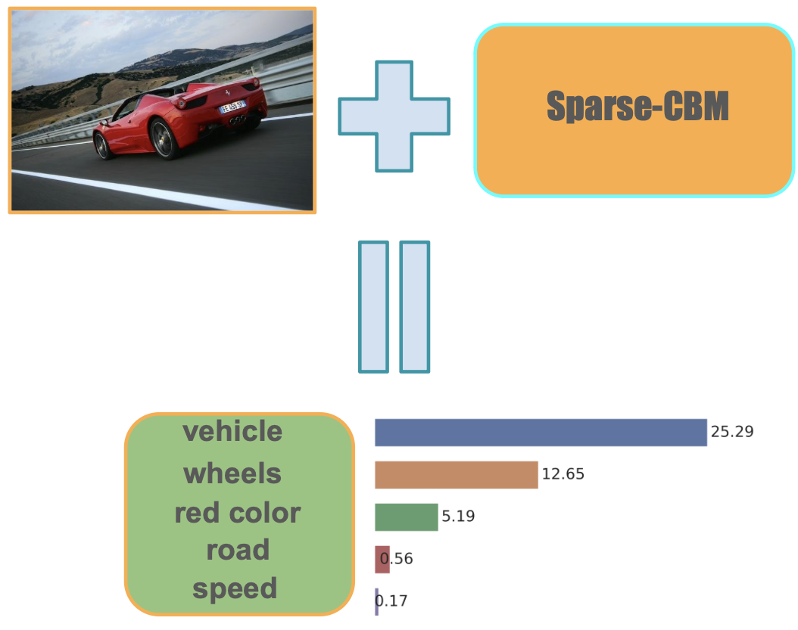
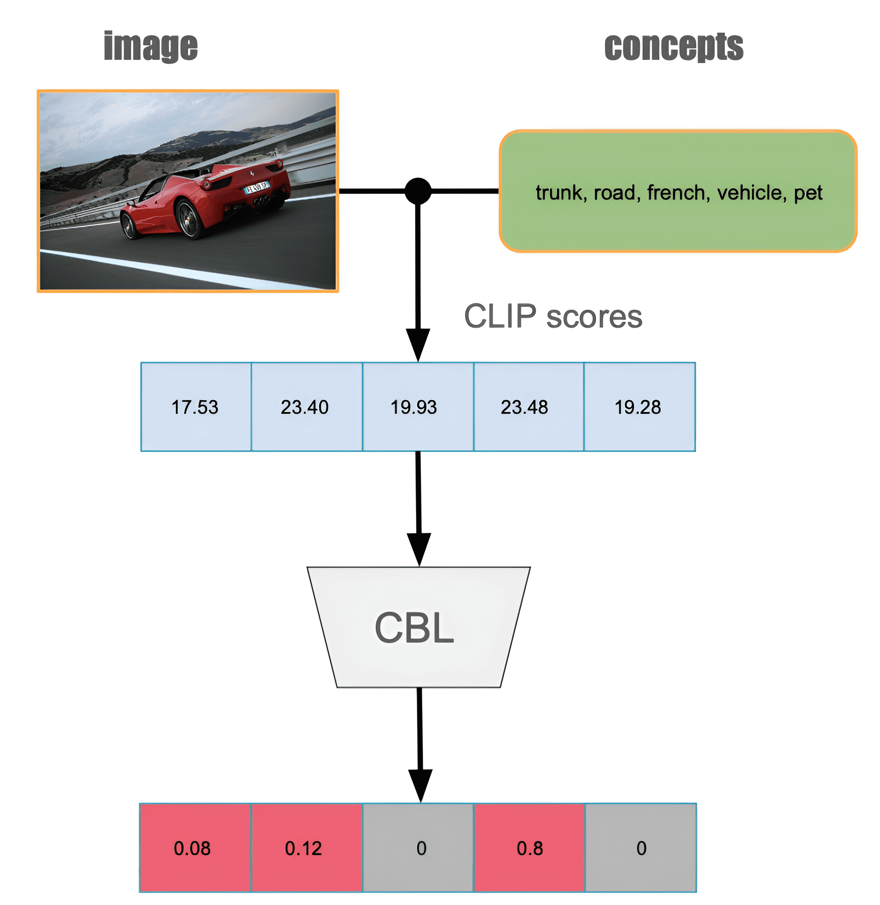

# Sparse Concept Bottleneck Models: Gumbel Tricks in Contrastive Learning

*Figure 1: Example of concepts extraction with Sparse-CBM.*

## TLDR

- This paper introduces Sparse Concept Bottleneck Models (Sparse-CBMs) for explainable image classification
- The approach builds on CLIP-like architectures and uses contrastive learning with Gumbel-Softmax to create sparse concept representations
- Sparse-CBMs outperform previous methods on several datasets while providing interpretable results
- A new Concept Matrix Search algorithm is proposed to improve CLIP predictions without additional training

## Introduction

In the realm of image classification, we've seen remarkable progress with state-of-the-art models achieving impressive accuracy. However, these models often function as black boxes, providing little insight into their decision-making process. This lack of interpretability can be problematic, especially in domains where explanations are crucial, such as medical applications.

Enter Concept Bottleneck Models (CBMs), an approach that aims to bridge the gap between high performance and interpretability. In this blog post, we'll dive deep into a new paper titled "Sparse Concept Bottleneck Models: Gumbel Tricks in Contrastive Learning" by Andrei Semenov, Vladimir Ivanov, Aleksandr Beznosikov, and Alexander Gasnikov. This work introduces an innovative framework for creating CBMs that leverages the power of contrastive learning and sparse representations.

## Background: Concept Bottleneck Models

Before we delve into the specifics of this paper, let's briefly review what Concept Bottleneck Models are and why they're important.

CBMs are neural network architectures designed to predict an intermediate set of human-understandable concepts before making a final classification. For example, when classifying a broken arm, a CBM might first identify concepts like "cracks on bones" or "unnatural arm angles" before concluding that the image shows a fracture.

The key benefits of CBMs include:

1. Explainability: They allow us to understand what information the model considers important for classification.
2. Debugging: We can identify why a model makes particular mistakes by examining which concepts were given incorrect priority.

However, traditional CBMs face some challenges:

1. Concept preparation: They require additional labeled concept data, which can be time-consuming and expensive to collect.
2. Performance: CBMs often have lower accuracy compared to unrestricted models.
3. Model editing: It's challenging to intervene in the model holistically, especially when working with pre-trained feature extractors.

## The Sparse-CBM Approach

The authors of this paper propose a novel framework for creating Concept Bottleneck Models that addresses these challenges. Their approach, which they call Sparse-CBM, builds upon the success of CLIP-like architectures and introduces several key innovations.

### Framework Overview

The Sparse-CBM framework consists of the following components:

1. A pre-trained multi-modal encoder (e.g., CLIP)
2. A Concept Bottleneck Layer (CBL)
3. A final Fully Connected (FC) layer

The authors propose three methods for training the CBL:

1. $\ell_1$-loss
2. Contrastive loss
3. Gumbel-Softmax based loss (Sparse-CBM)

The FC layer is trained using standard Cross-Entropy loss.

Let's break down each of these components in more detail.

### Pre-trained Multi-modal Encoder

The framework starts with a pre-trained multi-modal encoder, such as CLIP (Contrastive Language-Image Pre-training). CLIP is trained on a large dataset of image-text pairs and learns to embed both images and text into a shared latent space.

In the context of Sparse-CBM, we use CLIP's ability to compute similarity scores between images and textual concepts. Given an image $x$ and a set of concept texts $t$, we can obtain a vector of dot-product scores:

$$\psi(x, t) = \left(\langle i, d_1\rangle,\dots,\langle i, d_{|\mathrm{D}|}\rangle \right)^{\mathrm{\top}} \in \mathbb{R}^{|\mathrm{D}|}$$

where $i$ is the image embedding, $d_j$ are the concept embeddings, and $|\mathrm{D}|$ is the number of concepts.

### Concept Bottleneck Layer (CBL)

The Concept Bottleneck Layer is a linear layer that takes the dot-product scores from CLIP as input and produces a new representation. The goal is to learn a sparse and interpretable concept representation.

The authors propose three different methods for training the CBL:

1. **$\ell_1$-loss**: This method encourages sparsity by minimizing the $\ell_1$ norm of the CBL weights:

   $$\min \limits_{W_{\mathrm{CBL}}} \mathop{\mathbb{E}}\limits_{(x, t, l)\sim\mathcal{D}}\big[\mathcal{L}_{\mathrm{CE}}(W_{\mathrm{F}}W_{\mathrm{CBL}}\psi(x, t), l) + \frac{\lambda}{|\mathrm{D}|}\|W_{\mathrm{CBL}}\|_1 \big]$$

   where $\mathcal{L}_{\mathrm{CE}}$ is the Cross-Entropy loss, $W_{\mathrm{F}}$ are the weights of the final FC layer, and $\lambda$ is a regularization parameter.

2. **Contrastive loss**: This method adapts the CLIP contrastive loss for training the CBL:

   $$-\frac{1}{2|\mathrm{B}|} \sum_{\mathrm{k}=1}^{|\mathrm{B}|}\Bigg(\log \frac{e^{\alpha \langle w_{\mathrm{k}}, \varphi_{\mathrm{k}}\rangle}}{\sum_{\mathrm{j}=1}^{|\mathrm{B}|}e^{\alpha \langle w_{\mathrm{k}}, \varphi_{\mathrm{j}}\rangle}} + \log \frac{e^{\alpha \langle w_{\mathrm{k}}, \varphi_{\mathrm{k}}\rangle}}{\sum_{\mathrm{j}=1}^{|\mathrm{B}|}e^{\alpha \langle w_{\mathrm{j}}, \varphi_{\mathrm{k}}\rangle}} \Bigg)$$

   where $|\mathrm{B}|$ is the batch size, $w_k$ is the $k$-th row of $W_{\mathrm{CBL}}$, and $\varphi_k$ is the vector of dot-product scores for the $k$-th image.

3. **Gumbel-Softmax based loss (Sparse-CBM)**: This is the main innovation of the paper. It uses the Gumbel-Softmax trick to create a sparse and differentiable representation of concepts:

   $$-\frac{1}{2|\mathrm{B}|} \sum_{\mathrm{k}=1}^{|\mathrm{B}|}\Bigg(\log \frac{e^{\left(\log(\alpha \langle w_{\mathrm{k}}, \varphi_{\mathrm{k}}\rangle) + g_{\mathrm{k}}\right)/\tau}}{\sum_{\mathrm{j}=1}^{|\mathrm{B}|}e^{\left(\log(\alpha \langle w_{\mathrm{k}}, \varphi_{\mathrm{j}}\rangle) + g_{\mathrm{j}}\right)/\tau}} + \log \frac{e^{\left(\log(\alpha \langle w_{\mathrm{k}}, \varphi_{\mathrm{k}}\rangle) + g_{\mathrm{k}}\right)/\tau}}{\sum_{\mathrm{j}=1}^{|\mathrm{B}|}e^{\left(\log(\alpha \langle w_{\mathrm{j}}, \varphi_{\mathrm{k}}\rangle) + g_{\mathrm{j}}\right)/\tau}} \Bigg)$$

   where $g_k$ are samples from the Gumbel(0,1) distribution, and $\tau$ is a temperature parameter that controls the sparsity of the representation.

### Final Fully Connected Layer

The final FC layer takes the output of the CBL and produces class probabilities. It is trained using standard Cross-Entropy loss:

$$\min \limits_{W_{\mathrm{F}}} \mathop{\mathbb{E}}\limits_{(x, t, l)\sim\mathcal{D}}\big[\mathcal{L}_{\mathrm{CE}}(W_{\mathrm{F}}W_{\mathrm{CBL}}\psi(x, t), l) \big]$$

## Concept Matrix Search Algorithm

In addition to the Sparse-CBM framework, the authors introduce a novel algorithm called Concept Matrix Search (CMS). This algorithm aims to improve CLIP predictions on complex datasets without any additional training or fine-tuning.

The CMS algorithm is based on the following hypothesis:

Given matrices $\mathcal{V}$ (Image-Concept similarity) and $\mathcal{T}$ (Class-Concept similarity), for any image $k$ and its true class $\phi(k)$:

$$\cos(\mathcal{V}_{\mathrm{k},\cdot}^\top, \mathcal{T}_{\phi(\mathrm{k}),\cdot}^\top) \geq \cos(\mathcal{V}_{\mathrm{k},\cdot}^\top, \mathcal{T}_{\phi(\mathrm{j}),\cdot}^\top)$$

for all $j \neq k$.

In other words, the cosine similarity between an image's concept similarities and its true class's concept similarities should be higher than the similarity with any other class.

The CMS algorithm (Algorithm 1 in the paper) tests this hypothesis and uses it to classify images. It's a simple yet effective way to leverage CLIP's pre-trained knowledge for more accurate and interpretable classification.

## Experimental Results

The authors evaluated their Sparse-CBM approach on several popular image classification datasets, including CIFAR10, CIFAR100, ImageNet, CUB-200, and Places365. They compared their results with previous methods such as Label-free CBM, Post-hoc CBM, and LaBo.

Here are some key findings:

1. Sparse-CBM outperformed other methods on CIFAR10, CIFAR100, and CUB-200 datasets.
2. On the CUB-200 dataset, Sparse-CBM achieved an impressive accuracy of 80.02%.
3. The $\ell_1$-CBM and Contrastive-CBM variants also showed competitive performance.
4. The Concept Matrix Search algorithm demonstrated improved accuracy compared to zero-shot CLIP classification on several datasets.

Table 1 shows a comparison of the different methods:

| Model | CIFAR10 | CIFAR100 | ImageNet | CUB200 | Places365 |
|-------|---------|----------|----------|--------|-----------|
| Sparse-CBM (Ours) | **91.17%** | **74.88%** | 71.61% | **80.02%** | 41.34% |
| $\ell_1$-CBM (Ours) | 85.11% | 73.24% | 71.02% | 74.91% | 40.87% |
| Contrastive-CBM (Ours) | 84.75% | 68.46% | 70.22% | 67.04% | 40.22% |
| Label-free CBM | 86.40% | 65.13% | **71.95%** | 74.31% | **43.68%** |
| Post-hoc CBM (CLIP) | 83.34% | 57.20% | 62.57% | 63.92% | 39.66% |
| LaBo (full-supervised) | 87.90% | 69.10% | 70.40% | 71.80% | 39.43% |

## Interpretability and Visualization

One of the key advantages of Sparse-CBM is its ability to provide interpretable results. The authors demonstrate this through various visualizations and analyses.

*Figure 2: Visualization of Sparse-CBM Concept Bottleneck Layers.*

Figure 2 shows how the Sparse-CBM approach leads to more interpretable concept activations compared to other methods. The sparsity in the concept representation allows for easier identification of the most relevant concepts for a given image.

The authors also provide examples of concept extraction for various images across different datasets. These visualizations help to understand how the model is making its decisions and which concepts it considers most important for classification.

## Discussion and Future Directions

The Sparse-CBM approach presented in this paper offers several advantages over previous methods:

1. **Improved accuracy**: The method outperforms existing CBM approaches on several datasets while maintaining interpretability.
2. **Automatic concept generation**: The framework includes a method for automatically generating concept sets, reducing the need for manual concept labeling.
3. **Sparse representations**: The use of Gumbel-Softmax tricks leads to sparse and interpretable concept representations.
4. **Flexibility**: The approach can be applied to various pre-trained multi-modal encoders, not just CLIP.

However, there are also some limitations and areas for future research:

1. **End-to-end training**: The current approach doesn't modify the CLIP latent space, which could potentially limit its versatility.
2. **Concept set optimization**: While the method includes automatic concept generation, further research could explore ways to optimize the concept set for different datasets and tasks.
3. **Scalability**: The performance on larger datasets like ImageNet and Places365 could be improved.

Future work could explore:

1. Incorporating the Concept Matrix Search algorithm into the training process for even better performance.
2. Extending the approach to other tasks beyond image classification, such as object detection or segmentation.
3. Investigating ways to make the entire pipeline end-to-end trainable while maintaining interpretability.

## Conclusion

The Sparse Concept Bottleneck Models introduced in this paper represent a significant step forward in the field of explainable AI for image classification. By combining the power of contrastive learning with sparse concept representations, the authors have created a framework that offers both high accuracy and interpretability.

As we continue to deploy AI systems in critical domains, the ability to understand and explain model decisions becomes increasingly important. Approaches like Sparse-CBM pave the way for more transparent and trustworthy AI systems that can be confidently used in real-world applications.

The code for this project is available on GitHub at: [https://github.com/Andron00e/SparseCBM](https://github.com/Andron00e/SparseCBM). I encourage readers to explore the implementation and experiment with the Sparse-CBM approach on their own datasets.

## References

1. Koh, P. W., Nguyen, T., Tang, Y. S., Mussmann, S., Pierson, E., Kim, B., & Liang, P. (2020). Concept bottleneck models. [arXiv:2007.04612](https://arxiv.org/abs/2007.04612)

2. Radford, A., Kim, J. W., Hallacy, C., Ramesh, A., Goh, G., Agarwal, S., ... & Sutskever, I. (2021). Learning transferable visual models from natural language supervision. [arXiv:2103.00020](https://arxiv.org/abs/2103.00020)

3. Jang, E., Gu, S., & Poole, B. (2017). Categorical reparameterization with gumbel-softmax. [arXiv:1611.01144](https://arxiv.org/abs/1611.01144)

4. Oikarinen, T., Das, S., Nguyen, L. M., & Weng, T. W. (2023). Label-free concept bottleneck models. [ICLR 2023](https://openreview.net/forum?id=FlCg47MNvBA)

5. Yuksekgonul, M., Wang, M., & Zou, J. (2023). Post-hoc concept bottleneck models. [arXiv:2305.13868](https://arxiv.org/abs/2305.13868)

6. Yang, Y., Panagopoulou, A., Zhou, S., Jin, D., Callison-Burch, C., & Yatskar, M. (2023). Language in a bottle: Language model guided concept bottlenecks for interpretable image classification. [arXiv:2305.10549](https://arxiv.org/abs/2305.10549)

