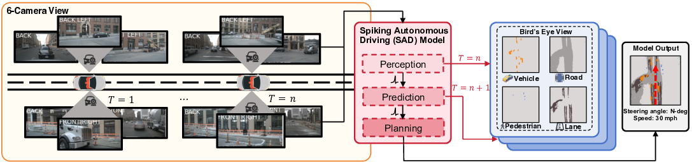

# Spiking Autonomous Driving: Neuromorphic End-to-End Learning for Self-Driving Cars

*Figure 1: Overview of the Spiking Autonomous Driving (SAD) system. The perception module processes multi-view camera inputs, the prediction module forecasts future states, and the planning module generates trajectories.*

## TLDR

- First end-to-end spiking neural network (SNN) for autonomous driving
- Integrates perception, prediction and planning using energy-efficient SNNs
- Competitive performance on nuScenes dataset while reducing energy consumption
- Demonstrates potential of neuromorphic computing for sustainable autonomous vehicles

## Introduction

Autonomous driving is often considered the "holy grail" of computer vision, requiring the seamless integration of perception, prediction, and planning capabilities. As we push towards higher levels of vehicle automation, a key challenge that emerges is the need for energy efficiency. Current autonomous driving systems must adhere to strict power budgets of 50-60 W/h, while also addressing growing environmental concerns.

In a fascinating new paper titled "Autonomous Driving with Spiking Neural Networks", researchers Rui-Jie Zhu, Ziqing Wang, Leilani Gilpin, and Jason K. Eshraghian present a novel approach that leverages neuromorphic computing to tackle this challenge. They introduce Spiking Autonomous Driving (SAD), the first unified spiking neural network designed to address the energy challenges faced by autonomous driving systems.

In this blog post, we'll dive deep into the key components of SAD, explore its innovative architecture, and discuss the implications of this work for the future of autonomous driving technology. Let's get started!

## Background: Spiking Neural Networks

Before we delve into the specifics of SAD, it's important to understand the basics of spiking neural networks (SNNs). Unlike traditional artificial neural networks (ANNs) that use continuous-valued activations, SNNs use discrete, binary spike events for communication between neurons. This approach is inspired by the way biological neurons in the brain communicate.

SNNs offer several advantages for energy-efficient computing:

1. **Event-driven processing**: SNNs only perform computations when neurons fire, leading to sparse activations and reduced energy consumption.
2. **Temporal information encoding**: Spikes naturally encode information over time, making SNNs well-suited for processing temporal data like video streams.
3. **Low-power hardware compatibility**: The binary nature of spikes aligns well with neuromorphic hardware designs, enabling further energy savings.

These properties make SNNs an attractive option for autonomous driving, where energy efficiency is crucial for scalability and sustainability.

## The SAD Architecture: Perception, Prediction, and Planning

The SAD system consists of three main modules: perception, prediction, and planning. Let's examine each of these components in detail.

### Perception Module

The perception module is responsible for constructing a bird's eye view (BEV) representation of the environment from multi-view camera inputs. This module uses a spiking encoder-decoder architecture with some key innovations:

1. **Spiking Token Mixer (STM)**: The encoder uses a novel STM architecture, which is a deeper version of the spiking patch embedding from previous work. It consists of 12 layers of spiking CNN pre-trained on ImageNet-1K.

2. **Inverted Bottleneck**: The STM employs an inverted bottleneck design, where the number of channels first increases and then decreases across the 12 layers.

3. **Dense Layers**: Instead of using self-attention, the authors replaced it with dense layers, reducing computational resources while improving performance.

The encoder's workflow can be summarized by the following equations:

$$
X = \text{STM}(I), \quad I \in \mathbb{R}^{N \times C_{in} \times T \times L \times H \times W}, \quad X \in \mathbb{R}^{C \times T \times L \times H \times W}
$$

$$
\mathcal{F} = \text{Head}_{\rm feature}(X), \quad X \in \mathbb{R}^{C \times T \times L \times H \times W}, \quad \mathcal{F} \in \mathbb{R}^{C_f \times L \times H \times W}
$$

$$
\mathcal{D} = \text{Head}_{\rm depth}(X), \quad X \in \mathbb{R}^{C \times T \times L \times H \times W}, \quad \mathcal{D} \in \mathbb{R}^{C_d \times L \times H \times W}
$$

$$
Y = \mathcal{F} \otimes \mathcal{D}, \quad Y \in \mathbb{R}^{C_f \times C_d \times T \times L \times H \times W}
$$

Where $I$ is the input tensor, $X$ is the output of the STM, $\mathcal{F}$ is the feature map, $\mathcal{D}$ is the depth estimation, and $Y$ is the final output of the encoder.

The decoder uses a recurrent architecture with spiking neurons to generate predictions for lane dividers, pedestrians, vehicles, and drivable areas.

### Prediction Module

The prediction module is designed to forecast future states of the environment. It uses a novel "dual pathway" architecture that allows data to flow through two separate paths:

1. **Past Information Path**: This path focuses on encoding information from past frames.
2. **Future Prediction Path**: This path specializes in predicting future information.

The outputs from these two paths are then fused to create a comprehensive temporal representation. The prediction process can be summarized by the following equation:

$$
\hat{x}_{t+1} = \mathrm{LIF}({\rm{BN}}({\rm{Conv2d}}(\text{concatenate}(x_t, \eta_t))) \oplus \mathrm{LIF}({\rm{BN}}({\rm{Conv2d}}((x_{0:t})))
$$

Where $\hat{x}_{t+1}$ is the predicted BEV features for the next timestep, $\mathrm{LIF}(\cdot)$ denotes the Leaky Integrate-and-Fire neuron layer, $\text{concatenate}(\cdot)$ represents the concatenation operation, and $\oplus$ denotes element-wise addition.

### Planning Module

The planning module generates safe trajectories by considering predicted occupancy, traffic rules, and ride comfort. It uses a two-step approach:

1. **Initial Trajectory Selection**: The module first selects an initial "best" trajectory $\tau^*$ from a set of sampled trajectories using a cost function:

   $$
   f(\tau, o, m; w) = f_o(\tau, o, m; w_o) + f_v(\tau; w_v) + f_r(\tau; w_r)
   $$

   Where $f_o$ evaluates trajectory compliance with obstacles, $f_v$ assesses future states, and $f_r$ addresses ride comfort and progress towards the goal.

2. **Trajectory Refinement**: The selected trajectory is then refined using a Spiking Gated Recurrent Unit (SGRU):

   $$
   r_t = \Theta(W_{ir} x_t + b_{ir} + W_{hr} h_{t-1} + b_{hr})
   $$
   
   $$
   z_t = \Theta(W_{iz} x_t + b_{iz} + W_{hz} h_{t-1} + b_{hz})
   $$
   
   $$
   n_t = \Theta(W_{in} x_t + b_{in} + r_t \odot (W_{hn} h_{t-1} + b_{hn}))
   $$
   
   $$
   h_t = (1 - z_t) \odot n_t + z_t \odot h_{t-1}
   $$

   Where $h_t$ is the hidden state, $x_t$ is the input, and $r_t$, $z_t$, $n_t$ are the reset, update, and new candidate state gates respectively.

## Training and Implementation Details

The SAD system is trained end-to-end using a composite loss function that combines objectives from perception, prediction, and planning:

$$
\mathcal{L} =  \mathcal{L}_{per} + \alpha \mathcal{L}_{pre} + \beta \mathcal{L}_{pla}
$$

Where $\alpha$ and $\beta$ are learnable weights that dynamically adjust the contributions of each task.

The training process is divided into three stages:

1. **Perception Module Training**: The perception module is trained first, with the prediction and planning modules disabled.
2. **Prediction Module Training**: The prediction module is then enabled and trained.
3. **Planning Module Training**: Finally, the planning module is trained using real trajectories for supervision.

This staged approach ensures that each component is well-trained before integrating them into the end-to-end framework.

## Experimental Results

The authors evaluated SAD on the nuScenes dataset, a comprehensive benchmark for autonomous driving. Here are some key results:

### Perception Performance

SAD achieved competitive performance on BEV segmentation tasks compared to state-of-the-art non-spiking methods:

| Method | Drivable Area | Lane | Vehicle | Pedestrian | Avg. |
|--------|---------------|------|---------|------------|------|
| VED    | 60.82         | 16.74| 23.28   | 11.93      | 28.19|
| VPN    | 65.97         | 17.05| 28.17   | 10.26      | 30.36|
| PON    | 63.05         | 17.19| 27.91   | 13.93      | 30.52|
| Lift-Splat | 72.23     | 19.98| 31.22   | 15.02      | 34.61|
| IVMP   | 74.70         | 20.94| 34.03   | 17.38      | 36.76|
| FIERY  | 71.97         | 33.58| 38.00   | 17.15      | 40.18|
| ST-P3  | 75.97         | 33.85| 38.00   | 17.15      | 42.69|
| **SAD (Ours)** | 64.74 | 27.78| 34.82   | 15.12      | 35.62|

### Prediction Performance

The prediction module showed promising results, although there is still room for improvement compared to non-spiking methods:

| Method | Future Semantic Seg. IoU | PQ    | SQ    | RQ    |
|--------|--------------------------|-------|-------|-------|
| Static | 32.20                    | 27.64 | 70.05 | 39.08 |
| FIERY  | 37.00                    | 30.20 | 70.20 | 42.90 |
| ST-P3  | 38.63                    | 31.72 | 70.15 | 45.22 |
| **SAD (Ours)** | 32.74            | 20.00 | 68.74 | 29.39 |

### Planning Performance

SAD demonstrated competitive planning performance while significantly reducing energy consumption:

| Method    | L2 (m) at 3s | Collision (%) at 3s | Energy (mJ) |
|-----------|--------------|---------------------|-------------|
| NMP       | 3.18         | 2.34                | -           |
| Freespace | 3.08         | 1.64                | 344.11      |
| ST-P3     | 2.90         | 1.27                | 3520.40     |
| **SAD (Ours)** | 3.21    | 2.38                | 46.92       |

The most striking result is the energy efficiency of SAD, which consumes **7.33x less energy** than the Freespace model and **75.03x less energy** than the ST-P3 model.

## Discussion and Future Directions

The SAD system represents a significant step forward in applying neuromorphic computing to autonomous driving. By leveraging the energy efficiency of SNNs, it addresses one of the key challenges in scaling autonomous vehicle technology.

Some key takeaways and areas for future research include:

1. **Energy Efficiency**: The dramatic reduction in energy consumption demonstrated by SAD opens up new possibilities for sustainable autonomous driving systems.

2. **Performance Gap**: While SAD shows competitive performance in many areas, there is still room for improvement, particularly in prediction tasks. Future work could focus on narrowing this gap with non-spiking methods.

3. **Hardware Implementation**: The next step would be to implement SAD on neuromorphic hardware to fully realize its energy-saving potential in real-world scenarios.

4. **Scalability**: As autonomous driving systems become more complex, the scalability advantages of SNNs could become even more pronounced. Further research could explore how SAD performs on larger, more complex driving scenarios.

5. **Sensor Fusion**: While this work focused on camera inputs, future iterations could incorporate other sensor modalities like LiDAR or radar using spiking neural architectures.

## Conclusion

The Spiking Autonomous Driving (SAD) system introduced in this paper represents a significant milestone in the application of neuromorphic computing to real-world problems. By demonstrating that SNNs can handle the complex requirements of autonomous driving while dramatically reducing energy consumption, this work opens up new avenues for sustainable and scalable autonomous vehicle technology.

As we continue to push the boundaries of AI and robotics, approaches like SAD that combine cutting-edge machine learning techniques with energy-efficient computing paradigms will be crucial in addressing the challenges of the future. The code for this project is available at [https://github.com/ridgerchu/SAD](https://github.com/ridgerchu/SAD), enabling further research and development in this exciting field.

What do you think about the potential of spiking neural networks for autonomous driving? How might this technology impact the future of transportation and urban planning? Share your thoughts and let's continue the discussion!

## References

1. Caesar, H., Bankiti, V., Lang, A. H., Vora, S., Liong, V. E., Xu, Q., ... & Beijbom, O. (2020). nuscenes: A multimodal dataset for autonomous driving. In Proceedings of the IEEE/CVF conference on computer vision and pattern recognition (pp. 11621-11631).

2. Davies, M., Srinivasa, N., Lin, T. H., Chinya, G., Cao, Y., Choday, S. H., ... & Wang, H. (2018). Loihi: A neuromorphic manycore processor with on-chip learning. IEEE Micro, 38(1), 82-99.

3. Hu, P., Huang, A., Dolan, J., Held, D., & Ramanan, D. (2021). Safe local motion planning with self-supervised freespace forecasting. In Proceedings of the IEEE/CVF Conference on Computer Vision and Pattern Recognition (pp. 13270-13279).

4. Hu, S., Chen, L., Wu, P., Li, H., Yan, J., & Tao, D. (2022). St-p3: End-to-end vision-based autonomous driving via spatial-temporal feature learning. In European Conference on Computer Vision (pp. 533-549). Springer, Cham.

5. Philion, J., & Fidler, S. (2020). Lift, splat, shoot: Encoding images from arbitrary camera rigs by implicitly unprojecting to 3d. In Computer Vision–ECCV 2020: 16th European Conference, Glasgow, UK, August 23–28, 2020, Proceedings, Part XIV 16 (pp. 194-210). Springer International Publishing.

6. Roy, K., Jaiswal, A., & Panda, P. (2019). Towards spike-based machine intelligence with neuromorphic computing. Nature, 575(7784), 607-617.

7. Zeng, W., Luo, W., Suo, S., Sadat, A., Yang, B., Casas, S., & Urtasun, R. (2019). End-to-end interpretable neural motion planner. In Proceedings of the IEEE/CVF Conference on Computer Vision and Pattern Recognition (pp. 8660-8669).

