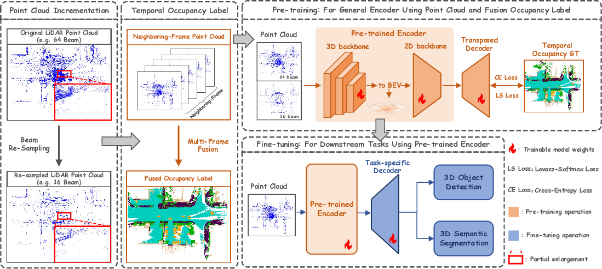

# SPOT: Scalable 3D Pre-training via Occupancy Prediction for Learning Transferable 3D Representations

*Figure 1: Overview of the proposed SPOT method for 3D pre-training*

## TLDR

- SPOT is a scalable 3D pre-training method that uses occupancy prediction to learn transferable representations for LiDAR point clouds
- It addresses domain gaps between datasets using beam re-sampling and class-balancing strategies
- SPOT achieves consistent performance improvements across various downstream 3D perception tasks and datasets
- The method demonstrates scalability, with performance improving as more pre-training data is used

## Introduction

3D perception tasks like object detection and semantic segmentation are crucial for autonomous driving applications. However, annotating 3D LiDAR point clouds is notoriously time-consuming and labor-intensive. To address this challenge, researchers have been exploring pre-training approaches to learn transferable 3D representations that can be fine-tuned on downstream tasks with fewer labeled examples.

In this blog post, we'll dive deep into SPOT (Scalable Pre-training via Occupancy prediction for learning Transferable 3D representations), a novel method proposed by Yan et al. that aims to learn general and scalable 3D representations for LiDAR point clouds. SPOT tackles both task-level and dataset-level gaps, making it a promising approach for real-world autonomous driving applications.

## The Challenge of 3D Pre-training

Before we delve into SPOT, let's consider the challenges in 3D pre-training:

1. **Task-level gap**: Existing methods like AD-PT [26] focus on specific tasks (e.g., 3D object detection), limiting their generalization to other perception tasks.

2. **Dataset-level gap**: Methods like GCC-3D [22], STRL [23], and BEV-MAE [24] struggle to generalize across datasets with different LiDAR sensors and annotation strategies.

3. **Scalability**: Many current approaches don't show consistent improvement as the amount of pre-training data increases.

SPOT addresses these challenges through a combination of innovative techniques and theoretical insights.

## SPOT: A Scalable 3D Pre-training Approach

### Occupancy Prediction as a Pre-training Task

The core idea behind SPOT is to use occupancy prediction as the pre-training task. But why occupancy prediction? The authors argue that it serves as a more general task compared to 3D object detection or LiDAR semantic segmentation. Here's why:

1. Occupancy prediction incorporates both spatial information (similar to 3D object detection) and semantic information (like semantic segmentation).
2. It uses denser voxel-level labels with abundant classes, providing richer supervision.

### Theoretical Justification

The authors provide a theoretical analysis to explain why occupancy-based pre-training outperforms self-supervised methods like MAE in downstream autonomous driving tasks. They introduce the concept of **temporally sufficient representations**:

**Definition 1 (Temporally Sufficient Representation):** The representation $z_{1, \text{suf}}^t$ of the $t$-th frame is temporally sufficient for another task $y_2^t$ if and only if $I(z_{1, \text{suf}}^t, y_2^t) = I(y_1^t, y_2^t)$, where $z_{1, \text{suf}}^t$ is learned from $y_1^t$, and $y_1^t$, $y_2^t$ are the $t$-th frame labels of two different prediction tasks that contains the shared information of consecutive frames.

Based on this definition, the authors prove that occupancy-based representations provide more information about downstream tasks than MAE-based representations:

$$I(z_{\text{occ}}^t, T) \geq I(z_{\text{mae}}^t, T)$$

Where $T$ represents the downstream task, $z_{\text{occ}}^t$ is the representation learned from occupancy prediction, and $z_{\text{mae}}^t$ is the representation learned from MAE.

This theoretical foundation supports the empirical results observed in the experiments.

### SPOT Architecture

Let's break down the key components of SPOT:

1. **Input Processing**: The input point cloud $\mathbf{P}\in \mathbb{R}^{N\times (3+d)}$ is first augmented using beam re-sampling and other techniques, resulting in $\mathbf{P}_{\text{aug}}$.

2. **Encoder**: The augmented point cloud is processed by 3D and 2D backbone encoders:

   $$\mathbf{F}_{\text{BEV}} = f^{\text{enc}}(\mathbf{P}_{\text{aug}})$$

   Where $\mathbf{F}_{\text{BEV}} \in \mathbb{R}^{\hat{H}\times\hat{W}\times\hat{d}}$ are the dense BEV features.

3. **Decoder**: A lightweight decoder predicts occupancy probabilities:

   $$\hat{\mathbf{O}} = \text{softmax}(f^{\text{dec}}(\mathbf{F}_{\text{BEV}}))$$

   Where $\hat{\mathbf{O}} \in \mathbb{R}^{H\times W \times (N_{\text{cls}}+1)}$ represents the predicted occupancy probabilities.

4. **Loss Function**: The overall loss combines a class-balancing cross-entropy loss and a Lovász-Softmax loss:

   $$\mathcal{L} = \mathcal{L}_\text{ce}(\mathbf{O}, \hat{\mathbf{O}}) + \lambda \cdot \mathcal{L}_\text{lov}(\mathbf{O}, \hat{\mathbf{O}})$$

### Addressing Domain Gaps

SPOT employs two key strategies to narrow domain gaps between datasets:

1. **Beam Re-sampling Augmentation**: This technique simulates LiDAR sensors with different numbers of laser beams, helping to generalize across datasets with varying LiDAR types. The beam density is calculated as:

   $$B_{\text{density}} = \frac{N_{\text{beam}}}{\alpha_{\text{up}} - \alpha_{\text{low}}}$$

   Where $N_{\text{beam}}$ is the number of LiDAR beams, and $\alpha_{\text{up}}$ and $\alpha_{\text{low}}$ represent the upper and lower limits of the vertical field of view.

2. **Class-balancing Strategies**: SPOT applies balance sampling on the dataset and category-specific weights on the loss functions. For dataset balancing, class sampling weights are calculated as:

   $$s_i = \sqrt{m / n_i}, \quad m = \frac{1}{N_{\text{fg}}}, \quad n_i = \frac{N_i}{\sum_{j=1}^{N_\text{fg}}N_j}$$

   Where $N_i$ is the number of samples for the $i$-th class.

## Experimental Results

The authors conducted extensive experiments to evaluate SPOT's performance across various downstream tasks and datasets. Let's look at some key findings:

### 1. Performance on nuScenes Detection

*Figure 2: Comparison of SPOT with other pre-training methods on various datasets and tasks*

SPOT consistently outperforms other pre-training methods across different detectors (SECOND and CenterPoint) and metrics (mAP and NDS). For example, using 100% of Waymo pre-training data, SPOT improves SECOND's performance by 10.41% mAP and 12.69% NDS compared to training from scratch.

### 2. Performance on KITTI Detection

On the KITTI dataset, SPOT achieves significant improvements for both SECOND and PV-RCNN detectors. With 100% pre-training data, the improvements are 5.66% and 5.06% mAPs at the moderate level, respectively.

### 3. Scalability

One of the most impressive aspects of SPOT is its scalability. As more pre-training data is used, the performance on downstream tasks consistently improves. This holds true even when using pseudo-labeled data for pre-training.

### 4. Generalization to Segmentation Tasks

SPOT also demonstrates strong performance on segmentation tasks. For example, on the SemanticKITTI dataset, SPOT improves mIoU by 6.57% compared to training from scratch, outperforming other pre-training methods.

### 5. Semi-supervised Pre-training

The authors explored a semi-supervised setting, showing that SPOT can achieve comparable performance to fully-supervised pre-training when using a combination of labeled and unlabeled data. This further demonstrates the method's flexibility and potential for real-world applications.

## Implementation Details

For those interested in implementing SPOT, here are some key details:

- Pre-training dataset: Waymo Open Dataset [20]
- Downstream datasets: KITTI [17], nuScenes [19], ONCE [18], SemanticKITTI [18]
- Detectors: SECOND [11], CenterPoint [12], PV-RCNN [13]
- Segmentation model: Cylinder3D [15]
- Pre-training: 30 epochs with Adam optimizer, one-cycle policy, learning rate of 0.003
- Fine-tuning: Varies by dataset (e.g., 30 epochs for nuScenes, 80 for KITTI and ONCE)
- Hardware: 8 NVIDIA Tesla A100 GPUs

The implementation is based on the 3DTrans [84] codebase.

## Discussion and Future Directions

SPOT represents a significant advancement in 3D pre-training for autonomous driving perception. Its ability to learn general representations that transfer well across tasks and datasets is particularly promising. However, there are still areas for future research:

1. **Exploring other pre-training tasks**: While occupancy prediction proves effective, there may be other tasks that could yield even better transferable representations.

2. **Improving efficiency**: As the amount of pre-training data grows, computational efficiency becomes crucial. Investigating ways to speed up pre-training without sacrificing performance could be valuable.

3. **Incorporating multi-modal data**: Extending SPOT to incorporate other sensor modalities (e.g., camera images) could lead to even more robust representations.

4. **Real-world deployment**: Evaluating SPOT's performance in real-world autonomous driving scenarios and addressing any challenges that arise will be crucial for practical adoption.

## Conclusion

SPOT offers a promising approach to learning scalable and transferable 3D representations for autonomous driving perception tasks. By addressing both task-level and dataset-level gaps, it paves the way for more efficient and effective use of large-scale LiDAR datasets. As the field of 3D perception continues to evolve, methods like SPOT will play a crucial role in advancing the capabilities of autonomous vehicles.

What are your thoughts on SPOT? Do you see potential applications beyond autonomous driving? Let us know in the comments!

## References

[11] Y. Yan, Y. Mao, and B. Li, "Second: Sparsely embedded convolutional detection," Sensors, vol. 18, no. 10, p. 3337, 2018.

[12] T. Yin, X. Zhou, and P. Krahenbuhl, "Center-based 3d object detection and tracking," in Proceedings of the IEEE/CVF Conference on Computer Vision and Pattern Recognition, 2021, pp. 11 784–11 793.

[13] S. Shi, C. Guo, L. Jiang, Z. Wang, J. Shi, X. Wang, and H. Li, "Pv-rcnn: Point-voxel feature set abstraction for 3d object detection," in Proceedings of the IEEE/CVF Conference on Computer Vision and Pattern Recognition, 2020, pp. 10 529–10 538.

[15] X. Zhu, H. Zhou, T. Wang, F. Hong, Y. Ma, W. Li, H. Li, and D. Lin, "Cylindrical and asymmetrical 3d convolution networks for lidar segmentation," in IEEE Conference on Computer Vision and Pattern Recognition, 2021, pp. 9939–9948.

[17] A. Geiger, P. Lenz, and R. Urtasun, "Are we ready for autonomous driving? the kitti vision benchmark suite," in Proceedings of the IEEE/CVF Conference on Computer Vision and Pattern Recognition, 2012, pp. 3354–3361.

[18] J. Behley, M. Garbade, A. Milioto, J. Quenzel, S. Behnke, C. Stachniss, and J. Gall, "Semantickitti: A dataset for semantic scene understanding of lidar sequences," in Proceedings of the IEEE/CVF international conference on computer vision, 2019, pp. 9297–9307.

[19] H. Caesar, V. Bankiti, A. H. Lang, S. Vora, V. E. Liong, Q. Xu, A. Krishnan, Y. Pan, G. Baldan, and O. Beijbom, "nuscenes: A multimodal dataset for autonomous driving," in Proceedings of the IEEE/CVF Conference on Computer Vision and Pattern Recognition, 2020, pp. 11 621–11 631.

[20] P. Sun, H. Kretzschmar, X. Dotiwalla, A. Chouard, V. Patnaik, P. Tsui, J. Guo, Y. Zhou, Y. Chai, B. Caine et al., "Scalability in perception for autonomous driving: Waymo open dataset," in Proceedings of the IEEE/CVF Conference on Computer Vision and Pattern Recognition, 2020, pp. 2446–2454.

[22] H. Liang, C. Jiang, D. Feng, X. Chen, H. Xu, X. Liang, W. Zhang, Z. Li, and L. Van Gool, "Exploring geometry-aware contrast and clustering harmonization for self-supervised 3d object detection," in Proceedings of the IEEE/CVF International Conference on Computer Vision, 2021, pp. 3293–3302.

[23] S. Huang, Y. Xie, S.-C. Zhu, and Y. Zhu, "Spatio-temporal self-supervised representation learning for 3d point clouds," in Proceedings of the IEEE/CVF International Conference on Computer Vision, 2021, pp. 6535–6545.

[24] Z. Lin, Y. Wang, S. Qi, N. Dong, and M.-H. Yang, "Bev-mae: Bird's eye view masked autoencoders for point cloud pre-training in autonomous driving scenarios," in Proceedings of the AAAI Conference on Artificial Intelligence, vol. 38, no. 4, 2024, pp. 3531–3539.

[26] J. Yuan, B. Zhang, X. Yan, B. Shi, T. Chen, Y. Li, and Y. Qiao, "Ad-pt: Autonomous driving pre-training with large-scale point cloud dataset," Advances in Neural Information Processing Systems, vol. 36, 2024.

[84] D. D. Team, "3dtrans: An open-source codebase for exploring transferable autonomous driving perception task," https://github.com/PJLab-ADG/3DTrans, 2023.

