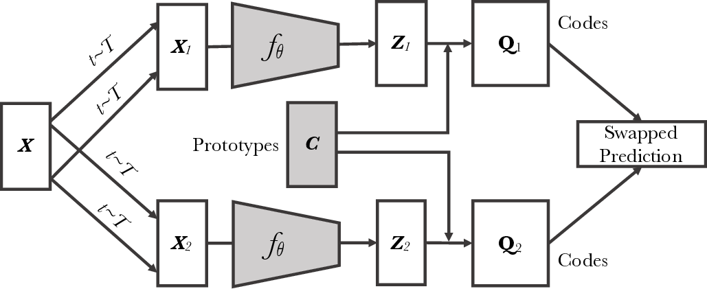
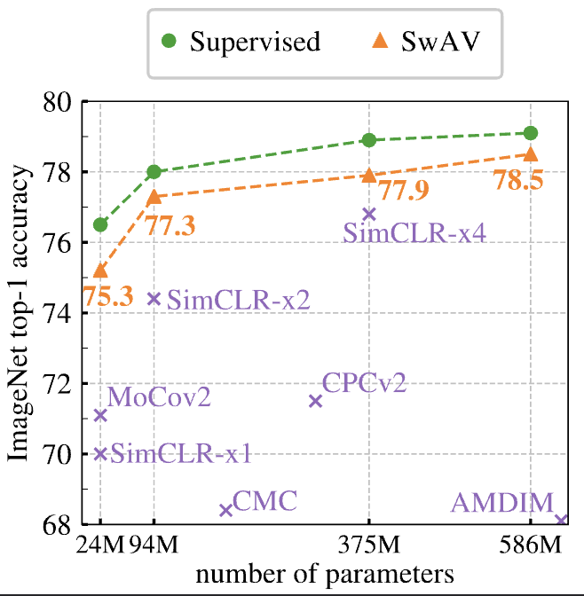

# Unsupervised Learning of Visual Features by Contrasting Cluster Assignments



*Figure 1: Overview of the SwAV (Swapping Assignments between Views) method*

## TLDR

- SwAV is a new self-supervised learning method that learns visual representations by contrasting cluster assignments instead of individual features
- It uses an online clustering approach that can scale to large datasets and works with both small and large batch sizes
- A novel multi-crop augmentation strategy is introduced that improves performance without increasing compute requirements
- SwAV achieves 75.3% top-1 accuracy on ImageNet linear evaluation, surpassing supervised pretraining on several downstream tasks

## Introduction

Self-supervised learning of visual representations has made remarkable progress in recent years, significantly closing the gap with supervised pretraining. Methods based on contrastive learning, which aim to learn invariant representations by comparing different views of the same image, have been particularly successful. However, these approaches typically rely on pairwise comparisons between a large number of negative samples, which can be computationally challenging.

In this paper, we introduce SwAV (Swapping Assignments between Views), a new self-supervised method that takes advantage of contrastive learning without requiring explicit pairwise comparisons. Instead, SwAV simultaneously clusters the data while enforcing consistency between cluster assignments produced for different augmentations (or "views") of the same image.

The key idea behind SwAV is to use a "swapped" prediction mechanism: we predict the cluster assignment of one view from the representation of another view. This approach allows us to contrast different image views by comparing their cluster assignments rather than their features directly.

Let's dive into the details of SwAV and explore its key components and innovations.

## Method

### Online Clustering

The core of SwAV is an online clustering approach that can be trained end-to-end with the convolutional neural network (ConvNet) used for feature extraction. Given an image $x_n$, we apply two transformations $t$ and $s$ sampled from a set of data augmentations $\mathcal{T}$ to obtain two views $x_{nt}$ and $x_{ns}$. These views are then mapped to feature representations $z_{nt}$ and $z_{ns}$ using a ConvNet $f_\theta$ with parameters $\theta$:

$$z_{nt} = f_\theta(x_{nt}) / \|f_\theta(x_{nt})\|_2$$

$$z_{ns} = f_\theta(x_{ns}) / \|f_\theta(x_{ns})\|_2$$

The features are L2-normalized to lie on the unit sphere.

Next, we compute "codes" $q_{nt}$ and $q_{ns}$ for each view by mapping the features to a set of $K$ trainable prototype vectors $\{c_1, \ldots, c_K\}$. The prototypes are stored in a matrix $C$ whose columns are the individual prototype vectors.

The key innovation of SwAV is the swapped prediction problem, which is formulated as:

$$L(z_t, z_s) = \ell(z_t, q_s) + \ell(z_s, q_t)$$

where $\ell(z, q)$ measures the fit between features $z$ and a code $q$. This loss function encourages the features from one view to predict the cluster assignment (code) of the other view, and vice versa.

The specific form of $\ell(z, q)$ is the cross-entropy loss between the code and the probability obtained by taking a softmax of the dot products between $z$ and all prototypes:

$$\ell(z_t, q_s) = - \sum_{k} q_s^{(k)} \log p_t^{(k)}$$

where

$$p_t^{(k)} = \frac{\exp(z_t^\top c_k / \tau)}{\sum_{k'} \exp(z_t^\top c_{k'} / \tau)}$$

Here, $\tau$ is a temperature parameter that controls the sharpness of the softmax distribution.

### Computing Codes Online

To make SwAV truly online and scalable, we compute the codes using only the image features within a batch. This is done by solving an optimal transport problem that maps the batch features to the prototypes while ensuring an equal partition of the batch across prototypes:

$$\max_{Q \in \mathcal{Q}} \text{Tr}(Q^\top C^\top Z) + \varepsilon H(Q)$$

where $Z$ is the matrix of batch features, $Q$ is the matrix of codes, $H(Q)$ is the entropy of $Q$, and $\varepsilon$ is a parameter controlling the smoothness of the mapping. The constraint set $\mathcal{Q}$ enforces the equal partition:

$$\mathcal{Q} = \{Q \in \mathbb{R}_+^{K \times B} | Q\mathbf{1}_B = \frac{1}{K}\mathbf{1}_K, Q^\top\mathbf{1}_K = \frac{1}{B}\mathbf{1}_B\}$$

This optimization problem is solved using the Sinkhorn-Knopp algorithm, which efficiently computes the codes with just a few matrix multiplications.

### Working with Small Batches

For scenarios where the batch size is small compared to the number of prototypes, SwAV uses features from previous batches to augment the size of $Z$ in the optimal transport problem. This allows the method to work effectively even with limited batch sizes, storing only around 3K features (comparable to the number of prototypes) instead of the large memory banks required by some contrastive methods.

## Multi-crop: Augmenting Views with Smaller Images

Another key contribution of this work is the introduction of the multi-crop augmentation strategy. Traditional contrastive methods typically use two full-resolution crops of an image. SwAV extends this by using two standard resolution crops and sampling $V$ additional low-resolution crops that cover only small parts of the image.

The multi-crop strategy generalizes the loss function to:

$$L(z_{t_1}, z_{t_2}, \ldots, z_{t_{V+2}}) = \sum_{i \in \{1, 2\}} \sum_{v=1}^{V+2} \mathbf{1}_{v \neq i} \ell(z_{t_v}, q_{t_i})$$

Importantly, codes are computed using only the full-resolution crops to maintain the quality of the assignments.

This approach allows SwAV to benefit from comparing more views during training without significantly increasing the memory or computational requirements. The use of crops with different resolutions also helps capture both global and local information from the images.

## Implementation Details

SwAV is implemented using PyTorch and can be trained efficiently on multiple GPUs. Here's a simplified pseudo-code for the main training loop:

```python
# C: prototypes (DxK)
# model: convnet + projection head
# temp: temperature

for x in loader:  # load a batch x with B samples
    x_t = t(x)  # t is a random augmentation
    x_s = s(x)  # s is another random augmentation

    z = model(cat(x_t, x_s))  # embeddings: 2BxD

    scores = mm(z, C)  # prototype scores: 2BxK
    scores_t = scores[:B]
    scores_s = scores[B:]

    # compute assignments
    with torch.no_grad():
        q_t = sinkhorn(scores_t)
        q_s = sinkhorn(scores_s)

    # convert scores to probabilities
    p_t = Softmax(scores_t / temp)
    p_s = Softmax(scores_s / temp)

    # swap prediction problem
    loss = - 0.5 * mean(q_t * log(p_s) + q_s * log(p_t))

    # SGD update: network and prototypes
    loss.backward()
    update(model.params)
    update(C)

    # normalize prototypes
    with torch.no_grad():
        C = normalize(C, dim=0, p=2)

# Sinkhorn-Knopp algorithm
def sinkhorn(scores, eps=0.05, niters=3):
    Q = exp(scores / eps).T
    Q /= sum(Q)
    K, B = Q.shape
    u, r, c = zeros(K), ones(K) / K, ones(B) / B
    for _ in range(niters):
        u = sum(Q, dim=1)
        Q *= (r / u).unsqueeze(1)
        Q *= (c / sum(Q, dim=0)).unsqueeze(0)
    return (Q / sum(Q, dim=0, keepdim=True)).T
```

The implementation uses several optimizations, including mixed precision training, synchronized batch normalization across GPUs, and the LARS optimizer with cosine learning rate decay.

## Experimental Results

### ImageNet Linear Evaluation

SwAV achieves impressive results on the standard ImageNet linear evaluation protocol, reaching 75.3% top-1 accuracy with a ResNet-50 architecture. This surpasses previous self-supervised methods and is only 1.2% below the performance of a fully supervised model.



*Figure 2: Linear classification performance on ImageNet for different self-supervised methods*

The plot shows that SwAV's performance scales well with increased model capacity, following a similar trend to supervised learning but with a smaller gap.

### Transfer Learning to Downstream Tasks

SwAV demonstrates excellent transfer learning capabilities across various downstream tasks:

1. **Linear Classification**: On datasets like Places205, Pascal VOC2007, and iNaturalist2018, SwAV outperforms ImageNet supervised pretraining.

2. **Object Detection**: Using Faster R-CNN on Pascal VOC2007+2012 and Mask R-CNN on COCO, SwAV surpasses supervised pretraining.

3. **DETR Object Detection**: SwAV improves performance on the COCO dataset using the DETR (DEtection TRansformer) framework.

These results show that SwAV is the first self-supervised method to outperform ImageNet supervised pretraining across all considered transfer tasks and datasets.

### Semi-Supervised Learning

When fine-tuning a SwAV pretrained ResNet-50 with only 1% or 10% of ImageNet labeled images, it achieves competitive results:

- 1% labels: 53.9% top-1 accuracy
- 10% labels: 70.2% top-1 accuracy

These results are on par with or better than other self-supervised and semi-supervised methods.

### Training with Small Batches

SwAV maintains strong performance even when trained with small batch sizes of 256 images on 4 GPUs. It achieves 72.0% top-1 accuracy on ImageNet after 200 epochs, outperforming methods like MoCo v2 which require larger memory banks or momentum encoders.

### Pretraining on Uncurated Data

To test the scalability and robustness of SwAV, the authors pretrained it on a large uncurated dataset of 1 billion random public non-EU images from Instagram. When transferring to ImageNet, SwAV outperforms training from scratch and shows significant improvements as model capacity increases.

## Ablation Studies and Insights

Several ablation studies provide insights into the workings of SwAV:

1. **Number of Prototypes**: Performance is relatively stable across a wide range of prototype numbers (3k-100k), suggesting that the exact number is not critical as long as there are "enough" prototypes.

2. **Learning Prototypes**: Learning prototypes improves performance compared to using fixed random prototypes, showing the benefit of adapting to the dataset distribution.

3. **Soft vs. Hard Assignments**: Soft assignments perform better than hard assignments, likely because the rounding in hard assignments is a more aggressive optimization step that can lead to suboptimal solutions.

4. **Sinkhorn-Knopp Iterations**: Using just 3 iterations in the Sinkhorn-Knopp algorithm is sufficient for good performance, with more iterations potentially leading to overly rapid convergence.

5. **Multi-crop Strategy**: The multi-crop augmentation consistently improves performance across different self-supervised methods, with clustering-based approaches benefiting more than contrastive methods.

## Conclusion and Future Directions

SwAV represents a significant advance in self-supervised visual representation learning. By combining online clustering with a novel swapped prediction mechanism and multi-crop augmentation, it achieves state-of-the-art performance on various benchmarks while being scalable and efficient.

Key takeaways from this work include:

1. The effectiveness of contrasting cluster assignments instead of individual features
2. The importance of online, scalable methods for large-scale self-supervised learning
3. The power of multi-crop augmentation in capturing both global and local image information

Future research directions might include:

- Exploring the application of SwAV to other domains beyond computer vision
- Investigating the learned prototypes and their semantic meaning
- Combining SwAV with other self-supervised learning techniques for further improvements
- Applying SwAV to guide model architecture search or pruning in a self-supervised manner

As self-supervised learning continues to narrow the gap with supervised methods, approaches like SwAV pave the way for more efficient and effective visual representation learning, potentially reducing the need for large labeled datasets in many computer vision tasks.

