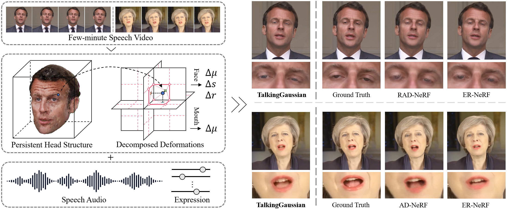
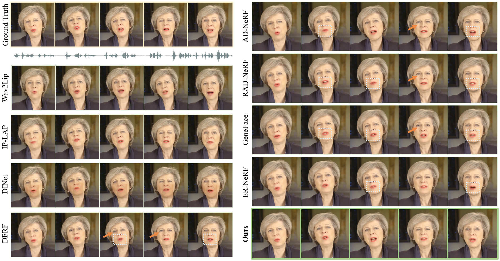
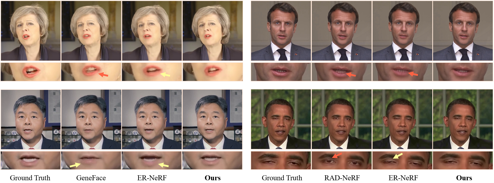

*Figure 1: TalkingGaussian outperforms previous NeRF-based methods in synthesizing more precise and clear talking heads by keeping a persistent head structure and predicting deformation to represent facial motion.*

## TLDR
- TalkingGaussian introduces a deformation-based radiance fields framework for high-fidelity 3D talking head synthesis
- Uses 3D Gaussian Splatting to maintain a persistent head structure and represent facial motions through deformations
- Decomposes the model into face and mouth branches to address motion inconsistencies
- Achieves superior performance in facial fidelity, lip synchronization, and efficiency compared to previous methods

## Introduction

Synthesizing audio-driven talking head videos has become increasingly important for applications in virtual reality, film-making, and human-computer interaction. Recent advancements in Neural Radiance Fields (NeRF) have shown promising results in generating photorealistic 3D talking heads. However, these methods often struggle with accurately representing rapid facial movements, leading to distortions in dynamic regions.

In this blog post, we'll dive into TalkingGaussian, a novel approach that addresses these challenges by leveraging 3D Gaussian Splatting and a deformation-based framework. We'll explore how this method achieves high-fidelity talking head synthesis with improved facial fidelity and lip synchronization.

## The Challenge with Existing Methods

Most NeRF-based approaches for talking head synthesis modify the color and density of spatial points in the radiance fields to represent facial motions. While this allows for dynamic lip-audio synchronization, it poses significant challenges:

1. Rapidly changing appearances are difficult for continuous and smooth neural fields to fit accurately.
2. This can lead to distortions in facial features, such as messy mouths and transparent eyelids.

## TalkingGaussian: A Deformation-Based Approach

TalkingGaussian takes a different approach by representing facial motions through deformations applied to a persistent head structure. This simplifies the learning task and eliminates distortions caused by inaccurate appearance predictions.

### Key Components

1. **Persistent Gaussian Fields**: Maintains an unchangeable appearance and stable geometry using 3D Gaussian Splatting (3DGS).
2. **Grid-based Motion Fields**: Predicts deformations to represent facial motions.
3. **Face-Mouth Decomposition**: Addresses motion inconsistencies between face and mouth regions.

Let's break down each component in detail.

### Persistent Gaussian Fields

The Persistent Gaussian Fields preserve the canonical parameters of Gaussian primitives:

$$\theta_C = \{\mu, s, q, \alpha, f\}$$

Where:
- $\mu$ is the center
- $s$ is the scaling factor
- $q$ is the rotation quaternion
- $\alpha$ is the opacity value
- $f$ is the color feature

This module is initialized using static 3DGS trained on speech video frames to obtain a coarse mean field.

### Grid-based Motion Fields

The Grid-based Motion Fields predict point-wise deformations for each primitive. It uses a tri-plane hash encoder $\mathcal{H}$ and an MLP decoder to create a continuous deformation space. The deformation $\delta_i$ for the $i$-th primitive is calculated as:

$$\delta_i = \text{MLP}(\mathcal{H}(\mu_i) \oplus \mathbf{C})$$

Where:
- $\mu_i$ is the center of the primitive
- $\mathbf{C}$ is the set of condition features
- $\oplus$ denotes concatenation

The deformed parameters $\theta_D$ are then obtained by combining the canonical parameters $\theta_C$ and the deformation $\delta$:

$$\theta_D = \{\mu+\Delta \mu, s+\Delta s, q+\Delta q, \alpha, f\}$$

### Face-Mouth Decomposition

To address the motion inconsistency between the face and inside mouth regions, TalkingGaussian decomposes the model into two separate branches:

1. **Face Branch**: Handles all facial motions except for the inside of the mouth.
2. **Inside Mouth Branch**: Represents the audio-driven dynamic inside mouth region.

This decomposition simplifies the learning tasks and improves the reconstruction quality of both static structure and dynamic performance.

#### Face Branch

The face branch uses a region attention mechanism to facilitate learning conditioned deformation driven by audio features $\boldsymbol{a}$ and upper-face expression features $\boldsymbol{e}$. The deformation $\delta_i^\text{F}$ for the $i$-th primitive in the face branch is predicted by:

$$\delta_i^\text{F} = \text{MLP}(\mathcal{H}^\text{F}(\mu_i) \oplus \boldsymbol{a}_{r, i} \oplus \boldsymbol{e}_{r, i})$$

Where $\boldsymbol{a}_{r, i}$ and $\boldsymbol{e}_{r, i}$ are region-aware features calculated using attention vectors.

#### Inside Mouth Branch

The inside mouth branch uses a lightweight deformable Gaussian field that only predicts the translation $\Delta \mu_i$ conditioned by the audio feature $\boldsymbol{a}$:

$$\delta_i^\text{M} = \{\Delta \mu_i^\text{M}\} = \text{MLP}(\mathcal{H}^\text{M}(\mu_i) \oplus \boldsymbol{a})$$

### Rendering

The final talking head image is fused with the rendered face and inside mouth images. The talking head color $\mathcal{C}_\text{head}$ of pixel $\mathbf{x}_p$ is rendered by:

$$\mathcal{C}_\text{head}(\mathbf{x}_p) = \mathcal{C}_\text{face}(\mathbf{x}_p) \times \mathcal{A}_\text{face}(\mathbf{x}_p) + \mathcal{C}_\text{mouth}(\mathbf{x}_p) \times (1 - \mathcal{A}_\text{face}(\mathbf{x}_p))$$

Where $\mathcal{C}_\text{face}$ and $\mathcal{A}_\text{face}$ are the predicted face color and opacity from the face branch, and $\mathcal{C}_\text{mouth}$ is the color predicted by the inside mouth branch.

## Training Process

The training process for TalkingGaussian is divided into three stages:

1. **Static Initialization**: Initialize the Persistent Gaussian Fields using vanilla 3DGS.
2. **Motion Learning**: Add the motion fields to training via predicted deformations.
3. **Fine-tuning**: Conduct color fine-tuning to better fuse the head and inside mouth branches.

### Incremental Sampling Strategy

To tackle the problem of vanishing gradients during deformation learning, TalkingGaussian introduces an incremental sampling strategy. This approach uses a sliding window to sample training frames based on a valid metric (e.g., action units or landmarks) that measures the deformation degree of each target facial motion.

## Experimental Results

TalkingGaussian was evaluated on four high-definition speaking video clips, including three male portraits ("Macron", "Lieu", "Obama") and one female portrait ("May"). The method was compared against state-of-the-art NeRF-based methods and 2D generative models.

*Figure 2: Qualitative comparison of visual-audio synchronization. TalkingGaussian performs best in synthesizing accurately synchronized talking heads compared to baselines.*

### Quantitative Results

TalkingGaussian outperforms previous methods in both rendering quality and motion quality metrics:

- **Rendering Quality**: Best LPIPS (0.0259) and SSIM (0.910) scores, indicating accurate details and structure preservation.
- **Motion Quality**: Lowest LMD (2.586) and AUE-(L/U) (0.53/0.22) scores, demonstrating precise facial motion synthesis.
- **Efficiency**: Fastest training (0.5h) and inference speed (108 FPS) among all baselines.

### Qualitative Results

Visual comparisons show that TalkingGaussian generates more accurate and intact facial features, especially in dynamic regions where previous methods struggle with distortions.

*Figure 3: Qualitative comparison of generated facial details. TalkingGaussian synthesizes more accurate and intact details than recent NeRF-based state-of-the-art methods.*

## Key Takeaways and Future Directions

1. TalkingGaussian successfully addresses the facial distortion problem in existing radiance-fields-based methods by using a deformation-based approach.
2. The Face-Mouth Decomposition module significantly improves the synthesis quality of both static structure and dynamic performance.
3. The method achieves superior performance in facial fidelity, lip synchronization, and efficiency compared to previous approaches.

Future work could focus on:
- Improving the control of primitive growth to reduce noisy artifacts
- Enhancing the connection between face and inside mouth branches for better alignment in cross-domain situations
- Exploring applications in cross-lingual and cross-gender talking head synthesis

TalkingGaussian represents a significant step forward in 3D talking head synthesis, offering improved visual quality and efficiency. As the field continues to evolve, we can expect even more realistic and versatile talking head models in the future.

## References

[1] Mildenhall, B., Srinivasan, P.P., Tancik, M., Barron, J.T., Ramamoorthi, R., Ng, R.: Nerf: Representing scenes as neural radiance fields for view synthesis. In: European Conference on Computer Vision. pp. 405--421. Springer (2020)

[2] Kerbl, B., Kopanas, G., Leimk{\"u}hler, T., Drettakis, G.: 3d gaussian splatting for real-time radiance field rendering. ACM Transactions on Graphics 42(4) (2023)

[3] Guo, Y., Chen, K., Liang, S., Liu, Y.J., Bao, H., Zhang, J.: Ad-nerf: Audio driven neural radiance fields for talking head synthesis. In: Proceedings of the IEEE/CVF International Conference on Computer Vision. pp. 5784--5794 (2021)

[4] Tang, J., Wang, K., Zhou, H., Chen, X., He, D., Hu, T., Liu, J., Zeng, G., Wang, J.: Real-time neural radiance talking portrait synthesis via audio-spatial decomposition. arXiv preprint arXiv:2211.12368 (2022)

[5] Li, J., Zhang, J., Bai, X., Zhou, J., Gu, L.: Efficient region-aware neural radiance fields for high-fidelity talking portrait synthesis. In: Proceedings of the IEEE/CVF International Conference on Computer Vision. pp. 7568--7578 (2023)

[6] Ye, Z., Jiang, Z., Ren, Y., Liu, J., He, J., Zhao, Z.: Geneface: Generalized and high-fidelity audio-driven 3d talking face synthesis. In: The Eleventh International Conference on Learning Representations (2022)

[7] Peng, Z., Hu, W., Shi, Y., Zhu, X., Zhang, X., He, J., Liu, H., Fan, Z.: Synctalk: The devil is in the synchronization for talking head synthesis. arXiv preprint arXiv:2311.17590 (2023)