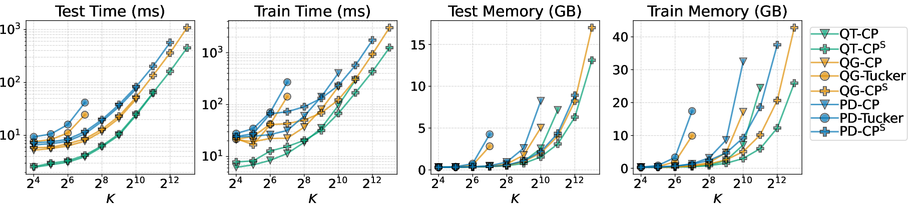

# What is the Relationship between Tensor Factorizations and Circuits (and How Can We Exploit it)?

## TL;DR

This paper establishes a formal connection between circuit representations and tensor factorizations, showing how circuits can be viewed as generalized hierarchical tensor factorizations. The authors introduce a unified pipeline for building overparameterized circuit architectures using tensor factorization concepts. They demonstrate how this connection enables compressing circuits, sharing parameters, and creating new architectures. Empirical evaluations show the effectiveness of the proposed framework for probabilistic modeling tasks.

## Introduction

Tensor factorizations and circuit representations are two seemingly distinct areas in machine learning and artificial intelligence that have developed largely independently. However, as this paper demonstrates, there are deep connections between these fields that, when properly understood, can lead to exciting new research directions and practical applications.

As a researcher in machine learning, I've often found myself working with either tensor methods or probabilistic circuits, but rarely considering how they might be related. This paper by Loconte et al. opened my eyes to the fascinating interplay between these areas and the potential for cross-pollination of ideas.

In this blog post, we'll dive into the key contributions of this work:

1. Establishing a rigorous connection between circuits and tensor factorizations
2. Introducing a modular "Lego block" approach for building tensorized circuit architectures
3. Unifying various circuit learning algorithms under a generalized factorization framework
4. Demonstrating how to compress and share parameters in circuits using tensor concepts
5. Empirical evaluation of the proposed framework on distribution estimation tasks

Let's explore each of these ideas in detail and see how they can reshape our understanding of both circuits and tensor factorizations.

## Bridging Circuits and Tensor Factorizations

### Tensor Factorizations as Shallow Circuits

The authors begin by showing how popular tensor factorization methods can be represented as circuits. Let's consider the Tucker decomposition as an example. Given a tensor $\mathcal{T} \in \mathbb{R}^{I_1 \times \cdots \times I_d}$, its multilinear rank-$(R_1,\ldots,R_d)$ Tucker factorization is defined as:

$$
\mathcal{T} \approx \mathcal{W} \times_1 \mathbf{V}^{(1)} \times_2 \mathbf{V}^{(2)} \ldots \times_d \mathbf{V}^{(d)}
$$

where $\mathcal{W} \in \mathbb{R}^{R_1 \times \cdots \times R_d}$ is the core tensor and $\mathbf{V}^{(j)} \in \mathbb{R}^{I_j \times R_j}$ are the factor matrices.

The authors show that this factorization can be represented as a circuit $c$ over variables $\mathbf{X} = \{X_j\}_{j=1}^d$ with $\text{dom}(X_j) = [I_j]$, such that:

$$
c(\mathbf{X}) = c(x_1,\ldots,x_d) = \sum_{r_1=1}^{R_1} \cdots \sum_{r_d=1}^{R_d} w_{r_1\cdots r_d} c_{1,r_1}(x_1) \cdots c_{d,r_d}(x_d)
$$

This circuit representation allows us to leverage the structural properties of circuits, such as smoothness and decomposability, which enable tractable inference for many queries of interest.

### Hierarchical Tensor Factorizations as Deep Circuits

The authors then extend this connection to hierarchical tensor factorizations, showing how they correspond to deep circuits. They introduce the concept of a Region Graph (RG) to specify the hierarchical structure of the factorization.

For example, given a tensor $\mathcal{T} \in \mathbb{R}^{I_1 \times \cdots \times I_d}$ and a tree-shaped binary RG $\mathcal{R}$, the hierarchical Tucker factorization is defined recursively:

$$
u_{y_1\cdots y_l s}^{(\mathbf{Y})} \approx \sum_{r_1=1}^{R_{\mathbf{Z}_1}} \sum_{r_2=1}^{R_{\mathbf{Z}_2}} w_{s\:r_1r_2}^{(\mathbf{Y})} \: u_{z_{1,1}\cdots z_{1,m} r_1}^{(\mathbf{Z}_1)} \: u_{z_{2,1}\cdots z_{2,n} r_2}^{(\mathbf{Z}_2)}
$$

where $\mathbf{Y} = \mathbf{Z}_1 \cup \mathbf{Z}_2$ is a region in the RG partitioned into $\mathbf{Z}_1$ and $\mathbf{Z}_2$.

This hierarchical factorization can be represented as a deep circuit, where each level in the hierarchy corresponds to a layer in the circuit. The authors provide a constructive proof showing how to build such a circuit and analyze its size complexity.

## A Modular Approach to Circuit Construction

One of the key contributions of this paper is the introduction of a modular "Lego block" approach to building tensorized circuit architectures. This approach allows for the systematic construction and exploration of various circuit and tensor factorization models while maintaining tractability.

The authors define a tensorized circuit as a computational graph composed of three types of layers:

1. Input layers
2. Product layers (Hadamard or Kronecker products)
3. Sum layers

These layers can be combined in various ways to create different architectures. For example, a Tucker layer can be constructed as:

$$
\ell(\mathbf{Y}) = \mathbf{W} \left( \ell_1(\mathbf{Z}_1) \otimes \ell_2(\mathbf{Z}_2) \right)
$$

where $\mathbf{W} \in \mathbb{R}^{K \times K^2}$ is the parameter matrix, and $\ell_1$ and $\ell_2$ are input layers.

This modular approach allows researchers to easily experiment with different architectures by mixing and matching layers. It also provides a clear framework for understanding existing architectures in terms of their component layers.

## Unifying Circuit Learning Algorithms

By representing circuits as tensor factorizations, the authors show that many existing circuit learning algorithms can be understood as special cases of a more general framework. This unification helps clarify the relationships between different approaches and suggests new directions for research.

For example, the authors show that popular architectures like RAT-SPNs (Randomized and Tensorized Sum-Product Networks) and EiNets (Einsum Networks) can be seen as instances of their general framework, differing mainly in their choice of region graph and layer types.

This unification suggests that the performance differences often reported in the literature may be more due to different hyperparameters and learning methods rather than fundamental differences in model expressiveness.

## Compressing Circuits with Tensor Factorizations

Another exciting application of the tensor-circuit connection is the ability to compress circuit parameters using tensor factorization techniques. The authors demonstrate this by applying a CP (CANDECOMP/PARAFAC) decomposition to the parameter tensors of Tucker layers.

Given a Tucker layer parameterized by $\mathcal{W} \in \mathbb{R}^{K \times K \times K}$, they apply a rank-$R$ CP factorization:

$$
\mathcal{W} \approx \sum_{r=1}^R \mathbf{a}_{:r} \circ \mathbf{b}_{:r} \circ \mathbf{c}_{:r}
$$

This decomposition allows them to rewrite the Tucker layer as:

$$
\ell(\mathbf{Y}) = \mathbf{A} \left[ \left( \mathbf{B}^\top \ell_1(\mathbf{Z}_1) \right) \odot \left( \mathbf{C}^\top \ell_2(\mathbf{Z}_2) \right) \right]
$$

where $\mathbf{A}, \mathbf{B}, \mathbf{C} \in \mathbb{R}^{K \times R}$ are the newly-introduced parameter matrices.

This compression technique can significantly reduce the number of parameters in a circuit while maintaining most of its expressiveness. The authors show how this approach can be applied to entire circuit architectures, leading to more efficient models.

## Empirical Evaluation

To demonstrate the effectiveness of their framework, the authors conduct extensive empirical evaluations on distribution estimation tasks. They compare various circuit architectures constructed using their pipeline, focusing on the impact of different region graphs and layer types.

*Figure 1: Benchmarking the role of RGs and composite layers in tensorized circuits.*

Some key findings from their experiments include:

1. The choice of region graph significantly impacts performance, with their proposed Quad-Graph (QG) and Quad-Tree (QT) structures outperforming the commonly used Poon-Domingos (PD) graph.

2. CP layers scale better than Tucker layers in terms of memory usage and computation time, allowing for larger models.

3. Parameter sharing techniques (CP-S and CP-XS layers) can provide a good trade-off between model size and performance.

4. Their compressed circuit architectures achieve competitive results on benchmark datasets, sometimes outperforming more complex models.

## Conclusion and Future Directions

This paper establishes a strong connection between tensor factorizations and circuit representations, opening up numerous opportunities for cross-pollination of ideas between these fields. The unified framework presented here provides a systematic way to design, analyze, and optimize circuit architectures using tensor factorization concepts.

Some exciting directions for future research include:

1. Exploring more advanced tensor decomposition techniques for circuit compression
2. Investigating the theoretical properties of tensorized circuits, such as expressiveness and generalization bounds
3. Applying the insights from this work to other domains, such as neural architecture search or interpretable AI

As a researcher, I find this work particularly exciting because it bridges two areas that have largely developed independently. The potential for new insights and practical applications is immense, and I look forward to seeing how the community builds upon these ideas.

## References

1. Loconte, L., Mari, A., Gala, G., Peharz, R., de Campos, C., Quaeghebeur, E., Vessio, G., & Vergari, A. (2025). What is the Relationship between Tensor Factorizations and Circuits (and How Can We Exploit it)?. [https://openreview.net/forum?id=Y7dRmpGiHj](https://openreview.net/forum?id=Y7dRmpGiHj)

2. Kolda, T. G., & Bader, B. W. (2009). Tensor Decompositions and Applications. SIAM Review, 51(3), 455-500.

3. Choi, Y., Vergari, A., & Van den Broeck, G. (2020). Probabilistic circuits: A unifying framework for tractable probabilistic modeling. Technical report, University of California, Los Angeles (UCLA).

4. Peharz, R., Lang, S., Vergari, A., Stelzner, K., Molina, A., Trapp, M., Van Den Broeck, G., Kersting, K., & Ghahramani, Z. (2020). Einsum Networks: Fast and Scalable Learning of Tractable Probabilistic Circuits. In International Conference on Machine Learning (pp. 7563-7574). PMLR.

5. Liu, A., & Van den Broeck, G. (2021). Tractable regularization of probabilistic circuits. Advances in Neural Information Processing Systems, 34, 3558-3570.

For the complete list of references and to explore the code used in this work, please visit the [project's GitHub repository](https://github.com/april-tools/uni-circ-le).

