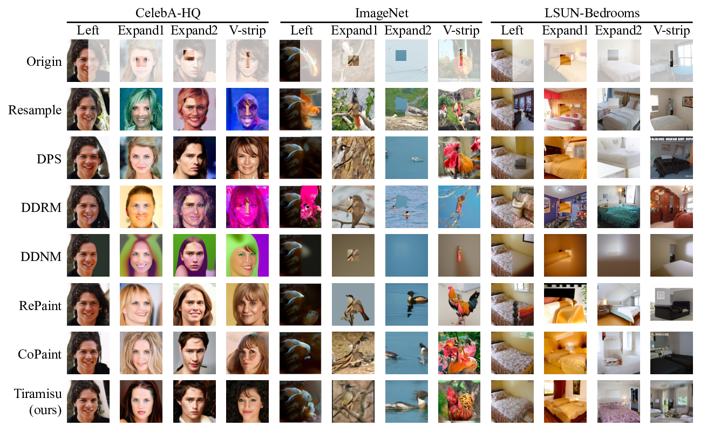
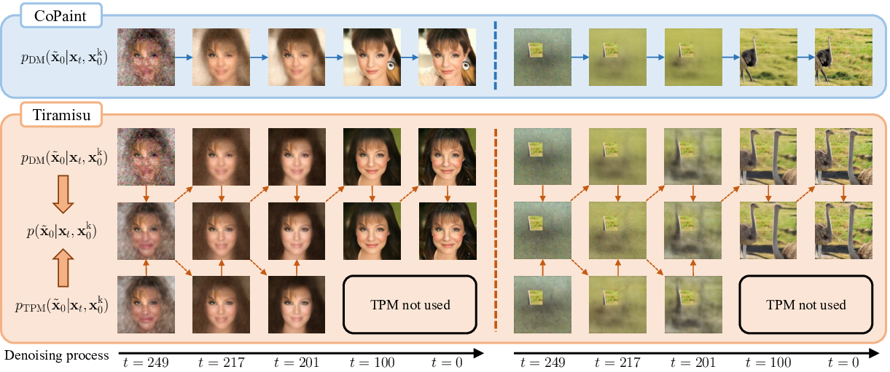
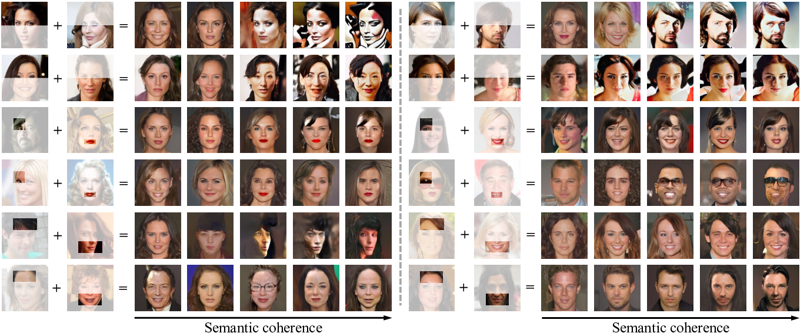

# Image Inpainting via Tractable Steering of Diffusion Models

*Figure 1: Qualitative results comparing Tiramisu against other diffusion-based inpainting methods on CelebA-HQ, ImageNet and LSUN-Bedroom datasets.*

## TL;DR

- This paper introduces Tiramisu, a novel approach for image inpainting that uses Tractable Probabilistic Models (TPMs) to steer the denoising process of diffusion models
- Tiramisu leverages Probabilistic Circuits (PCs) to efficiently compute exact constrained posteriors, improving semantic coherence of inpainted images
- Experiments on high-resolution datasets show Tiramisu outperforms state-of-the-art methods while adding only ~10% computational overhead
- The approach opens up possibilities for more controlled image generation tasks beyond inpainting

## Introduction

Image inpainting - the task of filling in missing or corrupted parts of an image - has long been a challenging problem in computer vision. Recent advances in diffusion models have led to impressive results in generating high-quality, photorealistic images. However, controlling these models to perform constrained generation tasks like inpainting remains difficult.

In this blog post, we'll dive into a fascinating new approach called Tiramisu (Tractable Image Inpainting via Steering Diffusion Models), introduced by Anji Liu, Mathias Niepert, and Guy Van den Broeck in their paper "Image Inpainting via Tractable Steering of Diffusion Models". This method combines the power of diffusion models with the tractability of probabilistic circuits to achieve state-of-the-art results in image inpainting.

## Background

Before we delve into Tiramisu, let's briefly review two key concepts:

1. **Diffusion Models**: These are generative models that learn to gradually denoise an image, starting from pure noise and progressively refining it into a coherent image. While they excel at generating high-quality images, controlling them for specific tasks like inpainting can be challenging.

2. **Tractable Probabilistic Models (TPMs)**: These are a class of models that support efficient and exact computation of certain probabilistic queries. Probabilistic Circuits (PCs) are a particularly expressive type of TPM that we'll focus on in this paper.

## The Tiramisu Approach

The core idea behind Tiramisu is to use a TPM (specifically, a Probabilistic Circuit) to guide the denoising process of a diffusion model. This guidance helps ensure that the generated image is semantically consistent with the given constraints (i.e., the known pixels in inpainting).

### The Denoising Process

In a standard diffusion model, the denoising process can be described by the following equation:

$$
p_\theta(x_{t-1} | x_t) = \sum_{\tilde{x}_0} q(x_{t-1} | \tilde{x}_0, x_t) \cdot p_\theta(\tilde{x}_0 | x_t)
$$

Here, $x_t$ represents the image at noise level $t$, and $\tilde{x}_0$ is the reconstructed noise-free image. The challenge in inpainting is to incorporate the constraint that certain pixels $x_0^k$ are known.

### Incorporating Constraints

Tiramisu approaches this by computing two distributions:

1. From the diffusion model:

   $$
   p_\text{DM}(\tilde{x}_0 | x_t, x_0^k) = \frac{1}{Z} \cdot p_\theta(\tilde{x}_0 | x_t) \cdot \mathbb{1}[\tilde{x}_0^k = x_0^k]
   $$

2. From the TPM:

   $$
   p_\text{TPM}(\tilde{x}_0 | x_t, x_0^k) = \frac{1}{Z} \cdot \prod_i q(x_t^i | \tilde{x}_0^i) \cdot p_\theta(\tilde{x}_0^u | x_0^k) \cdot \mathbb{1}[\tilde{x}_0^k = x_0^k]
   $$

The key innovation is that the TPM allows for efficient and exact computation of this constrained posterior.

### Combining the Distributions

Tiramisu then combines these distributions using a weighted geometric mean:

$$
p(\tilde{x}_0 | x_t, x_0^k) \propto p_\text{DM}(\tilde{x}_0 | x_t, x_0^k)^\alpha \cdot p_\text{TPM}(\tilde{x}_0 | x_t, x_0^k)^{1-\alpha}
$$

This combined distribution is used to guide the denoising process, leveraging both the high-fidelity image generation of the diffusion model and the semantic consistency enforced by the TPM.

## Probabilistic Circuits for Efficient Inference

A critical component of Tiramisu is the use of Probabilistic Circuits (PCs) as the TPM. PCs are a class of tractable probabilistic models that support efficient and exact computation of various probabilistic queries.

### Structure of Probabilistic Circuits

PCs are represented as a directed acyclic graph (DAG) with three types of nodes:

1. Input nodes: Define primitive distributions over variables
2. Product nodes: Represent factorized distributions of their children
3. Sum nodes: Represent mixture distributions of their children

The distribution encoded by a PC is defined recursively:

$$
p_n(x) := \begin{cases}
f_n(x) & \text{if n is an input node} \\
\prod_{c \in \text{ch}(n)} p_c(x) & \text{if n is a product node} \\
\sum_{c \in \text{ch}(n)} \theta_{n,c} \cdot p_c(x) & \text{if n is a sum node}
\end{cases}
$$

Where $\text{ch}(n)$ denotes the children of node $n$, and $\theta_{n,c}$ are learnable parameters.

### Efficient Inference Algorithm

The paper introduces an algorithm that can compute the required conditional probabilities in linear time with respect to the size of the PC. This algorithm consists of a forward pass and a backward pass on the PC's DAG structure.

The forward pass computes:

$$
\text{fw}_n = \sum_{x_0} \prod_{i \in \phi(n)} w_i(x_0^i) \cdot p_n(x_0)
$$

Where $\phi(n)$ is the scope of node $n$ (the variables it depends on), and $w_i$ are soft evidence constraints.

The backward pass then computes the conditional probabilities:

$$
p_\text{TPM}(\tilde{x}_0^i | x_t, x_0^k) \propto \sum_{n \in S_i} \text{bk}_n \cdot f_n(x_0^i) \cdot w_i(x_0^i)
$$

Where $S_i$ is the set of input nodes defined on variable $X_0^i$, and $\text{bk}_n$ are backward values computed during the backward pass.

This efficient inference is what allows Tiramisu to incorporate TPM guidance with minimal computational overhead.

## Scaling to High-Resolution Images

While PCs have shown promise on datasets like CIFAR and downsampled ImageNet, scaling them to high-resolution images remains challenging. Tiramisu addresses this by using a Vector Quantized Generative Adversarial Network (VQ-GAN) to transform images to a lower-dimensional latent space.

The process works as follows:

1. Use a VQ-GAN encoder $q(z_0 | x_0)$ to map images to a latent space
2. Train a PC $p(Z_0)$ on this latent space
3. Approximate the pixel-space conditional probability using:

   $$
   p_\text{TPM}(\tilde{x}_0 | x_t, x_0^k) \approx \mathbb{E}_{\tilde{z}_0 \sim p_\text{TPM}(\cdot | x_t, x_0^k)}[p(\tilde{x}_0 | \tilde{z}_0)]
   $$

This approach allows Tiramisu to handle high-resolution images while still benefiting from the tractability of PCs.

## Experimental Results

The authors evaluated Tiramisu on three challenging high-resolution image datasets: CelebA-HQ, ImageNet, and LSUN-Bedroom. They used seven types of masks that reveal only 5-20% of the original image, creating a particularly challenging inpainting task.

*Figure 2: Illustration of the steering effect of the TPM on the diffusion model. The TPM guidance helps generate more semantically coherent images throughout the denoising process.*

### Quantitative Results

Tiramisu was compared against six state-of-the-art diffusion-based inpainting methods: CoPaint, RePaint, DDNM, DDRM, DPS, and Resampling. The primary metric used was LPIPS (Learned Perceptual Image Patch Similarity), where lower values indicate better performance.

Here's a summary of the results:

| Dataset | Mask | Tiramisu (ours) | CoPaint | RePaint | DDNM | DDRM | DPS | Resampling |
|---------|------|-----------------|---------|---------|------|------|-----|------------|
| CelebA-HQ | Average | **0.330** | 0.336 | 0.354 | 0.435 | 0.500 | 0.342 | 0.448 |
| ImageNet | Average | **0.462** | 0.468 | 0.518 | 0.617 | 0.558 | 0.475 | 0.557 |
| LSUN-Bedroom | Average | **0.473** | 0.481 | 0.509 | 0.545 | 0.539 | 0.486 | 0.540 |

Tiramisu consistently outperforms other methods across all datasets and mask types, demonstrating its effectiveness in generating high-quality, semantically consistent inpainted images.

### Qualitative Analysis

The paper also provides qualitative results, showing that Tiramisu generates more semantically coherent images compared to baselines. For example, in face inpainting tasks, Tiramisu better preserves facial features and symmetry.

### Computational Efficiency

One of the key advantages of Tiramisu is its computational efficiency. The authors show that the TPM guidance adds only about 10% additional computational overhead compared to the baseline diffusion model. This is achieved by using the TPM guidance only in the early stages of the denoising process, where it has the most impact on global semantics.

## Beyond Inpainting: Semantic Fusion

The authors also demonstrate that Tiramisu can be extended to more complex controlled generation tasks. They introduce a task called "semantic fusion," where the goal is to generate images that semantically align with unmasked regions from multiple reference images.

*Figure 3: CelebA-HQ qualitative results for the semantic fusion task. Tiramisu can generate images that combine semantic information from multiple reference images with varying levels of coherence.*

This task showcases the potential of Tiramisu for more general controlled image generation, where constraints can be specified on the semantics of different image regions.

## Conclusion and Future Directions

Tiramisu represents a significant advance in controlled image generation, particularly for inpainting tasks. By combining the expressive power of diffusion models with the tractability of probabilistic circuits, it achieves state-of-the-art results while maintaining computational efficiency.

Key takeaways:

1. Tiramisu demonstrates the potential of using tractable probabilistic models to guide powerful but less controllable generative models.
2. The approach is general and could potentially be applied to other constrained generation tasks beyond inpainting.
3. The success of Tiramisu motivates further research into scaling up tractable probabilistic models for high-dimensional data.

Future directions for this line of research could include:

- Extending Tiramisu to other image manipulation tasks, such as style transfer or attribute editing
- Exploring the use of other types of tractable probabilistic models for guiding diffusion models
- Investigating ways to further reduce the computational overhead of the TPM guidance
- Applying similar principles to guide other types of generative models beyond diffusion models

As we continue to push the boundaries of controlled image generation, approaches like Tiramisu that combine different modeling paradigms are likely to play an increasingly important role. The success of this method not only advances the state of the art in image inpainting but also opens up exciting possibilities for more flexible and controllable image generation techniques.

