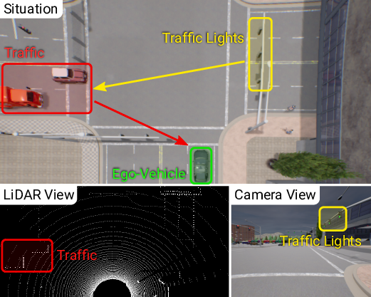
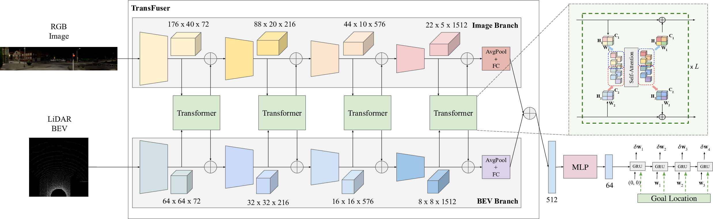

# TransFuser: Imitation with Transformer-Based Sensor Fusion for Autonomous Driving

*Figure 1: TransFuser integrates geometric and semantic information across multiple modalities via attention mechanisms to capture global context, enabling safe driving behavior in complex urban scenarios.*

## TL;DR

- TransFuser is a novel multi-modal fusion transformer for integrating LiDAR and camera data in end-to-end autonomous driving
- It uses self-attention to capture global context and pair-wise interactions between different sensor modalities
- TransFuser significantly outperforms existing sensor fusion methods on the CARLA autonomous driving benchmark, reducing collisions by 48%
- The approach is simple, flexible, and achieves state-of-the-art performance on the CARLA leaderboard

## Introduction

Autonomous driving is one of the most exciting and challenging applications of artificial intelligence and computer vision. A key challenge is how to effectively integrate information from multiple complementary sensors like cameras and LiDAR to enable safe and robust driving in complex urban environments. 

In this blog post, we'll dive into TransFuser, a novel transformer-based approach for multi-modal sensor fusion in end-to-end autonomous driving. TransFuser was developed by researchers at the University of Tübingen and Max Planck Institute for Intelligent Systems and achieves state-of-the-art performance on the CARLA autonomous driving benchmark.

The key innovation of TransFuser is using self-attention mechanisms to fuse LiDAR and camera features at multiple scales, allowing the model to capture global context and pair-wise interactions between different sensor modalities. This enables more effective reasoning about the 3D scene, leading to safer driving behavior, especially in challenging scenarios with dense traffic.

Let's explore how TransFuser works and why it's such an exciting advancement for autonomous driving!

## Background and Motivation

### The Sensor Fusion Challenge

Modern autonomous vehicles rely on multiple sensors to perceive the environment, with cameras and LiDAR being two of the most important:

- **Cameras** provide rich visual information about the scene, including color, texture, and semantic understanding. However, they struggle with accurate depth estimation and can be affected by lighting conditions.

- **LiDAR** (Light Detection and Ranging) provides precise 3D point cloud data of the environment. It excels at capturing the geometry and depth of the scene but lacks the rich semantic information of cameras.

Fusing these complementary sensor modalities is crucial for robust autonomous driving. However, it's a challenging problem due to the different data representations and the need to reason about complex spatial and temporal relationships in the scene.

### Limitations of Existing Approaches

Previous work on sensor fusion for autonomous driving has focused primarily on perception tasks like object detection and motion forecasting. Common approaches include:

1. **Late fusion**: Process each sensor modality independently and combine high-level features at the end.
2. **Geometric projection**: Project features from one sensor space to another (e.g., LiDAR to image space) based on known geometric relationships.

While these methods have shown promise for specific perception tasks, they have limitations when applied to end-to-end driving:

- They often rely on local feature aggregation, missing global context that's crucial for safe driving decisions.
- They struggle to model complex interactions between different parts of the scene (e.g., between traffic lights and vehicles at an intersection).

The authors of TransFuser observed that imitation learning policies based on these existing sensor fusion methods suffer from high infraction rates in complex driving scenarios with dense traffic. This motivated the development of a new approach that could better capture global context and inter-object relationships.

## TransFuser: Transformer-Based Sensor Fusion

TransFuser addresses these limitations by leveraging the power of transformer architectures for multi-modal sensor fusion. Let's break down the key components and innovations of the approach.

### Architecture Overview

*Figure 2: The TransFuser architecture, showing the multi-modal fusion transformer and auto-regressive waypoint prediction network.*

The TransFuser architecture consists of two main components:

1. **Multi-Modal Fusion Transformer**: This is the core innovation, responsible for integrating information from the camera and LiDAR sensors.
2. **Auto-regressive Waypoint Prediction Network**: This component takes the fused representations and predicts future waypoints for the vehicle to follow.

Let's dive deeper into each of these components.

### Multi-Modal Fusion Transformer

The fusion transformer takes two inputs:

1. An RGB image from the vehicle's cameras
2. A bird's eye view (BEV) representation of the LiDAR point cloud

These inputs are first processed by separate convolutional encoder branches to extract initial features. The key innovation is how these features are then fused using transformer modules at multiple scales throughout the network.

#### Transformer Fusion Mechanism

The fusion process works as follows:

1. The image and LiDAR feature maps at a given scale are flattened into sequences of tokens.
2. These tokens, along with learned positional embeddings, are fed into a transformer module.
3. The transformer applies self-attention, allowing each token to attend to all other tokens, regardless of which sensor they came from.
4. The output tokens are then reshaped back into 2D feature maps and combined with the original convolutional features via residual connections.

This process is repeated at multiple scales, allowing for the fusion of both low-level and high-level features.

The transformer fusion can be expressed mathematically as follows:

$$
\mathbf{Q} = \mathbf{F}^{in}\mathbf{M}^q, \quad \mathbf{K} = \mathbf{F}^{in}\mathbf{M}^k, \quad \mathbf{V} = \mathbf{F}^{in}\mathbf{M}^v
$$

$$
\mathbf{A} = \text{softmax} \left(\frac{\mathbf{Q} \mathbf{K}^T} {\sqrt{D_k}}\right) \mathbf{V}
$$

$$
\mathbf{F}^{out} = \text{MLP}(\mathbf{A}) + \mathbf{F}^{in}
$$

Where $\mathbf{F}^{in}$ is the input feature sequence, $\mathbf{M}^q$, $\mathbf{M}^k$, and $\mathbf{M}^v$ are learned projection matrices, and $\mathbf{F}^{out}$ is the output feature sequence.

#### Advantages of Transformer Fusion

This transformer-based fusion approach has several key advantages:

1. **Global Context**: The self-attention mechanism allows each part of the scene to interact with every other part, capturing long-range dependencies and global context.
2. **Cross-Modal Interactions**: Image and LiDAR features can directly attend to each other, enabling rich multi-modal reasoning.
3. **Flexibility**: The approach can easily scale to additional sensor modalities or different input representations.

### Waypoint Prediction Network

The fused features from the transformer modules are passed through a final set of convolutional layers and then to an auto-regressive waypoint prediction network. This network consists of:

1. A multi-layer perceptron (MLP) to reduce the feature dimensionality
2. A Gated Recurrent Unit (GRU) that predicts a sequence of future waypoints

The waypoint prediction is formulated as:

$$
\{ \mathbf{w}_t = \mathbf{w}_{t-1} + \delta \mathbf{w}_t \}_{t=1}^T
$$

Where $\mathbf{w}_t$ is the predicted waypoint at time step $t$, and $\delta \mathbf{w}_t$ is the predicted offset.

## Training and Implementation Details

TransFuser is trained using imitation learning on data collected from an expert policy in the CARLA simulator. The training process involves several key components:

### Loss Functions

The primary loss function is an L1 loss between the predicted waypoints and the ground truth expert waypoints:

$$
\mathcal{L} = \sum_{t=1}^{T} {\|\mathbf{w}_t - \mathbf{w}_t^{gt}\|}_1
$$

Additionally, the authors incorporate several auxiliary tasks to improve performance:

1. Depth prediction from the image branch
2. Semantic segmentation from the image branch
3. HD map prediction from the LiDAR branch
4. Vehicle detection from the LiDAR branch

These auxiliary tasks help the model learn more robust and informative representations of the scene.

### Data Augmentation and Preprocessing

The authors apply several data augmentation techniques, including:

- Random rotation of sensor inputs by ±20°
- Conversion of LiDAR point clouds to a 2-bin histogram over a 2D BEV grid

### Network Architecture Details

- Image Encoder: RegNetY-3.2GF pretrained on ImageNet
- LiDAR Encoder: RegNetY-3.2GF trained from scratch
- Transformer: 4 fusion scales, 4 attention heads per transformer

### Training Details

- Optimizer: AdamW
- Learning Rate: 10^-4, reduced by a factor of 10 after epochs 30 and 40
- Training Duration: 41 epochs

## Experimental Results

The authors evaluate TransFuser on two main benchmarks:

1. A new "Longest6" benchmark they propose, consisting of long routes with dense traffic
2. The official CARLA autonomous driving leaderboard

### Longest6 Benchmark Results

*Table 1: Comparison of TransFuser with baseline methods on the Longest6 benchmark.*

Key findings:

- TransFuser achieves the highest Driving Score (DS) of 47.30, significantly outperforming other methods
- It reduces collisions per kilometer by 48% compared to geometric fusion baselines
- TransFuser shows particular improvement in handling complex scenarios like unprotected turns and intersections

### CARLA Leaderboard Results

*Table 2: Performance on the CARLA autonomous driving leaderboard.*

On the official CARLA leaderboard:

- TransFuser achieves state-of-the-art performance with a Driving Score of 61.18
- It significantly outperforms previous methods in terms of Infraction Score (IS), indicating safer driving behavior

## Ablation Studies and Analysis

The authors conduct extensive ablation studies to understand the impact of different components of TransFuser. Some key findings:

1. **Importance of Multi-Scale Fusion**: Fusing features at multiple scales throughout the network is crucial for performance.
2. **Auxiliary Tasks**: The addition of auxiliary tasks like depth prediction and semantic segmentation improves overall driving performance.
3. **Attention Visualization**: Analysis of attention maps shows that TransFuser learns to focus on important areas like vehicles and traffic lights at intersections.

*Figure 3: Visualization of attention maps, showing how TransFuser attends to relevant parts of the scene.*

## Discussion and Future Directions

TransFuser represents a significant advancement in sensor fusion for autonomous driving. Some key takeaways and areas for future work include:

1. **Effectiveness of Transformers**: The success of TransFuser demonstrates the power of transformer architectures for integrating multi-modal sensor data in a way that captures global context.

2. **Imitation Learning vs. Reinforcement Learning**: TransFuser achieves state-of-the-art results using a relatively simple imitation learning approach, outperforming more complex reinforcement learning methods.

3. **Remaining Challenges**: While TransFuser significantly reduces infractions, it still struggles with some scenarios like lane changes in dense traffic. Future work could focus on addressing these specific challenges.

4. **Real-World Application**: The current work is limited to simulation. Adapting TransFuser to real-world driving scenarios, with their additional complexities and noise, is an important next step.

5. **Computational Efficiency**: While a single TransFuser model can run in real-time on high-end GPUs, further optimizations may be needed for deployment on more constrained hardware.

## Conclusion

TransFuser represents an exciting step forward in autonomous driving, demonstrating how transformer-based architectures can be leveraged for effective multi-modal sensor fusion. By capturing global context and enabling rich cross-modal interactions, TransFuser achieves state-of-the-art performance on challenging driving benchmarks.

As autonomous driving technology continues to advance, approaches like TransFuser that can effectively integrate information from multiple sensors will be crucial for achieving safe and robust performance in complex real-world environments.

The code and pretrained models for TransFuser are available at [https://github.com/autonomousvision/transfuser](https://github.com/autonomousvision/transfuser), enabling further research and development in this exciting area.

## References

[1] Vaswani, A., Shazeer, N., Parmar, N., Uszkoreit, J., Jones, L., Gomez, A. N., Kaiser, L., & Polosukhin, I. (2017). Attention is all you need. In Advances in Neural Information Processing Systems (NeurIPS).

[2] Dosovitskiy, A., Ros, G., Codevilla, F., Lopez, A., & Koltun, V. (2017). CARLA: An open urban driving simulator. In Proc. Conf. on Robot Learning (CoRL).

[3] Chen, D., Zhou, B., Koltun, V., & Krähenbühl, P. (2019). Learning by cheating. In Proc. Conf. on Robot Learning (CoRL).

[4] Codevilla, F., Santana, E., López, A. M., & Gaidon, A. (2019). Exploring the limitations of behavior cloning for autonomous driving. In Proc. of the IEEE International Conf. on Computer Vision (ICCV).

[5] Chitta, K., Prakash, A., & Geiger, A. (2021). NEAT: Neural attention fields for end-to-end autonomous driving. In Proc. of the IEEE International Conf. on Computer Vision (ICCV).

