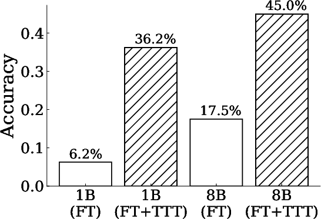
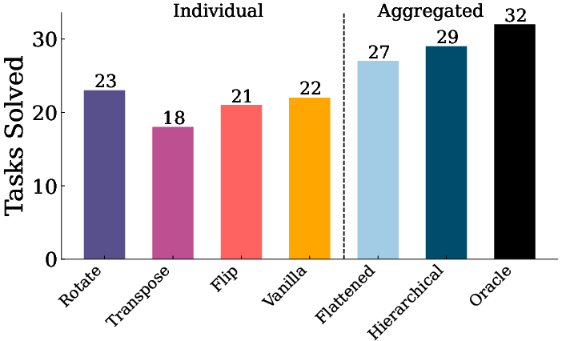

# The Surprising Effectiveness of Test-Time Training for Abstract Reasoning

## TLDR

This paper investigates the effectiveness of test-time training (TTT) for improving language models' reasoning capabilities on complex, novel tasks. Using the Abstraction and Reasoning Corpus (ARC) as a benchmark, the authors identify key components for successful TTT: initial fine-tuning on similar tasks, auxiliary task format and augmentations, and per-instance training. Their method achieves state-of-the-art results for purely neural approaches on ARC, challenging the assumption that symbolic components are necessary for solving such complex tasks.

## Introduction

Large language models (LMs) have shown impressive performance on tasks within their training distribution, but often struggle with novel problems requiring complex reasoning. In this blog post, we'll dive deep into a fascinating paper that explores a promising approach to enhance LMs' abstract reasoning capabilities: test-time training (TTT).

The authors, Ekin Akyürek, Mehul Damani, Linlu Qiu, Han Guo, Yoon Kim, and Jacob Andreas from Massachusetts Institute of Technology, present a comprehensive study on the effectiveness of TTT for improving LMs' performance on the challenging Abstraction and Reasoning Corpus (ARC). Their findings not only demonstrate significant improvements in model performance but also challenge some common assumptions about the limitations of purely neural approaches in complex reasoning tasks.

Let's break down the key components of their research and explore the implications of their results.

## Background: The ARC Challenge

Before we dive into the details of the paper, it's essential to understand the benchmark they're working with: the Abstraction and Reasoning Corpus (ARC). Created by François Chollet, ARC is designed to evaluate the abstract reasoning capabilities of AI systems through a series of visual puzzles.

Each ARC task consists of input-output pairs of 2D grids containing shapes or patterns made with up to 10 different colors. The goal is to infer the underlying transformation rule from a few examples and apply it to new inputs. These transformations can range from simple operations like reflection or counting to more complex concepts like gravity simulation or pathfinding.

Formally, an ARC task $d$ is defined as:

$$d = (\mathbf{x}^{\textrm{train}}, \mathbf{y}^{\textrm{train}}, \mathbf{x}^{\textrm{test}}, \mathbf{y}^{\textrm{test}})$$

where $\mathbf{x}^{\textrm{train}}$ and $\mathbf{y}^{\textrm{train}}$ are the training input-output pairs, and $\mathbf{x}^{\textrm{test}}$ and $\mathbf{y}^{\textrm{test}}$ are the test input-output pairs.

What makes ARC particularly challenging is that it requires models to generalize to entirely new types of problems, testing their ability to perform abstract reasoning rather than simply applying learned patterns.

## The Power of Test-Time Training

The core idea behind test-time training (TTT) is to update a model's parameters temporarily during inference using a loss derived from input data. This approach allows the model to adapt to specific test instances, potentially improving its performance on novel or challenging tasks.

In the context of this paper, TTT involves three crucial components:

1. Initial fine-tuning on similar tasks
2. Auxiliary task format and augmentations
3. Per-instance training

Let's explore each of these components in detail.

### 1. Initial Fine-tuning

The authors found that fine-tuning the base language model on a dataset of tasks similar to those encountered at test time significantly improves performance. This step helps the model develop a foundation for the types of reasoning required in ARC tasks.

To create this fine-tuning dataset, the authors employed several strategies:

a) Using existing generators from the ReARC dataset
b) Few-shot prompting of large language models (GPT-4 and GPT-4o) to generate novel tasks
c) Applying geometric transformations to existing tasks

The fine-tuning process involves optimizing the model parameters $\theta$ to minimize a loss function $\mathcal{L}$ over the fine-tuning dataset $\mathcal{D}_{\textrm{FT}}$:

$$\theta^* = \arg\min_\theta \sum_{d \in \mathcal{D}_{\textrm{FT}}} \mathcal{L}(d; \theta)$$

### 2. Auxiliary Task Format and Augmentations

One of the key insights from this research is the importance of the auxiliary task format used during TTT. The authors found that using an in-context learning (ICL) format significantly outperforms an end-to-end (E2E) format.

For a given task with training examples ${(x_k, y_k)}_{k=1}^K$ and test input $x_{\textrm{test}}$, the ICL format creates leave-one-out tasks:

$$d_j^{\textrm{ICL}} = (\underbrace{(x_k, y_k)_{k \in \{1,...,K\} \setminus \{j\}}}_{\textrm{synthetic training examples}}, \underbrace{{x_j, \quad\quad y_j}}_{\textrm{synthetic test example}}) \quad \text{where } j \in [1, K]$$

These tasks are then augmented using invertible geometric transformations $t$:

$$\mathcal{D}_{\textrm{TTT-ICL}}=\{t(d_j^\textrm{ICL})\} \quad \text{for all $t,j$ pairs.}$$

This approach allows the model to learn from multiple perspectives of the same task, enhancing its ability to generalize.

### 3. Per-Instance Training

During test time, the authors employ a novel approach of learning task-specific Low-Rank Adaptation (LoRA) parameters for each test instance. This allows for efficient adaptation to individual tasks without modifying the entire model.

The training objective for each task $i$ is:

$$\mathcal{L}_i(\mathcal{D}^{i}_{\textrm{TTT}}; \theta_{\textrm{i}}) = \sum_{d \in \mathcal{D}^{i}_{\textrm{TTT}}} \left(\sum_{n=2}^K \mathcal{L}_{\textrm{LM}}(y_n | x_1, y_1, ..., x_n; \theta_{\textrm{i}}) + \mathcal{L}_{\textrm{LM}}(y_{\textrm{test}} | x_1, y_1, ..., x_K, y_K, x_{\textrm{test}}; \theta_{\textrm{i}})\right)$$

where $\mathcal{L}_{\textrm{LM}}$ is the standard cross-entropy loss for language modeling.

## Augmented Inference and Voting Strategy

To further improve performance, the authors introduce an augmented inference strategy that leverages invertible geometric transformations and a hierarchical voting scheme.

For each transformation $t$ in a set of transformations $\mathcal{T}$, they generate predictions:

$$\tilde{y} \sim \textrm{LM}(t(\mathbf{d_{\textrm{input}}})) := \left[t(x_1), t(y_1),\dots, t(x_{\textrm{test}})\right]$$
$$y_{t} = t^{-1}(\tilde{y})$$

These predictions are then aggregated using a two-stage voting process:

1. Intra-transformation voting: Select the top-3 most frequent predictions within each transformation group.
2. Global voting: Conduct an overall vote across transformation-specific candidates to identify the top-2 most frequent predictions.

This approach allows the model to consider multiple perspectives of the same task and make more robust predictions.

## Results and Analysis

The authors' method achieves remarkable results on the ARC benchmark:

- 53% accuracy on the public validation set with an 8B parameter model
- 61.875% accuracy when ensembled with program synthesis approaches, comparable to average human performance (60.2%)

These results represent a significant improvement over previous state-of-the-art approaches and challenge the assumption that symbolic components are necessary for solving complex reasoning tasks.

Some key findings from their ablation studies include:

1. The in-context learning (ICL) format for TTT significantly outperforms the end-to-end (E2E) format.
2. Applying geometric transformations to augment the TTT dataset notably enhances performance.
3. Learning task-specific adapters is more effective than using a single shared adapter across all tasks.
4. The hierarchical voting strategy outperforms flat voting and approaches oracle-level performance.

## Implications and Future Directions

The success of this TTT approach on ARC has several important implications:

1. It demonstrates that purely neural approaches can achieve competitive performance on complex reasoning tasks, challenging the notion that symbolic methods are strictly necessary.
2. The effectiveness of test-time computation suggests that allocating proper computational resources during inference may be a critical factor in solving novel reasoning problems.
3. The complementary nature of different test-time methods (e.g., TTT, augmented inference, voting) indicates that combining multiple approaches can lead to significant performance gains.

Future research directions might include:

- Exploring more sophisticated data augmentation techniques for TTT
- Investigating the scalability of TTT to even larger language models
- Applying similar TTT approaches to other complex reasoning benchmarks
- Developing more efficient TTT methods to reduce computational requirements

## Conclusion

The paper we've explored presents a compelling case for the effectiveness of test-time training in enhancing language models' abstract reasoning capabilities. By carefully designing the TTT process, including initial fine-tuning, auxiliary task formatting, and per-instance adaptation, the authors have demonstrated that purely neural approaches can achieve state-of-the-art performance on the challenging ARC benchmark.

This research not only advances our understanding of how to improve LMs' performance on novel tasks but also challenges some fundamental assumptions about the limitations of neural approaches in complex reasoning. As we continue to push the boundaries of AI capabilities, techniques like TTT may play an increasingly important role in bridging the gap between human-level reasoning and machine learning models.

The code for this project is available at: [https://github.com/ekinakyurek/marc](https://github.com/ekinakyurek/marc)

## References

[1] Chollet, F. (2019). On the measure of intelligence. arXiv preprint arXiv:1911.01547.

[2] Brown, T. B., et al. (2020). Language models are few-shot learners. arXiv preprint arXiv:2005.14165.

[3] Sun, Y., et al. (2020). Test-time training with self-supervision for generalization under distribution shifts. In International conference on machine learning (pp. 9229-9248). PMLR.

[4] Hu, E. J., et al. (2021). LoRA: Low-rank adaptation of large language models. arXiv preprint arXiv:2106.09685.

[5] Wang, X., et al. (2022). Self-consistency improves chain of thought reasoning in language models. arXiv preprint arXiv:2203.11171.

[6] Li, W. D., et al. (2024). Combining induction and transduction for abstract reasoning. arXiv preprint arXiv:2411.02272.

[7] LeGris, S., et al. (2024). H-ARC: A robust estimate of human performance on the abstraction and reasoning corpus benchmark. arXiv preprint arXiv:2409.01374.

