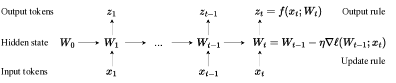
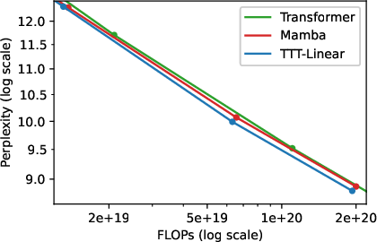
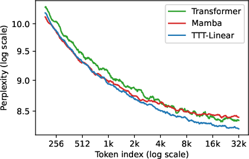

# Learning to (Learn at Test Time): RNNs with Expressive Hidden States

## TL;DR

This paper introduces Test-Time Training (TTT) layers, a new class of sequence modeling layers where the hidden state is itself a machine learning model, and the update rule is a step of self-supervised learning. The key contributions are:

1. A novel perspective on sequence modeling as learning to learn at test time
2. Two instantiations - TTT-Linear and TTT-MLP - that outperform Transformers and modern RNNs like Mamba
3. Techniques to improve hardware efficiency like mini-batch TTT and a dual form computation
4. Theoretical connections to existing methods like linear attention

## Introduction

Sequence modeling is at the heart of many modern AI systems, from language models to video understanding. The two dominant paradigms have been:

1. RNNs: Efficient but struggle with long-range dependencies
2. Self-attention: Powerful but quadratic complexity

This paper introduces a new perspective - what if we could make the hidden state of an RNN itself a machine learning model, trained on-the-fly as we process the sequence? This leads to Test-Time Training (TTT) layers, which aim to combine the efficiency of RNNs with the expressiveness of self-attention.

Let's dive into the key ideas!

## The Core Idea: Learning to Learn at Test Time

The fundamental insight of this paper is to reformulate sequence modeling as a nested learning problem:

1. Outer loop: Learn a good initialization and update rule
2. Inner loop: For each sequence, learn a model to compress and represent it

This is visualized in Figure 1:

The hidden state is now a model $f$ with weights $W$. As we process each token $x_t$, we:

1. Update the weights: $W_t = W_{t-1} - \eta \nabla \ell(W_{t-1}; x_t)$
2. Generate the output: $z_t = f(x_t; W_t)$

The loss $\ell$ is a self-supervised task, typically reconstruction:

$$ \ell(W; x_t) = \| f(\tilde{x}_t; W) - x_t \|^2 $$

Where $\tilde{x}_t$ is a corrupted version of $x_t$.

This formulation has several interesting properties:

- The hidden state (weights $W$) has fixed size, giving linear complexity like RNNs
- But it can potentially capture more complex patterns by learning on-the-fly
- The update rule and initialization are learned end-to-end

## TTT Instantiations: Linear and MLP

The authors propose two concrete instantiations:

1. TTT-Linear: $f$ is a linear model
2. TTT-MLP: $f$ is a 2-layer MLP

Both use layer normalization and residual connections for stability:

$$ f(x) = x + \text{LN}(f_{\text{res}}(x)) $$

Where $f_{\text{res}}$ is either linear or MLP.

## Improving Hardware Efficiency

While the basic TTT formulation is efficient in FLOPs, two key innovations make it practical:

### 1. Mini-batch TTT

Instead of updating $W$ for every token, we can use mini-batches:

$$ W_t = W_{t'} - \eta \sum_{s=t'+1}^t \nabla \ell(W_{t'}; x_s) $$

Where $t'$ is the last step of the previous mini-batch. This allows for more parallelism.

### 2. Dual Form Computation

The authors derive a "dual form" that avoids explicitly materializing intermediate $W_t$. For a linear model, this looks like:

$$ Z = W_0X - 2\eta(W_0X - X)\text{mask}(X^TX) $$

Where $X$ is the matrix of input tokens and $Z$ the outputs. This formulation uses efficient matrix multiplications.

## Theoretical Connections

The authors show some interesting theoretical connections:

1. TTT-Linear with batch gradient descent is equivalent to linear attention
2. TTT with a non-parametric learner (Nadaraya-Watson estimator) is equivalent to self-attention

This provides a unifying view of different sequence modeling approaches.

## Experimental Results

The authors evaluate TTT-Linear and TTT-MLP against Transformer and Mamba (a modern RNN) baselines. Some key findings:

1. TTT layers match or exceed baselines in perplexity vs. FLOPs trade-off
2. TTT layers continue to improve with longer context, while Mamba plateaus
3. With optimizations, TTT-Linear is faster than Transformer at 8k context and matches Mamba

Let's look at some specific results:

This plot shows perplexity vs. FLOPs for different model sizes on the Books dataset. We can see that TTT-Linear (red) outperforms Mamba (green) and matches or beats Transformer (blue) across different scales.

This plot shows how perplexity changes as we move through a long sequence. TTT layers and Transformer continue to improve, while Mamba plateaus after 16k tokens.

## Implementation Details

Some key implementation details:

1. The self-supervised task uses learned projections:

   $$ \ell(W; x_t) = \| f(\theta_K x_t; W) - \theta_V x_t \|^2 $$

2. The learning rate $\eta$ is learned and input-dependent:

   $$ \eta(x) = \eta_{\text{base}} \sigma(\theta_{\text{lr}} \cdot x) $$

3. The authors use the "Mamba backbone" which includes temporal convolutions before the TTT layers

## Discussion and Future Work

The authors view this work as opening up a new direction for sequence modeling. Some potential areas for future work:

1. More expressive inner loop models (e.g. CNNs for video)
2. Better parameterizations of the self-supervised task
3. Further systems optimizations for even better hardware efficiency
4. Scaling to much longer contexts and larger models

## Conclusion

TTT layers represent a novel and promising approach to sequence modeling. By reformulating the problem as learning to learn, they combine the efficiency of RNNs with the expressiveness of self-attention. While there's still work to be done in scaling and optimization, the initial results are very encouraging.

This work also connects to broader themes in AI, like meta-learning and the nature of human intelligence. As the authors note:

> We believe that human learning has a more promising connection with TTT, our inner loop, whose data is a potentially very long sequence with strong temporal dependencies, and any piece of data can be used for both training and testing.

It will be exciting to see how these ideas develop and influence the field in the coming years!

## References

1. Kaplan, J., McCandlish, S., Henighan, T., Brown, T. B., Chess, B., Child, R., ... & Amodei, D. (2020). Scaling laws for neural language models. arXiv preprint arXiv:2001.08361.

2. Gu, A., & Dao, T. (2023). Mamba: Linear-time sequence modeling with selective state spaces. arXiv preprint arXiv:2312.00752.

3. Hoffmann, J., Borgeaud, S., Mensch, A., Buchatskaya, E., Cai, T., Rutherford, E., ... & Sifre, L. (2022). Training compute-optimal large language models. arXiv preprint arXiv:2203.15556.

4. Touvron, H., Martin, L., Stone, K., Albert, P., Almahairi, A., Babaei, Y., ... & Scialom, T. (2023). Llama 2: Open foundation and fine-tuned chat models. arXiv preprint arXiv:2307.09288.

5. Sun, Y., Wang, X., Liu, Z., Miller, J., Efros, A., & Hardt, M. (2020). Test-time training with self-supervision for generalization under distribution shifts. In International Conference on Machine Learning (pp. 9229-9248). PMLR.

[Full list of references available in the paper]

