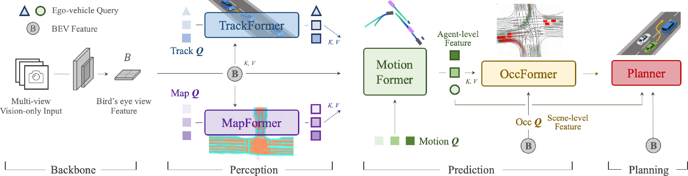
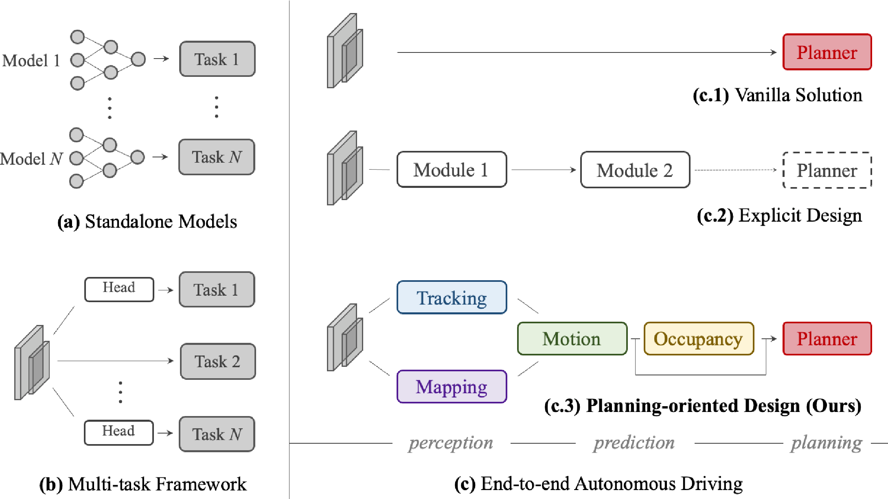

# Planning-oriented Autonomous Driving: A Unified Approach for Perception, Prediction and Planning

*Figure 1: Overview of the UniAD framework for autonomous driving*

## TLDR

- UniAD is a comprehensive end-to-end framework for autonomous driving that unifies perception, prediction and planning tasks
- It uses a query-based design to connect modules and enable flexible information exchange
- The system is "planning-oriented", with preceding tasks designed to facilitate the ultimate goal of safe planning
- UniAD outperforms previous state-of-the-art methods on the nuScenes benchmark across multiple autonomous driving tasks

## Introduction

Autonomous driving is one of the most exciting and challenging applications of artificial intelligence and robotics. A key challenge is designing a system that can reliably perceive the environment, predict future states, and plan safe trajectories - all in real-time and under diverse conditions. 

In this blog post, we'll dive into an impressive new framework called UniAD (Unified Autonomous Driving) that takes a holistic approach to tackling this challenge. Developed by researchers from Shanghai AI Laboratory, Wuhan University, and SenseTime Research, UniAD unifies multiple autonomous driving tasks in a single end-to-end trainable network.

Let's explore the key ideas behind UniAD and see how it pushes the state-of-the-art in autonomous driving technology.

## Motivation: The Need for a Unified Approach

Most current autonomous driving systems use a modular pipeline, with separate models for tasks like detection, tracking, prediction, and planning. While this simplifies development, it can lead to issues:

1. Information loss between modules
2. Error accumulation 
3. Misaligned optimization targets

Some researchers have explored multi-task learning approaches, sharing a backbone network with task-specific heads. However, this can sometimes cause "negative transfer" between tasks.

The authors of UniAD argue that we need a more holistic, "planning-oriented" approach. The key idea is to design the entire pipeline with the ultimate goal of safe planning in mind. This means carefully considering which preceding tasks are truly necessary and how they can best contribute to planning.

*Figure 2: Comparison of different autonomous driving system designs*

## The UniAD Framework

UniAD is an end-to-end framework that incorporates five key tasks:

1. 3D Object Detection and Tracking
2. Online Mapping
3. Motion Forecasting
4. Occupancy Prediction  
5. Planning

Let's break down each component and see how they work together.

### Perception: Tracking and Mapping

The perception stage of UniAD consists of two main components:

1. **TrackFormer**: This module performs joint 3D object detection and multi-object tracking. It uses a transformer-based architecture with two types of queries:
   - Detection queries: For detecting new objects
   - Track queries: For tracking previously detected objects

   TrackFormer outputs agent features $Q_A$ which are used in downstream tasks.

2. **MapFormer**: This module performs online mapping without relying on pre-built HD maps. It uses a panoptic segmentation approach to identify:
   - Things: Lanes, dividers, and crossings
   - Stuff: Drivable area

   MapFormer outputs map features $Q_M$ which are also used in later stages.

### Prediction: Motion Forecasting and Occupancy

The prediction stage consists of two complementary modules:

1. **MotionFormer**: This module predicts future trajectories for all agents in the scene. It takes as input:
   - Agent features $Q_A$ from TrackFormer
   - Map features $Q_M$ from MapFormer
   - BEV (Bird's Eye View) features $B$

   MotionFormer uses a series of attention mechanisms to model:
   - Agent-agent interactions
   - Agent-map interactions
   - Agent-goal interactions

   The output is a set of $\mathcal{K}$ possible trajectories for each agent over $T$ future timesteps.

   The motion forecasting loss $L_{motion}$ is defined as:

   $$L_{motion} = \lambda_{cls} L_{cls} + \lambda_{reg} L_{nll}$$

   where $L_{cls}$ is a classification loss for trajectory modes and $L_{nll}$ is a negative log-likelihood loss for trajectory coordinates.

2. **OccFormer**: This module predicts future occupancy grid maps, providing a dense representation of the scene evolution. It takes as input:
   - BEV features $B$
   - Agent features $G^t$ derived from tracking and motion forecasting

   OccFormer uses a series of attention mechanisms to model pixel-agent interactions and generate instance-level occupancy predictions.

   The occupancy prediction loss $L_{occ}$ is defined as:

   $$L_{occ} = \lambda_{bce} L_{bce} + \lambda_{dice} L_{dice}$$

   where $L_{bce}$ is a binary cross-entropy loss and $L_{dice}$ is a Dice loss for segmentation quality.

### Planning

The final stage of UniAD is the planning module, which generates safe trajectories for the ego vehicle. It takes as input:

- The ego-vehicle query from MotionFormer
- BEV features $B$
- Predicted occupancy maps from OccFormer

The planner uses an attention-based mechanism to generate a trajectory $\hat{\tau}$ over $T_p$ future timesteps. This trajectory is then optimized to avoid collisions using the predicted occupancy.

The planning loss $L_{plan}$ is defined as:

$$L_{plan} = \lambda_{imi} |\hat{\tau} - \tilde{\tau}|_2 + \lambda_{col} \sum_{(\omega,\delta)} \omega L_{col}(\hat{\tau}, \delta)$$

where $\tilde{\tau}$ is the ground truth trajectory, and $L_{col}$ is a collision loss that keeps the planned trajectory away from obstacles.

## Query-based Design: The Key to Unification

A crucial aspect of UniAD is its use of queries as interfaces between modules. This query-based design offers several advantages:

1. **Flexible representation**: Queries can encode a variety of information and interactions, making them more versatile than traditional bounding box representations.

2. **Large receptive field**: Queries can attend to broader contexts, helping to mitigate compounding errors from upstream predictions.

3. **Efficient information exchange**: The query format allows for easy communication between tasks, facilitating multi-task learning.

## Training and Implementation Details

UniAD is trained in two stages:

1. **Stage 1**: Pre-train perception tasks (tracking and mapping) for 6 epochs.
2. **Stage 2**: End-to-end training of all tasks for 20 epochs.

The loss function for stage 2 is a combination of all task-specific losses:

$$L_2 = L_{track} + L_{map} + L_{motion} + L_{occ} + L_{plan}$$

The authors use the AdamW optimizer with a learning rate of $2 \times 10^{-4}$ and a weight decay of $0.01$. The model is trained on 16 NVIDIA Tesla A100 GPUs.

## Experimental Results

The authors evaluate UniAD on the challenging nuScenes benchmark, which provides a diverse set of urban driving scenarios. Let's look at some key results:

### Multi-Object Tracking

| Method | AMOTA↑ | AMOTP↓ | Recall↑ | IDS↓ |
|--------|--------|--------|---------|------|
| ViP3D | 0.217 | 1.625 | 0.363 | - |
| MUTR3D | 0.294 | 1.498 | 0.427 | 3822 |
| UniAD | **0.359** | **1.320** | **0.467** | **906** |

UniAD significantly outperforms previous end-to-end MOT techniques, achieving the best results across all metrics.

### Motion Forecasting

| Method | minADE(m)↓ | minFDE(m)↓ | MR↓ | EPA↑ |
|--------|------------|------------|-----|------|
| PnPNet | 1.15 | 1.95 | 0.226 | 0.222 |
| ViP3D | 2.05 | 2.84 | 0.246 | 0.226 |
| UniAD | **0.71** | **1.02** | **0.151** | **0.456** |

UniAD achieves remarkable improvements in motion forecasting, reducing prediction errors by 38.3% and 65.4% on minADE compared to PnPNet and ViP3D respectively.

### Planning

| Method | L2 Error (3s)↓ | Collision Rate (3s)↓ |
|--------|----------------|----------------------|
| ST-P3 | 2.90 | 1.27 |
| UniAD | **1.65** | **0.71** |

UniAD reduces planning L2 error and collision rate by 43.1% and 44.1% respectively compared to ST-P3, demonstrating its ability to generate safer trajectories.

## Ablation Studies and Insights

The authors conduct extensive ablation studies to validate the effectiveness of each component in UniAD. Some key findings include:

1. **Importance of perception tasks**: Incorporating both tracking and mapping modules brings significant improvements to motion forecasting performance (9.7% reduction in minADE, 12.9% reduction in minFDE).

2. **Synergy between prediction tasks**: Integrating both motion forecasting and occupancy prediction leads to better performance in both tasks (3.5% reduction in minADE, 2.4% improvement in IoU for occupancy).

3. **Planning-oriented design**: The full UniAD model outperforms a naive multi-task learning baseline by a significant margin across all metrics, demonstrating the benefits of the planning-oriented approach.

## Conclusion and Future Directions

UniAD represents a significant step forward in autonomous driving research, demonstrating the power of a unified, planning-oriented approach. By carefully designing each component to contribute towards the ultimate goal of safe planning, the authors have created a system that outperforms previous state-of-the-art methods across multiple tasks.

Some potential areas for future work include:

1. **Efficiency improvements**: While UniAD achieves impressive results, its computational requirements are significant. Future work could focus on making the system more lightweight for real-time deployment.

2. **Incorporating additional tasks**: The authors mention that exploring the integration of tasks like depth estimation or behavior prediction could be valuable.

3. **Handling long-tail scenarios**: The failure cases presented in the paper highlight the need for improved performance in challenging, rare scenarios (e.g., large trailers, dark environments).

4. **Explainable AI**: While UniAD provides some interpretability through its attention visualizations, further work on explaining the system's decision-making process could be crucial for real-world adoption.

UniAD opens up exciting possibilities for autonomous driving research and brings us one step closer to safe, reliable self-driving vehicles. As the field continues to evolve, it will be interesting to see how approaches like UniAD influence the design of future autonomous driving systems.

## References

1. Hu, Y., Yang, J., Chen, L., Li, K., Sima, C., Zhu, X., ... & Li, H. (2023). Planning-oriented Autonomous Driving. arXiv preprint arXiv:2306.06073.

2. Li, Z., Wang, W., Li, H., Xie, E., Sima, C., Lu, T., ... & Dai, J. (2022). BEVFormer: Learning bird's-eye-view representation from multi-camera images via spatiotemporal transformers. In European Conference on Computer Vision (pp. 1-18). Springer, Cham.

3. Zeng, F., Dong, B., Wang, T., Zhang, X., & Wei, Y. (2021). MOTR: End-to-end multiple-object tracking with transformer. In European Conference on Computer Vision (pp. 523-539). Springer, Cham.

4. Gu, J., Hu, C., Zhang, T., Chen, X., Wang, Y., Wang, Y., & Zhao, H. (2023). ViP3D: End-to-end visual trajectory prediction via 3d agent queries. In Proceedings of the IEEE/CVF Conference on Computer Vision and Pattern Recognition (pp. 21409-21419).

5. Liang, M., Yang, B., Zeng, W., Chen, Y., Hu, R., Casas, S., & Urtasun, R. (2020). Pnpnet: End-to-end perception and prediction with tracking in the loop. In Proceedings of the IEEE/CVF Conference on Computer Vision and Pattern Recognition (pp. 11553-11562).

6. Hu, S., Chen, L., Wu, P., Li, H., Yan, J., & Tao, D. (2022). ST-P3: End-to-end vision-based autonomous driving via spatial-temporal feature learning. In European Conference on Computer Vision (pp. 299-317). Springer, Cham.

