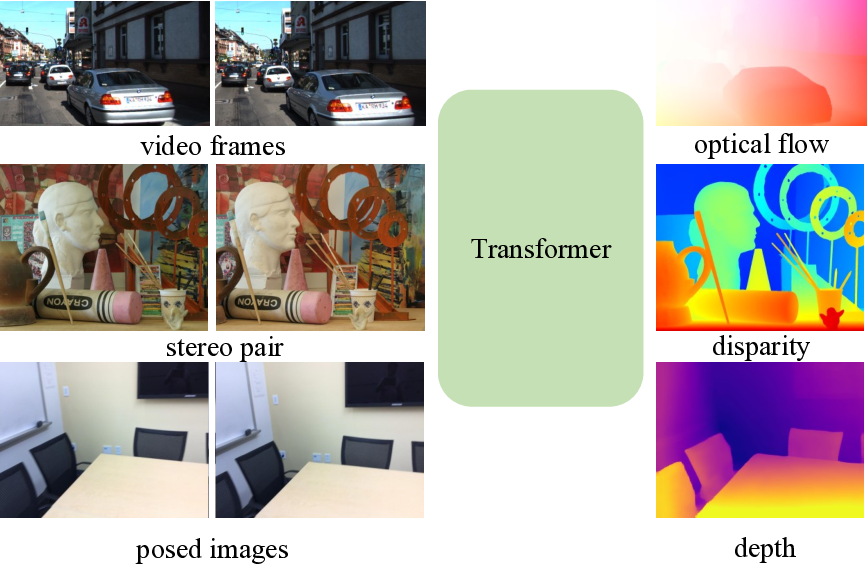

# Unifying Flow, Stereo and Depth Estimation: A Transformer-based Approach

*Figure 1: Overview of our unified model for optical flow, rectified stereo matching and unrectified stereo depth estimation tasks.*

## TLDR

- This paper presents a unified formulation and model for three dense correspondence tasks: optical flow, rectified stereo matching, and unrectified stereo depth estimation.
- The key idea is to use a Transformer, particularly the cross-attention mechanism, to learn strong feature representations for matching.
- The proposed method outperforms state-of-the-art approaches on multiple benchmarks while being simpler and more efficient.
- The unified model enables cross-task transfer, allowing pretrained models to be reused across tasks.

## Introduction

Dense correspondence estimation between images is a fundamental problem in computer vision with applications ranging from 3D reconstruction to autonomous driving. Traditionally, tasks like optical flow, stereo matching, and depth estimation have been tackled independently with specialized architectures. However, this approach leads to redundancy and missed opportunities for knowledge transfer between related tasks.

In this paper, we present a unified formulation and model that can handle three key dense correspondence tasks:

1. Optical flow
2. Rectified stereo matching  
3. Unrectified stereo depth estimation

The key insight is that all of these tasks can be formulated as a dense matching problem, where the goal is to find correspondences between pixels in different images. By taking this unified view, we can develop a single architecture that works well across tasks.

## Unified Formulation

The core idea is to formulate all three tasks as explicit dense correspondence matching problems that can be solved by directly comparing feature similarities. This shifts the focus to learning strong, discriminative feature representations that work well for matching.

To achieve this, we leverage a Transformer architecture, particularly the cross-attention mechanism. The cross-attention allows integrating information from multiple views, which significantly improves the quality of the extracted features compared to independent per-image processing.

Let's look at how we formulate each task:

### Optical Flow

For optical flow, we want to find 2D correspondences between two video frames. Given features $\mathbf{F}_1, \mathbf{F}_2 \in \mathbb{R}^{H \times W \times D}$ extracted from two frames, we compute a 4D correlation volume:

$$
\mathbf{C}_{\text{flow}} = \frac{\mathbf{F}_1 \mathbf{F}_2^T}{\sqrt{D}} \in \mathbb{R}^{H \times W \times H \times W}
$$

We then apply softmax to get a matching distribution:

$$
\mathbf{M}_{\text{flow}} = \text{softmax}(\mathbf{C}_{\text{flow}}) \in \mathbb{R}^{H \times W \times H \times W}
$$

The final flow field is obtained by computing the expected 2D coordinates:

$$
\mathbf{V}_{\text{flow}} = \hat{\mathbf{G}}_{2D} - \mathbf{G}_{2D}
$$

where $\hat{\mathbf{G}}_{2D} = \mathbf{M}_{\text{flow}} \mathbf{G}_{2D}$ and $\mathbf{G}_{2D}$ is the regular pixel grid.

### Stereo Matching

For rectified stereo matching, we only need to search along the horizontal epipolar lines. The correlation volume becomes 3D:

$$
\mathbf{C}_{\text{disp}} \in \mathbb{R}^{H \times W \times W}
$$

After softmax, we compute the expected disparity:

$$
\mathbf{V}_{\text{disp}} = \mathbf{G}_{1D} - \hat{\mathbf{G}}_{1D}
$$

where $\hat{\mathbf{G}}_{1D} = \mathbf{M}_{\text{disp}} \mathbf{P}$ and $\mathbf{P} = [0, 1, 2, ..., W-1]$.

### Depth Estimation

For unrectified stereo depth estimation, we discretize the inverse depth range and compute correlations for each depth plane:

$$
\mathbf{C}_{\text{depth}} = [\mathbf{C}^1, \mathbf{C}^2, ..., \mathbf{C}^N] \in \mathbb{R}^{H \times W \times N}
$$

The final depth is obtained as a weighted average:

$$
\mathbf{V}_{\text{depth}} = \mathbf{M}_{\text{depth}} \mathbf{G}_{\text{depth}}
$$

where $\mathbf{G}_{\text{depth}} = [d_1, d_2, ..., d_N]$ are the depth candidates.

## Transformer-based Feature Extraction

The key to our approach is learning high-quality features for matching. We use a combination of a convolutional network (CNN) and a Transformer:

1. A shared ResNet backbone extracts initial features at 1/8 resolution.
2. A Transformer with 6 blocks further processes these features.

The Transformer uses both self-attention and cross-attention:

- Self-attention aggregates context within each image
- Cross-attention integrates information across views

The cross-attention is particularly important, as it allows the model to reason about correspondences during feature extraction. This leads to more discriminative features compared to independent per-image processing.

To handle high-resolution inputs efficiently, we use a local window attention approach inspired by Swin Transformer. We split the feature maps into 2x2 windows and perform attention within each window.

## Handling Occlusions and Boundaries

Our matching formulation assumes that corresponding pixels are visible in both images. To handle occlusions and out-of-boundary regions, we introduce a flow propagation step using self-attention:

$$
\hat{\mathbf{V}} = \text{softmax}\left(\frac{\mathbf{F}_1 \mathbf{F}_1^T}{\sqrt{D}}\right) \mathbf{V}
$$

This propagates high-quality predictions to occluded regions based on feature similarity.

## Refinement

While our base model already achieves strong performance, we can further improve results with additional refinement steps:

1. Hierarchical matching refinement: Perform an additional matching step at 1/4 resolution for optical flow and stereo matching.

2. Local regression refinement: Use task-specific convolutional refinement inspired by RAFT for further improvements.

These refinements are optional and allow for different speed-accuracy trade-offs.

## Experiments

We evaluate our unified model, which we call GMFlow (Global Matching Flow), on multiple benchmarks for each task. Here are some key results:

### Optical Flow

On the challenging Sintel benchmark, GMFlow outperforms RAFT with significantly fewer refinement iterations:

*Figure 2: End-point-error vs number of refinements for optical flow on Sintel (clean).*

GMFlow achieves state-of-the-art results on Sintel (clean) and highly competitive performance on other benchmarks:

| Method | Sintel Clean | Sintel Final | KITTI (All) |
|--------|--------------|--------------|-------------|
| RAFT   | 1.94         | 3.18         | 5.10        |
| GMFlow+ | **1.03**    | 2.37         | **4.49**    |

### Stereo Matching

On the KITTI 2015 benchmark, GMFlow achieves competitive results while being significantly faster:

| Method    | D1-all (All) | D1-all (Noc) | Time (s) |
|-----------|--------------|--------------|----------|
| LEAStereo | **1.65**     | **1.51**     | 0.30     |
| GMStereo  | 1.77         | 1.61         | **0.17** |

### Depth Estimation

On the ScanNet benchmark, GMFlow achieves comparable performance to state-of-the-art methods while being much faster:

| Model    | Abs Rel | Sq Rel | RMSE  | Time (s) |
|----------|---------|--------|-------|----------|
| DeepV2D  | **0.057** | **0.010** | **0.168** | 0.69     |
| GMDepth  | 0.059   | 0.019  | 0.179 | **0.04**    |

## Cross-Task Transfer

A unique advantage of our unified formulation is the ability to transfer knowledge between tasks. We demonstrate this by using a pretrained optical flow model for stereo matching and depth estimation:

*Figure 3: Using a pretrained optical flow model for depth estimation on ScanNet, with and without finetuning.*

We observe that:

1. The pretrained flow model can be directly applied to other tasks with reasonable performance.
2. Finetuning from the pretrained flow model leads to faster convergence and better final performance compared to random initialization.

## Conclusion

In this paper, we presented a unified formulation and model for three dense correspondence tasks: optical flow, stereo matching, and depth estimation. By leveraging a Transformer-based architecture with cross-attention, we achieve state-of-the-art or highly competitive performance across multiple benchmarks while enabling cross-task transfer.

Key takeaways:

1. A unified matching-based formulation can effectively handle multiple dense correspondence tasks.
2. Transformer architectures, particularly cross-attention, are powerful for learning discriminative features for matching.
3. The proposed approach achieves a good balance between accuracy, efficiency, and simplicity compared to task-specific architectures.

Future directions include extending the approach to multi-view scenarios and exploring unsupervised pretraining techniques to learn even more general feature representations for matching.

## References

1. Z. Teed and J. Deng, "RAFT: Recurrent All-Pairs Field Transforms for Optical Flow," in ECCV, 2020.
2. X. Cheng et al., "Hierarchical Neural Architecture Search for Deep Stereo Matching," in NeurIPS, 2020.
3. Z. Teed and J. Deng, "DeepV2D: Video to Depth with Differentiable Structure from Motion," in ICLR, 2020.
4. A. Vaswani et al., "Attention Is All You Need," in NeurIPS, 2017.
5. Z. Liu et al., "Swin Transformer: Hierarchical Vision Transformer using Shifted Windows," in ICCV, 2021.

