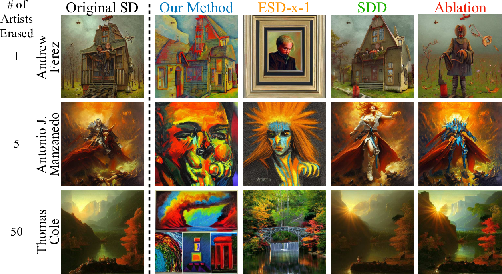
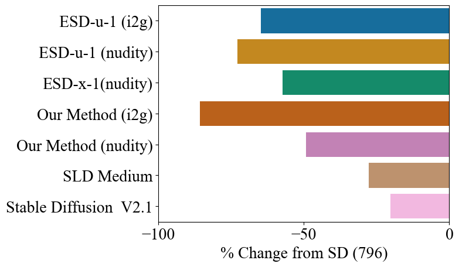

*Figure 1: Our method enables unified and efficient editing of multiple concepts in text-to-image models through closed-form modifications to attention weights. We present applications to debias, erase, and moderate concepts at scale. Debiasing professions leads the edited model to generate fairer gender and race ratios. Erasing an artistic style removes characteristics associated with a particular creator. Moderating the model reduces the likelihood of generating inappropriate images.*

## TL;DR
- Unified Concept Editing (UCE) is a novel method for simultaneously addressing multiple safety issues in text-to-image diffusion models.
- UCE can debias, erase, and moderate concepts using a single, efficient closed-form solution.
- The method outperforms existing techniques in terms of efficacy and scalability.
- UCE enables targeted editing of hundreds of concepts while minimizing interference with unedited concepts.

## Introduction

Text-to-image diffusion models have revolutionized the field of AI-generated art, but they've also introduced a host of societal challenges. These models can inadvertently clone artists' styles, reinforce harmful biases, and generate offensive content. While several methods have been proposed to address these issues individually, real-world deployments of generative image models face all these problems simultaneously.

In this blog post, we'll dive deep into a new method called Unified Concept Editing (UCE), introduced by Rohit Gandikota, Hadas Orgad, Yonatan Belinkov, Joanna Materzyńska, and David Bau. UCE is a closed-form parameter-editing method that enables the application of hundreds of editorial modifications within a single text-to-image synthesis model while preserving the generative quality of the model for unedited concepts.

## Background

Before we delve into UCE, let's briefly review the basics of diffusion models and their text-to-image variants.

Diffusion models are generative models that approximate distributions through a gradual denoising process. They start with Gaussian noise and iteratively denoise over T time steps to form a final image. At each intermediate step t, the model predicts noise ε_t that is added to the original image, with x_T as initial noise and x_0 as the final output.

The denoising process is modeled as a Markov transition probability:

$$p_{\theta}(x_{T:0}) = p(x_T)\prod_{t=T}^{1}p_{\theta}(x_{t-1} | x_t)$$

Text-to-image latent diffusion models operate on low-dimensional embeddings modeled with a U-Net generation network. The text conditioning is fed to the network via text embedding, extracted from a language model, in the cross-attention layers.

The attention modules within diffusion models follow the QKV (Query-Key-Value) structure [1], where queries originate from the image space, while keys and values are derived from the text embeddings. UCE focuses on the linear layers W_k and W_v, responsible for projecting text embeddings.

For a given text embedding c_i, the keys and values are generated by:

$$k_i = W_kc_i$$
$$v_i = W_vc_i$$

The keys are then multiplied by the query q_i that represents the visual features of the current intermediate image. This produces an attention map that aligns relevant text and image regions:

$$\mathcal{A} \propto \mathrm{softmax} (q_ik_i^T)$$

The attention map indicates the relevance between each text token and visual feature. Using this alignment, the cross-attention output is then computed by attending over the value vector V with the normalized attention weights:

$$\mathcal{O} = \mathcal{A}v_i$$

This cross-attention mechanism is crucial as it links the text and image information, assigning visual meaning to text tokens.

## Unified Concept Editing (UCE)

Now that we have a solid foundation, let's explore the UCE method in detail.

### The Core Idea

UCE is designed to edit a set of concepts E while preserving a set of concepts P in any linear projection layer. Given a pretrained layer W^old, the goal is to find new edited weights W that modify the concepts in E while keeping the concepts in P intact.

*Figure 2: Closed-form editing of cross-attention weights enables concept manipulation in diffusion models. Our method modifies the attention weights to induce targeted changes to the keys and values corresponding to specific text embeddings for a set of edited concepts c_i∈E while minimizing changes to a set of preserved concepts c_j∈P. That dual objective allows debiasing, erasing, or moderating concepts while preserving unrelated ones. The same editing function is applied in all cases, but the target keys and values are set differently per application. As a closed-form edit, modifying attention weights given the new keys and values mappings takes less than 1 minute. That enables efficient simultaneous editing of multiple concepts.*

### The Mathematical Formulation

The objective function for UCE can be written as:

$$\min_{W} \sum_{c_i\in E}||Wc_i - v_i^*||_2^2 + \sum_{c_j\in P}||Wc_j - W^\mathrm{old}c_j||_2^2$$

Where:
- c_i are the concepts to edit
- v_i* are the target outputs for edited concepts
- c_j are the concepts to preserve

This objective function has a closed-form solution:

$$W = \left(\sum_{c_i\in E} v_i^* c_i^T + \sum_{c_j\in P} W^\mathrm{old} c_jc_j^T\right)\left(\sum_{c_i\in E} c_i c_i^T + \sum_{c_j\in P} c_j c_j^T \right)^{-1}$$

This formulation generalizes both the TIME [2] and MEMIT [3] editing methods, making UCE a powerful and flexible approach.

### Applications of UCE

UCE can be applied to various concept editing tasks:

1. **Erasing**: To erase a concept c_i, we set the target output v_i* to align with a different concept c_*:

   $$v_i^* \gets W^\mathrm{old}c_*$$

2. **Debiasing**: To debias a concept c_i across attributes a_1, a_2, ..., a_p, we adjust the magnitude of v_i along the directions of v_a1, v_a2, ..., v_ap:

   $$v_i^* \gets W^\mathrm{old}\left[ c_i +\alpha_1 a_1 +\alpha_2 a_2 +...+\alpha_p a_p \right]$$

3. **Moderation**: To moderate a concept c_i, we align the target output v_i* with an unconditional prompt c_0:

   $$v_i^* \gets W^\mathrm{old}c_0$$

## Experimental Results

The authors conducted extensive experiments to demonstrate the effectiveness of UCE across various tasks. Let's look at some of the key findings.

### Erasing Artistic Styles

UCE showed superior performance in erasing artistic styles compared to existing methods like ESD-x [4], Concept Ablation [5], and SDD [6]. The method was able to consistently erase multiple artistic styles while preserving the model's knowledge of unrelated concepts.

*Figure 3: Our method and ESD-x show strong erasing capabilities. SDD and Ablation start to dilute their erasing capabilities as the number of concepts being erased are increased.*

The authors also tested the limits of erasing up to 1000 artists simultaneously. They found that UCE can erase up to 100 artists before significantly impacting image fidelity and CLIP scores.

### Debiasing

UCE demonstrated impressive results in debiasing professions across gender and racial attributes. The method was able to improve gender representation in generated images for various professions.

*Figure 4: Our method improves the gender representation of professions in the stable diffusion generated images. We find that the images precisely change the gender while keeping the rest of the scene intact.*

For racial debiasing, UCE showed significant improvements in representing diverse racial groups among generated professional images.

*Figure 5: Our method improves the racial diversity of professions in the pre-trained stable diffusion. We show images from the original SD and the corresponding images from the edited model for the same prompts and seeds for comparison. We find that our edited model has a better race representation.*

### Moderation

UCE was evaluated on moderating sensitive concepts, particularly in reducing nudity in generated images. The method showed comparable performance to state-of-the-art techniques like ESD-u and ESD-x [4] in erasing nudity, while inducing less distortion to model generations.

*Figure 6: Our method erases nudity content from pre-trained SD and has an advantage of erasing multiple concepts in I2P prompts. The figure shows percentage reduction in nudity classified samples on I2P prompts compared to SD which had 796 total images. "Nudity" erased model performs very similar to ESD-x-1 as both the methods edit only cross attentions. Although, as noted in Table 1, we find that our method results in a more finer edit and has better alignment with COCO.*

## Limitations and Future Directions

While UCE shows promising results, the authors acknowledge some limitations:

1. Compounding biases when debiasing across multiple attributes.
2. Degradation of general image generation capabilities when erasing too many artistic styles.
3. Word-level biases in prompts that compose unfavorably.

These limitations open up avenues for future research, such as:

- Developing methods to address compounding biases in multi-attribute debiasing.
- Investigating techniques to preserve core visual priors while erasing a large number of concepts.
- Exploring ways to mitigate word-level biases in prompt composition.

## Conclusion

Unified Concept Editing (UCE) represents a significant step forward in making text-to-image diffusion models more responsible and beneficial for society. By enabling targeted debiasing, erasure of potentially copyrighted content, and moderation of offensive concepts using only text descriptions, UCE offers a powerful tool for researchers and practitioners working with generative AI.

The method's ability to scale to hundreds of concepts while minimizing interference with unedited content makes it particularly promising for real-world applications. As we continue to grapple with the ethical implications of AI-generated content, techniques like UCE will play a crucial role in shaping the future of responsible AI development.

For those interested in exploring UCE further, the authors have made their code available at [unified.baulab.info](https://unified.baulab.info/) and [github.com/rohitgandikota/unified-concept-editing](https://github.com/rohitgandikota/unified-concept-editing).

## References

[1] Vaswani, A., Shazeer, N., Parmar, N., Uszkoreit, J., Jones, L., Gomez, A. N., ... & Polosukhin, I. (2017). Attention is all you need. Advances in neural information processing systems, 30.

[2] Orgad, H., Kawar, B., & Belinkov, Y. (2023). Editing implicit assumptions in text-to-image diffusion models. In Proceedings of the 2023 IEEE International Conference on Computer Vision.

[3] Meng, K., Sharma, A. S., Andonian, A., Belinkov, Y., & Bau, D. (2023). Mass-editing memory in a transformer. In The Eleventh International Conference on Learning Representations.

[4] Gandikota, R., Materzyńska, J., Fiotto-Kaufman, J., & Bau, D. (2023). Erasing concepts from diffusion models. In Proceedings of the 2023 IEEE International Conference on Computer Vision.

[5] Kumari, N., Zhang, B., Wang, S. Y., Shechtman, E., Zhang, R., & Zhu, J. Y. (2023). Ablating concepts in text-to-image diffusion models. In Proceedings of the 2023 IEEE International Conference on Computer Vision.

[6] Kim, S., Jung, S., Kim, B., Choi, M., Shin, J., & Lee, J. (2023). Towards safe self-distillation of internet-scale text-to-image diffusion models. arXiv preprint arXiv:2307.05977.