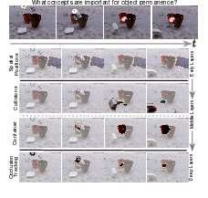
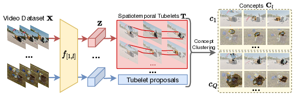
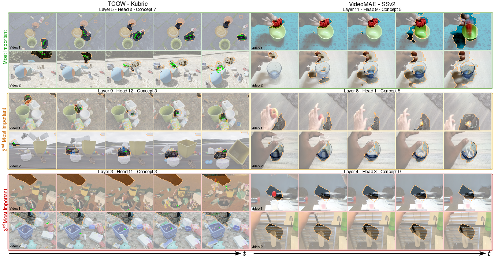

---
title: "Understanding Video Transformers via Universal Concept Discovery: A Deep Dive into VTCD"
date: 2020-09-15T11:30:03+00:00
# weight: 1
# aliases: ["/first"]
tags: ['video transformers', 'concept discovery', 'interpretability', 'computer vision', 'deep learning', 'spatiotemporal reasoning', 'object tracking', 'action recognition', 'video object segmentation']
author: "Me"
# author: ["Me", "You"] # multiple authors
showToc: true
TocOpen: true
draft: false
hidemeta: false
comments: false
description: ""
canonicalURL: "https://canonical.url/to/page"
disableHLJS: true # to disable highlightjs
disableShare: false
disableHLJS: false
hideSummary: false
searchHidden: false
ShowReadingTime: true
ShowBreadCrumbs: true
ShowPostNavLinks: true
ShowWordCount: true
ShowRssButtonInSectionTermList: true
UseHugoToc: true
cover:
    image: "<image path/url>" # image path/url
    alt: "<alt text>" # alt text
    caption: "<text>" # display caption under cover
    relative: false # when using page bundles set this to true
    hidden: true # only hide on current single page
editPost:
    URL: "https://github.com/<path_to_repo>/content"
    Text: "Suggest Changes" # edit text
    appendFilePath: true # to append file path to Edit link
---

# Understanding Video Transformers via Universal Concept Discovery

*By Matthew Kowal, Achal Dave, Rares Ambrus, Adrien Gaidon, Konstantinos G. Derpanis, Pavel Tokmakov*

[Project Page](https://yorkucvil.github.io/VTCD)

## TLDR
- First concept discovery methodology for interpreting video transformer representations
- Introduces VTCD (Video Transformer Concept Discovery) algorithm to identify and rank spatiotemporal concepts
- Discovers universal mechanisms across different video transformers regardless of training objectives
- Shows practical applications in action recognition and video object segmentation
- Reveals that video transformers naturally develop object-centric representations

*Heatmap predictions of the TCOW model for tracking through occlusions (top), together with concepts discovered by VTCD (bottom). The model encodes positional information in early layers, identifies containers and collision events in mid-layers and tracks through occlusions in late layers.*

## Introduction

Understanding how neural networks make decisions is crucial for addressing regulatory concerns, preventing deployment harms, and improving model designs. While this has been extensively studied for image models, video transformers present unique challenges due to their temporal dimension and complex spatiotemporal reasoning mechanisms.

Consider a video model tracking an object through occlusion - how does it reason about the trajectory of an invisible object? What mechanisms enable this capability? Are these mechanisms universal across different video models? This blog post explores these questions through the lens of concept-based interpretability.

## Video Transformer Concept Discovery (VTCD)

### Overview

*VTCD takes videos as input, processes them through a model, generates spatiotemporal tubelet proposals, and clusters them into high-level concepts.*

VTCD is designed to:
1. Decompose video representations into interpretable concepts
2. Rank concepts by importance to model predictions
3. Identify universal mechanisms across different models

### Mathematical Framework

Given:
- Set of RGB videos $\mathbf{X} \in \mathbb{R}^{N \times 3 \times T \times H \times W}$
- L-layer pretrained model $f$
- Intermediate representation at layer l: $f_{[1,l]}(\mathbf{X}) = \mathbf{Z}_l \in \mathbb{R}^{N \times C \times T' \times H' \times W'}$

The goal is to decompose $\mathbf{Z}_l$ into interpretable concepts $\mathbf{C}_l = \{c_1, \ldots, c_Q\}$.

### Key Components

#### 1. Tubelet Proposals

Unlike previous methods that use superpixels or crops in RGB space, VTCD generates proposals in feature space using SLIC clustering:

$$\mathbf{T} = \text{GAP}(\mathbf{B} \odot \mathbf{Z}) = \text{GAP}(\text{SLIC}(\mathbf{Z}) \odot \mathbf{Z})$$

where:
- $\mathbf{T} \in \mathbb{R}^{M \times C}$ are the tubelets
- $\mathbf{B}$ are binary support masks
- GAP is global average pooling

#### 2. Concept Clustering

VTCD uses Convex Non-negative Matrix Factorization (CNMF) to cluster tubelets into concepts:

$$(\mathbf{G}^*,\mathbf{C}^*) = \argmin_{\mathbf{C}>0,\mathbf{G}>0} || \mathbf{T} - \mathbf{T} \mathbf{G} \mathbf{C} ||^2$$

where:
- $\mathbf{G} \in [0,1]^{C \times Q}$ with $\sum_j \mathbf{G}_{i,j}=1$
- Final concepts are rows of matrix $\mathbf{C}$

#### 3. Concept Importance Estimation (CRIS)

To handle transformer's robustness to perturbations, VTCD introduces CRIS (Concept Randomized Importance Sampling):

1. Sample K different concept sets
2. Mask concepts at every layer:
   $$\hat y_k = g(\tilde{\mathbf{B}}_{\mathbf{C}^k_L} \odot f_{[L-1,L]} (\cdots( \tilde{\mathbf{B}}_{\mathbf{C}^k_{1}} \odot f_{[0,1]} (\mathbf{X}) ) ) )$$
3. Calculate importance scores:
   $$s_i = \frac{1}{K} \sum_k^K (\mathbb{D}(\tilde y, y)-\mathbb{D}(\hat{y_k}, y)) \mathbb{1}_{c_i \in \mathbf{C}^k}$$

## Universal Mechanisms in Video Transformers

### Early Layers: Spatiotemporal Basis

The early layers of video transformers consistently form a spatiotemporal basis that underlies subsequent information processing. This includes:
- Positional encoding
- Basic motion patterns
- Temporal continuity

### Middle Layers: Object-Centric Representations

*Top-3 most important concepts for TCOW (left) and VideoMAE (right) models. Both models develop object tracking capabilities despite different training objectives.*

A fascinating discovery is that video transformers naturally develop object-centric representations in middle layers, even without explicit supervision. This includes:
- Object tracking
- Multiple object awareness
- Hand tracking (in models trained on human action data)

### Late Layers: Task-Specific Processing

The final layers specialize based on the model's training objective:
- Action recognition models develop fine-grained event detection
- Tracking models focus on occlusion reasoning
- Multi-modal models build semantic understanding

## Practical Applications

### Action Recognition

VTCD can improve model efficiency through targeted pruning:
- 33% head pruning → 4.3% accuracy increase + 33% compute reduction
- 50% head pruning → maintains accuracy + 50% compute reduction

### Video Object Segmentation

VTCD discovers object tracking concepts that enable zero-shot video object segmentation:

| Features | VTCD | VTCD + SAM |
|----------|------|------------|
| VideoMAE-SSL | 45.0 | 68.1 |
| VideoMAE | 43.1 | 66.6 |
| InternVideo | 45.8 | 68.0 |

*Results on DAVIS'16 benchmark (mIoU)*

## Implementation Details

Key hyperparameters and settings:
- SLIC compactness: 0.01-0.15 (model dependent)
- CNMF clustering: Elbow method with Silhouette metric
- CRIS iterations: 4,000-8,000 (model dependent)

## Limitations

1. Manual tuning of SLIC compactness parameter
2. Difficulty capturing non-spatially-localized concepts
3. Computational complexity of Rosetta scoring for many models

## Future Directions

1. Automated hyperparameter selection
2. Extension to non-localized concepts
3. More efficient universal concept discovery
4. Integration with large-scale video representation learning

## Conclusion

VTCD provides a powerful framework for understanding video transformers through concept discovery. The revelation of universal mechanisms and practical applications in model improvement makes it a valuable tool for both researchers and practitioners in computer vision.

## References

1. van2023tracking - TCOW: Tracking Any Object through Occlusions in Videos
2. tong2022videomae - VideoMAE: Masked Autoencoders are Data-Efficient Learners for Self-Supervised Video Pre-Training
3. kirillov2023segment - Segment Anything Model (SAM)
4. wang2022internvideo - InternVideo: General Video Foundation Models via Generative and Discriminative Learning
5. perazzi2016benchmark - DAVIS Benchmark

